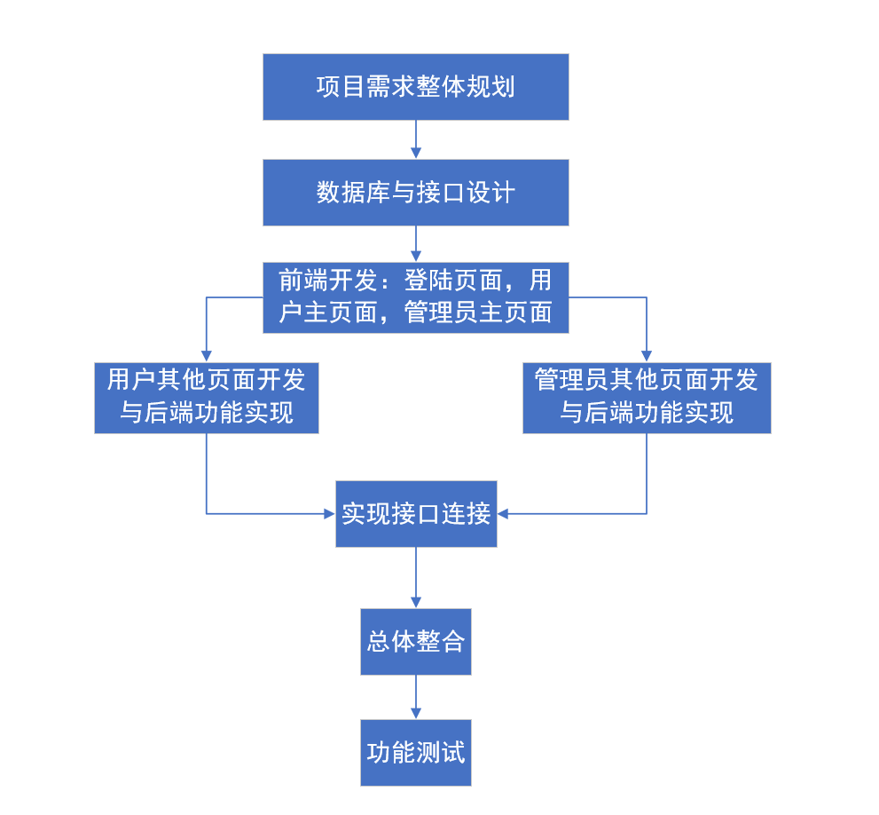
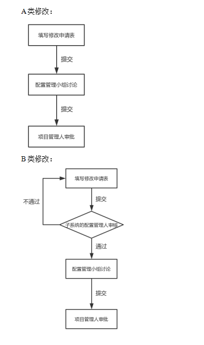
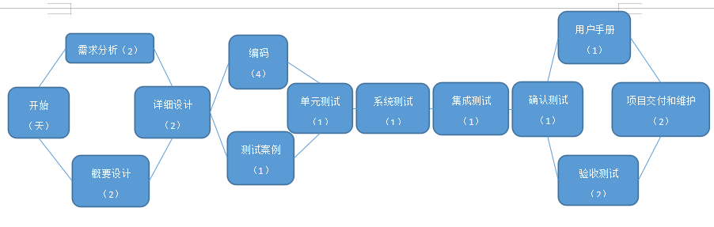
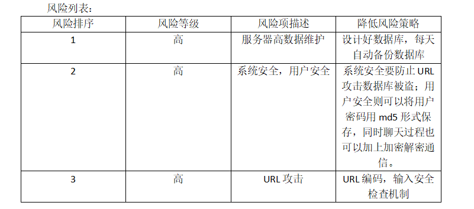

H2H-Doc-SDP-v2.0.2

**软件开发计划说明书**

**版本： 2.0.2**

>   编写： *黄韬 李新博*

>   校对： *黄韬*

>   审核： *李宁生*

>   批准： *卢延悦*

**西北工业大学H2H小组**

>   **2019年7月**

**修订记录**

| **版本号** | **修订时间** | **修订内容**                                                 | **提出人**      | **审核人** | **是否通过** |
|------------|--------------|--------------------------------------------------------------|-----------------|------------|--------------|
| **V2.0.1** | **7月6日**   | **修订功能描述； 修订软件开发环境描述； 修改部分字体格式；** | **黄韬 李新博** | **李宁生** | **是**       |
| **V2.0.2** | **7月9日**   | **修订体系设计内容； 更新版本号； 修订详细设计内容；**       | **李新博 黄韬** | **李宁生** | **是**       |
| **V2.0.3** | **7月10日**  | **修订文档进度表**                                           | **李新博 黄韬** | **李宁生** | **是**       |
| **V2.0.4** | **7月10日**  | **修订系统开发流图；修订进度表，添加迭代过程**               | **卢延悦 黄韬** | **李宁生** | **是**       |
| **V2.1.0** | **7月11日**  | **修改文档与需求规格说明书一致**                             | **李宁生**      | **李宁生** | **是**       |
|            |              |                                                              |                 |            |              |

**审核记录**

| **审核版本号** | **审核时间** | **审核内容**                  | **审核问题**                                           | **审核人** | **是否通过** |
|----------------|--------------|-------------------------------|--------------------------------------------------------|------------|--------------|
| **1.0.0**      | **7.2**      | **SDP是否完善**               | **功能需求需要进行修改，部分字体格式需要进行修改**     | **李宁生** | **是**       |
| **2.0.1**      | **7.6**      | **SDP是否符合规范，需求变更** | **所需工作概况需要进行及时更新，软件需求分析需要更新** | **李宁生** | **是**       |
| **2.0.4**      | **7.11**     | **查看是否满足目前需求规格**  | **需要将各项目未完成的项目属性，功能修改**             | **李宁生** | **是**       |
|                |              |                               |                                                        |            |              |
|                |              |                               |                                                        |            |              |

### 1 引言

本章分为以下几条。

#### 1.1标识

标识号：H2H012019001DP01

标题：HELP TO HELP

缩略词语：H2H

版本号：1.1.1.190701_alpha

发行号：略

#### 1.2系统概述

系统正在执行开发、无运行和维护的历史；

投资方：无

需方：开拓校园业务的公司或学校组织机构

用户：因课业、竞赛、社团等活动而无法及时做一些事情的学生

开发方和支持机构；HTH项目小组

标识前和计划的运行现场；小组进行了关于项目的初步讨论，正在编写软件开发计划书。

其他文档：《校园互助平台计划书》

#### 1.3文档概述

《软件开发计划》由HTH小组成员编写，描写开发者实施软件开发工作的计划，是编写《需求规格说明书》、《概要设计说明书》、《详细设计说明文档》、《软件交付说明书》等文档的依据。

保密性：本文档仅限于项目参与者使用

#### 1.4与其他计划之间的关系

无

#### 1.5基线

参考《H2H-Doc-SRS-v2.0》

### 2引用文件

《计算机软件文档编制规范 GB/T 8567-2006》

### 3交付产品

#### 3.1 程序

“Help To Help”项目前端源代码

“Help To Help”项目后端源代码

#### 3.2文档

《H2H-Doc-SDP-v2.0》

《H2H-Doc-SRS-v2.0》

《H2H-Doc-SDD-v2.0》

《H2H-Doc-SCMP-v2.0》

《H2H-Doc-STR-v1.0》

《H2H-Doc-SUM-v1.0》

《H2H-Doc-SVD-v1.0》

《H2H-Doc-STD-v1.0》

#### 3.3服务

为需方进行最终产品环境配置部署即后期维护。

#### 3.4非移交产品

《H2H-Doc-开发内部文档》等

#### 3.5验收标准

软件进行配置后，进行第三方专家验收，检验是否达到标准。

#### 3.6最后交付期限

2019-07-13日前进行交付。

### 4所需工作概述

1.  对所要开发系统、软件的需求和约束；

>   软件采用JFinal框架进行Java开发，采用Tomcat服务器及Mysql数据库。

1.  对项目文档编制的需求和约束；

>   统一采用国家标准进行编写。

1.  该项目在系统生命周期中所处的地位；

>   处于 识别需求 阶段

1.  所选用的计划/采购策略或对它们的需求和约束；

>   无

1.  项目进度安排及资源的需求和约柬；

>   项目需要在两周时间内完成。

f.其他的需求和约束。

本项目内容仅限于本项目开发人员使用。

### 5实施整个软件开发活动的计划

#### 5.1软件开发过程

采用敏捷开发方式，以人为核心、迭代、循序渐进的开发。在敏捷开发中，软件项目的构建被切分成多个子项目，各个子项目的成果都经过测试，具备集成和可运行的特征。

换言之，就是把一个大项目分为多个相互联系，但也可独立运行的小项目，并分别完成，在此过程中软件一直处于可使用状态。首先我们进行立项，小组进行需求分析，系统设计和开发环境配置，然后小组成员分配任务进行项目开发，并随之进行测试，进行迭代，最终进行项目部署，项目测试。

#### 5.2软件开发总体计划

##### 5.2.1软件开发方法

我们将整个开发工作被组织为一系列的短小的、固定长度的小项目，被称为一系列的迭代。每一次迭代都包括了需求分析、设计、实现与测试。采用这种方法，开发工作可以在需求被完整地确定之前启动，并在一次迭代中完成系统的一部分功能或业务逻辑的开发工作。再通过客户的反馈来细化需求，并开始新一轮的迭代。迭代一般指某版本的生产过程，包括从需求分析到测试完成；
版本一般指某阶段软件开发的结果，一个可交付使用的产品。

##### 5.2.2软件产品标准

###### 5.2.2.1 界面设计标准

（1）界面要美观、操作要方便并能高效率地完成工作。

（2）界面要根据用户需求设计。

（3）界面要根据不同用户的层次设计。（有的用户对计算机相当了解而有的从来就没碰过计算机）

（4）避免出现嵌套式的界面设计。

（5）界面和代码要相互制约。

（6）界面要通“人性”。即要有引导用户操作的功能，不能是操作一有误就卡住什么都做不下去，又无任何提示来帮助用户如何进行操作。

###### 5.2.2.2 编码设计标准。

（1）选用控制结构只准许一个入口和一个出口。

（2）程序语句组成容易识别的块，每块只有一个入口和一个出口。

（3）复杂的结构应该用基本控制结构进行组合嵌套来实现。

（4）语句中没有的控制结构，可用一段等价的程序段模拟，但要求该程序段在整个系统应前后一致。

（5）严格控制GOTO语句，仅在下列情形才可使用。

 用一个非结构化的程序设计语言去实现一个结构化的构造。

 在某种可以改善而不是损害程序可读性的情况下。

###### 5.2.2.3 对象命名约定。

对象名称=对象前缀+自定义名称（自定义名称要有一定的意义且第一个字母大写）

说明：如果是不需要对其编码的对象，那么对象名用默认对象名。

###### 5.2.2.4 常量和变量命名约定。

>   常量或变量名称=常量或变量范围前缀+常量或变量类型前缀+自定义名称（自定义名称要有一定的意义且第一个字母大写）

>   除了对象之外，常量和变量也需要良好格式的命名约定。本节列出了（此处加入变量列表）。

>   变量应该总是被定义在尽可能小的范围内。全局 (Public)
>   变量可以导致极其复杂的状态机构，并且使一个应用程序的逻辑非常难于理解。全局变量也使代码的重用和维护更加困难。

###### 5.2.2.5 数据库访问约定。

>   访问数据库用JDBC
>   drivers/ADO，但如果在有的技术ADO解决不了的情况下可用其他方法。

######  5.2.2.6 其他约定。

>   格式标准：缩进标准为上下级之间1格缩进；空格标准为2格空格；大小写根据实际情况定；信息按信息类型分类排序。

>   首部注释标准：按照Javadoc的标准注释，在代码首部提供作者、版本号、参数名描述、描述、引用以及异常类名。对于特殊使用的算法、假设、约束等需要加特殊注释。

##### 5.2.3可重用的软件产品

###### 5.2.3.1吸纳可重用的软件产品

>   可以采取横向重用的重用技术，横向重用是指重用不同应用领域中的软件元素，例如数据结构、分类算法、人机界面构件等。标准函数库是一种典型的原始的横向重用机制。通过横向重用之前的一个图书馆管理系统，也是一款基于MVC的管理系统，而且满足可重用软件的条件：

>   ①软件系统应是模块化结构。

>   ②软件系统应不依赖于具体的运行环境。

>   ③软件系统应建立在标准的、统一的数据接口上.

>   ④软件系统应有知识的帮助。我们将重用它的CSS格式以及一些基础运 行函数算法等。

###### 5.2.3.2开发可重用的软件产品

>   由于环境中硬件或性能约束带来的影响并不大，所以将问卷管理系统开发为可重用软件产品的可能性很大。我们将采用类属参数化方法开发可重用方法，保证可重用部件不会出错。

##### 5.2.4处理关键性需求

###### 5.2.4.1安全性保证

（1）权限控制系统

系统设置了严格有效的权限控制系统，何人可以发信息，何人能删除信息等权限设置系统一共有数十项详细设置，并且网站不同栏目可以设置完全不同的权限，所有权限均在多个层次上严格控制权限。

（2）IP记录

IP地址库
除记录所有重要操作的IP外，还记录了IP所在地区，系统中内置约了17万条IP特征记录。

详细的IP记录
所有的创建记录、编辑记录行为（如发文章，发评论，发站内信等），均记录此操作发生的IP，IP所在地区，操作时间，以便日后备查。在发现安全问题时，这些数据会非常关键和必要。

（3）隐藏的程序入口

本系统具有全站生成静态页
系统可以全站生成HTML静态文件，使网站的执行程序不暴露在WEB服务中，HTML页不和服务器端程序交互，黑客很难对HTML页进行攻击，很难找到攻击目标。

###### 5.2.4.2保密性保证

项目小组成员签订《项目信息保密书》。

###### 5.2.4.3私密性保证

>   只有管理员和用户自己可以查看到自己的相关信息，采取安全部署手段保护部署公司的数据信息。

###### 5.2.4.4其他关键性需求保证

无。

##### 5.2.5计算机硬件资源利用

操作系统：Windows8/Windows10 Professional。

数据库访问：ADO。

应用服务器：jetty。

管理工具：maven

数据库访问：ADO、JDBC。

数据库系统：Mysql。

开发环境：Microsoft .

##### 5.2.6记录原理

>   我们将以规范的模板记录决策，“我们做了什么决策？”“为什么这样决策？”“我们还考虑过哪些解决方案？为什么没有采用？”作为决策记录的基础来记录，这样可以作为与开发人员沟通的工具；向利益相关者说明某个单一的问题；把项目移交给其他人等。

##### 5.2.7需方评审途径

>   设计评审的目的是评价设计结果满足质量要求的能力。设计评审由实验课老师及助教组成评审小组，设计评审前需要发出评审通知给评审小组成员及项目小组，评审通知应标明评审时间、地点、职责与分工、评审内容等信息。设计评审由实验课老师主持，主要包括以下几点：评价设计满足质量要求的能力；识别问题并提出解决方法；对设计进行综合地、系统地检查。

### 6实施详细软件开发活动的计划

#### 6.1项目计划和监督

|                | 主线程                   | 分线程                                     | 时间（天） | 总天数               |
|----------------|--------------------------|--------------------------------------------|------------|----------------------|
| 系统总策划     | 设计制作策划             | 系统项目策划                               | 2          | 2（1天内用多项任务） |
|                |                          | 设计风格策划                               | 1          |                      |
|                | 资料信息整理             | 资料收集整理                               | 1          |                      |
|                |                          | 资料编辑整理                               | 1          |                      |
|                | 系统计划推广             | 推广活动策划                               | 1          |                      |
|                |                          | 存在问题讨论                               | 1          |                      |
| 前端开发       | 设计阶段                 | 参考                                       | 1          | 3（1天内用多项任务） |
|                |                          | 设计框架完成登录主页面和用户与管理员主页面 | 2          |                      |
|                |                          | 设计装饰图片                               | 1          |                      |
|                |                          | 完成设计整合                               | 1          |                      |
|                | 制作阶段                 | 设计页面布局                               | 1          |                      |
|                |                          | 完成用户其他页面制作与管理员其他页面制作   | 2          |                      |
|                |                          | 加入JS                                     | 1          |                      |
|                |                          | 作代码优化                                 | 1          |                      |
|                | 设计制作整合             | 与策划人员沟通                             | 1          |                      |
|                |                          | 在后台代码加入后，根据项目小组意见进行整合 | 1          |                      |
| 后端开发       | 后台开发                 | 审阅功能规范                               | 1          | 4（1天内用多项任务） |
|                |                          | 确定模块化/分层设计参数                    | 1          |                      |
|                |                          | 制定开发计划                               | 2          |                      |
|                |                          | 编写代码                                   | 3          |                      |
|                |                          | 开发人员测试(初步调试）                    | 1          |                      |
|                |                          | 在后台代码加入后，根据项目小组意见进行整合 | 1          |                      |
|                |                          | 上传功能模块                               | 1          |                      |
| 运行及测试过程 | 收集建议及意见进行完善期 | 调试发布                                   | 1          | 4                    |
|                |                          | 广泛征集意见                               | 2          |                      |
|                |                          | 配套修改与更新                             | 1          |                      |

#### 6.2建立软件开发环境

本系统使用JFinal的新框架开发实现，系统统一使用HTML JAVA Script
JSP等语言开发技术，在网页客户端进行执行，用户可将数据传递到管理员，管理员也可向用户发送信息。

#### 6.3系统需求分析

“校园互助”系统的目的在于利用不同用户的分散时间，互帮互助去完成更多的事情。用户而言，可以达到节约时间精力，提高效率，并且在平台独有的任务模式下，完成任务会得到一定的成就感。同时也可以通过这样的平台达到线下交友的目的。于利益相关商家（如快递点、校车运营服务人员、出租车服务公司等）而言，可以整合资源，提高工作效率，更利于快速发展。

#### 6.4系统设计

采用敏捷开发方式，对系统要实现的需求进行汇总统计，并指定完备的项目开发流程，系统大致设计流程为:

#### 6.5 软件需求分析

##### **6.5.1功能描述**

1. 注册登陆找回密码

2. 发布、接收、指派、提交、验收任务

3. 任务讨论

4. 任务评价

5. 积分系统

6. 私信系统

7. 任务管理（审核、删除、搜索、筛选）

8. 用户管理（删除、封号、搜索、筛选）

9. 通知公告

10.热度排行

##### 6.5.2 划分模块

管理员：

1. 任务管理

（1）审核（通过、不通过）

（2）删除

（3）搜索（关键词、用户）

（4）筛选（分类筛选：未审核、审核通过、审核拒绝、已完成；日期筛选）

2. 用户管理

（1）删除

（2）封号

（3）搜索（关键词）

（4）筛选（封号中）

（5）积分更改

3. 系统管理

（1）修改系统参数（每次登陆给多少分）

（2）发布公告（文本）

（3）修改密码

用户：

1. 登陆、注册、找回密码、每日首次登陆加积分

2. 首页

（1）主页上的任务列表（显示未指派的任务）

1）筛选（类型）

（2）发布任务按钮

（3）公告窗口

（4）未读消息数目

（5）我的信息按钮

3. 私信界面

（1）消息列表（回复）

4. 个人信息模块

（1）信誉

（2）积分

（3）基本信息（联系方式、学号、姓名、发布任务数、完成任务数、放弃任务数）

（4）个人信息上的任务列表

（5）修改密码（用找回密码的页面）

任务：

1. 任务发布页（标题、描述、类型、悬赏、有效截止时间）

2. 任务详情页

（1）任务介绍

（2）任务评论（类似于追问）

（3）申请任务

（4）指派任务

（5）提交任务（评分；暂时不可见，发布者验收任务后才可见；之后不可修改）

（6）验收任务（评分；提交后不可修改；积分变动）

（7）放弃任务

#### 6.6软件设计

##### 6.6.1 CSCI级设计决策

H2H系统面向系统中的信息交互主体，被划分为三个模块：“系统管理员模块”、“用户模块”和“任务模块”。

（1）系统管理员模块

系统管理员模块仅向本系统的管理者开放，拥有系统的最高权限，通过特殊的链接入口进入。该模块包含三个小模块：“用户管理模块”、“任务管理模块”和“系统管理模块”。

 用户管理模块实现了对用户的统一管理。主要功能包括：


删除无效用户。无效用户主要指已毕业的学生或在发布、执行任务中多次出现恶意破坏行为的用户。


封锁用户账号。当用户出现轻微违规行为，管理员可以通过在一段时间内限制其使用作为惩罚措施。

 搜索用户。系统管理员可以通过用户的账户、姓名来搜索需要管理的用户。

 筛选用户。管理员可以通过用户管理列表提供的滤波器筛选被封号中的用户账户。


积分更改。管理员可以更改用户的积分值。主要用于用户违规行为的惩罚措施以及当系统出现问题时的修复措施。

 任务管理模块实现了管理员对任务的审核以及其他管理功能，主要包括：

 审核用户提交的任务。

 删除审核通过后违规的任务。

 通过关键词、用户账户搜索需要管理的任务。

 筛选任务。管理员可以通过任务状态、任务发布日期筛选任务列表，进而方便其管理。


系统管理模块负责管理管理所有可供修改的系统参数，包括：管理员账户密码、每日签到能获得的积分数目等。

（2）用户模块

用户模块主要面向系统用户，为用户行为提供接口。用户可以通过用户模块使用系统的账户管理、信息浏览、用户间交流、个人信息记录等功能。对应五个功能项分为五个模块：注册登陆模块、首页模块、私信模块、个人信息模块。


注册登陆模块为用户提供了注册新账户、使用已有账户登陆、忘记密码时找回密码的功能。注册新账户时要求用户填写基本信息，见4.2.1；用户登录时需要输入用户名和对应的密码；找回密码时需要输入待找回的账户。

 首页模块是用户使用系统的主要模块之一，使用户与任务交互的主要场景。


任务列表展示了当前已审核发布而未指派的任务。用户可以通过列表浏览任务的详细情形，决定是否申请执行该任务。任务列表也会提供筛选功能和搜索功能。按照任务的类型进行筛选和搜索。


首页模块包含了发布任务功能。使用户可以根据自己的需求发布任务，寻求其他用户的帮助。

 公告窗口向用户展示管理员发布的系统相关的通知。


私信界面提供了用户之间私下交流的功能。使用该功能用户可以自由交流任务信息与任务完成情况。


个人信息模块展示了用户的基本信息，包括用户的学号、姓名、发布任务数、完成任务数、放弃任务数）、个人信誉、积分等。个人信息页面还展示了用户的任务列表，包括发布的任务、完成的任务。个人信息模块还提供修改用户密码的功能。

（3）任务模块

任务模块提供了以任务为中心的一系列功能。主要包含了任务发布模块、任务展示与操作模块。


任务发布模块填写任务的基本信息，包括标题、描述、类型、悬赏、有效截止时间等。用户可以通过这个界面提交一个任务。待管理员审核后发布到系统中。


任务展示与任务操作模块使用户可以浏览一个任务的详细信息，并在任务的不同阶段对任务进行评论、申请、指派、提交、验收或放弃。

##### 6.6.2 CSCI体系结构设计

###### 6.6.2.1 程序(模块)划分

H2H系统被划分为三个面向用户的模块：“系统管理员模块”、“用户模块”和“任务模块”。

-   系统管理员模块HIPO图

-   用户模块HIPO图

-   任务模块HIPO图

##### 6.6.3 CSCI详细设计

###### 6.6.3.1 功能

**管理员：**

-   登陆

用户输入正确的系统管理员的账号和密码进行登陆。用户若输入了错误的密码，会有密码错误提示。

-   首页

首页提供搜索，对用户的浏览和删除等操作。管理员可以通过左侧的导航栏通向其他可用的功能。在导航栏右上角有登出按钮供管理员登出系统。

-   任务管理

    -   审核（通过、不通过）

    -   删除

    -   搜索（通过关键词、用户搜索）

    -   筛选（分类筛选：未审核、审核通过、审核拒绝、已完成）

-   用户管理

    -   删除

    -   封号

    -   搜索（关键词）

    -   筛选（封号中）

    -   积分更改

-   系统管理

    -   修改系统参数（设置每次登陆给多少分）

-   公告管理

    -   删除公告

    -   发布公告

    -   搜索公告（关键词）

    -   编辑公告

**用户：**

-   登陆

用户输入正确的账号和密码进行登陆。用户若输入了错误的密码，会有密码错误提示。

-   找回密码

用户可以通过电子邮箱验证找回密码。

-   注册

用户可以注册新账号加入系统。

-   首页

首页提供搜索，对任务的浏览等操作。用户可以通过上侧的导航栏通向其他可用的功能。在导航栏右上角有登出按钮供用户登出系统。

-   任务列表（显示未指派的任务）

    -   筛选（类型、发布时间、悬赏范围、热度）

    -   搜索（关键词）

    -   公告窗口

    -   未读消息数目

    -   我的留言箱按钮

-   私信界面

私信界面提供查看已有的消息，已经给其他用户发私信等功能。

-   消息列表（回复）

    -   筛选（时间）

    -   搜索（关键词）

    -   未读消息数目

    -   发送私信

-   个人界面

个人页面提供个人信息的浏览，更改等操作。

-   个人信息

    -   浏览个人信息

    -   更改个人信息

    -   修改密码

-   与我有关的任务（在任务系统中详细说明）

**任务系统：**

-   任务发布页（标题、描述、类型、悬赏、有效截止时间）

    -   发布任务

        -   发布任务

-   任务详情页（标题、描述、类型、悬赏、有效截止时间）

    -   任务介绍

        -   任务介绍

    -   任务评论（类似于追问）

        -   评论

    -   申请任务

        -   申请任务

    -   提交任务

        -   提交任务

    -   验收任务

        -   任务验收（评分、评价；提交后不可修改；积分变动）

    -   放弃任务

        -   任务放弃

    -   任务申请人

        -   浏览申请人列表

        -   查看申请人详细信息

        -   指派任务

-   任务状态变动提醒

#### 6.7软件实现和配置项测试

##### 6.7.1软件实现

###### 6.7.1.1 编码风格：源程序文档化 

6.7.1.1.1.定义编码风格（程序设计风格、编程风 格），是指导人们编写出逻辑明清晰、
易读易懂程序的基本原则。

6.7.1.1.2.内容(1)源程序文档化：为了提高程序的可维护性，源代码也
需要实现文档化（内部文档编制）。包括： 1、符号名的命名：
2、程序注释：序言、功能等。

6.7.1.1.3、标准的书写格式： 分层缩进的写法显示嵌套结构层次。

（1）数据说明：对数据添加说明。

（2）语句结构：结构化、库函数、可读性。

（3）输入/输出（I/O）：友好、方便使用。

（4）规则:

A.标识符应当直观且可以拼读，可望文知意，不必进行“解码”。标识符最好采用英文单词或其组合，便于记
忆和阅读。切忌使用汉语拼音来命名。程序中的
英文单词一般不会太复杂，用词应当准确。

B.标识符的长度应当符合标识符的长度应当符合“min-length && max-information”原则。

C.：程序中不要出现仅靠大小写区分的相似的标识符
。规则:程序中不要出现标识符完全相同的局部变量和全局变量，尽管两者的作用域不同而不会发
生语法错误，但会使人误解。规则：变量的名字应当使用“名词”或者“形容 词＋名词”。

D.全局函数的名字应当使用
全局函数的名字应当使用“动词”或者“动词＋名词”（动宾词组）。

E.用正确的反义词组命名具有互斥意义的变 量或相反动作的函数等。

F.常量全用大写的字母，用下划线分割单词。

G.静态变量加前缀 静态变量加前缀s_（表示static ）

H.如果不得已需要全局变量 如果不得已需要全局变量 ，则使全局变量加 则使全局变量加
前缀g_（表示global）。

###### 6.7.1.2 测试驱动开发

（1）定义：编写一小段测试代码，再编写一小段产品代码

优点：保证编写单元测试
，使程序员获得满足感从而更始终如一地坚持编写测试有助于澄清接口和行为的细节可证明，可再现，自动的验证改变事物的信心

（2）代码管理

A.定义代码管理，又称版本控制，主要指在由多个程序员参与开发的大型软件开发项目中，对在开发过程中产生的源代码与文档进行管理，保证在同一个系统中的不同版本中的代码是一致的。

B. 管理内容:可管理源程序、文档、影像、二进制文件等主要功能: 用户管理:
对参加软件项目的程序员分配帐户，且根据其业务需要可赋予不同的存取权限。

C.版本控制: 任何时刻不会有多个程序员修改更新系统中的同一部分。

D.变动记录: 记录每次修改的变动情况，可以得到以前的任何版本。

##### 6.7.2配置项测试准备

（1）计算工作量，工作量非常大，等价划分减少工作量

（2）确定需要的硬件类型

（3）考虑一个特例：是否有联机注册功能。（如果有就要考虑调制解调器和网络通信）

（4）确定有那些产商，型号和驱动程序可用，将列出的信息放入表格之中。

（5）获得硬件（只卖经常使用的配置，或者与硬件产商联系租赁，或者看职员家里有没有硬件，如果资金足够的话就与项目经理进行专业配置和兼容性测试实验室联系外协测试，他们拥有知名的超级多的硬件。）

##### 6.7.3配置项测试执行

1.文档审查

对于配置项级别的测试来说，一般审查软件需求规格说明文档及接口需求规格说明文档，还有用户使用手册。在审查中，着重查看需求文档中对功能和性能的描述，是否遵循软件任务书的要求，需求的描述是否明确，是否有二义性和模棱两可的地方，是否与软件配置项的功能实现有分歧。查看用户使用手册的是否支持用户对软件的安装和使用，功能描述和使用步骤是否与软件实现保持一致，描述是否合理等。在进行文档审查时，最好提前制作好文档审查单，并以此做参照。

2.静态分析

在不运行代码的方式下，通过词法分析、语法分析、控制流、数据流分析等技术对程序代码进行扫描，验证代码是否满足规范性、安全性、可靠性、可维护性等指标的一种代码分析技术。扫描代码，一般须得有工具支持，KlocWork，LDRA都可用于静态分析，但这些工具一般都不便宜。测试人员需要从工具提供的结果中，挑出属于软件缺陷的那部分并加以分析。

3.内存使用缺陷测试

顾名思义，就是对软件内存使用进行测试，看是否有缺陷。内存使用缺陷测试，可静态扫描代码，也可动态执行代码。不管哪种方式，一般也都由测试工具来完成，例如前面提到的KlocWork，就是静态检测内存使用缺陷的工具。

4.功能测试

配置项级别的软件功能测试，以需求规格说明为依据，测试软件的功能是否满足需求规格说明的要求，所以，功能测试的前提是需求规格说明完全正确。当然，江湖上广泛流传的“需求善变”，如何从测试的角度来应对善变的需求，有机会将另外开篇讨论，今天这里不做赘述。功能测试属于典型的黑盒测试。只在意结果是否满足需求，而不关心软件内部如何实现。功能测试需要测试人员对被测软件产品所在行业非常熟练和精通，最好也是行业内专家。

5.性能测试

同功能测试一样，如果需求规格说明中有明确的性能需求，例如完成复杂运算处理的解算时间要求，解算精度要求，网络传输吞吐量，数据库的最大容量，服务器能允许的同时在线访问数量，等等，都要反映在配置项测试里。如果没有明确指出性能要求，测试人员可根据软件产品所处行业，自行产生测试需求。——这很考验测试人员的素质和水平的哦。例如前面所提到的，服务器能允许的最大同时在线访问量，就是互联网行业的一个性能需求。当然，还有常规的空间性能（存储和占用计算机硬件资源）和时间性能（软件处理一个任务所用时间），如今的计算机资源，基本都满足要求，除非你是航空发射，武器控制等特殊行业，才需要非常关注。

6.余量测试

余量测试是和性能测试是相辅相成的，余量测试依据性能测试的结果。一般要求性能测试之外，还要有20%的余量。例如服务器的性能要求为满足同时在线2000个客户端，余量测试则要求服务器最少满足2400个客户端同时在线才行。

7.人机界面测试

测试用户在使用软件产品时的人机交互友好性。不同行业有不同的界面设计风格和要求，运行于windows平台的软件和运行于vxWorks平台的界面显示风格也不同，这就要求测试人员对软件产品所在行业非常熟悉，最好就是软件产品所在行业的专家。如果在软件研发时有界面设计方案和设计要求，就按照设计要求来进行测试，否则就以所处行业的规范性标准来测试，着重在于测试人机交互的便捷友好，以及对功能和性能的支持。

##### 6.7.4修改和再测试

将测试发现的错误修改，再重复进行6.7.3所描述的测试内容。

##### 6.7.5配置项测试结果分析与记录

形成《配置项测试结果分析与记录报告》。

#### 6.8配置项集成和测试

##### 6.8.1 集成准备

###### 6.8.1.1 集成准备

（1） 建立集成环境

集成负责人依据“集成构建方案”的要求建立集成环境。

（2） 定义检查表

集成负责人依据组织对产品集成就绪检查的要求，定义适合项目的产品集成就绪检查表。

检查项包括但不限于：

1.  集成环境是否已经准备好？

2.  待集成的子系统/模块是否完成“产品需求规格说明书”中审定的功能？

3.  各子系统/模块是否已经将完成相应功能的正确源代码版本存放在项目的配置项库中？

>   （3） 检查集成条件

>   集成负责人依据项目的产品集成就绪检查表，检查待集成子系统/模块及集成环境等集成条件是否准备就绪，并记录检查结果。

>   （4） 建立集成工作路径

>   集成负责人确定集成的工作区并建立集成工作路径。

###### 6.8.1.2 集成测试准备

（1） 集成测试负责人指定集成测试人员根据系统的运行条件准备集成测试环境。

（2）集成测试负责人从配置库中获取已集成的待测试软件产品。

##### 6.8.2配置项集成和测试执行

###### 6.8.2.1 配置项集成

（1）集成系统/子系统

集成负责人按照“集成构建方案”的要求，在保证版本获取正确的情况下进行集成操作。集成负责人按照CML指定的路径，将配置库中已标记的源代码获取到已建立的集成工作路径下，按照“集成构建方案”中确定的集成顺序，通过编译、链接的方式构建成的软件产品。如果出现编译错误，应及时通知相关人员查找原因，修正错误。

（2）集成检验

项目软件负责人组织指定人员检验集成的系统/子系统，保证集成的功能没有遗漏、集成的系统可以正常运行。

###### 6.8.2.2 集成测试执行

（1）
集成测试人员“集成测试用例”进行测试，通过“Buglist”或缺陷管理工具报告发现缺陷，并确认上一测试版本中发现缺陷的修改情况。

（2） 编码人员修正集成测试发现的缺陷。

（3）
集成负责人从配置库中获取新的源代码版本，对系统/子系统进行重新集成，并形成新的待测试版本。

（4）
集成测试人员获取新的待测试版本，再进行集成测试工作，重复1-3步骤，直至达到集成测试通过准则，完成集成测试。

##### 6.8.3修改和再测试

将测试发现的错误修改，再重复进行6.8.3所描述的测试内容。

##### 6.8.4配置项集成和测试结果分析与记录

形成《配置项集成和测试结果分析与记录报告》。

#### 6.9 CSCI合格性测试

本条分条描述CSCI合格性测试中要遵循的方法，各分条的计划覆盖合同中论及它的所有条款。

##### 6.9.1 CSCI合格性测试的独立性

本项目匹配的CSCI主要为一台云服务器和多个客户端，CSCI结构为服务器CSC以及下一级CSC之间的关系和客户端CSC以及下一级CSC之间的关系。

总体来说，本项目CSCI满足相互独立的要求。

##### 6.9.2在目标计算机系统（或模拟的环境）上测试

对于本项目测试，根据需求规格说明书中给的功能需求，在对应的CSC下进行功能测试，以便测试CSCI合格性。

##### 6.9.3 CSCI合格性测试准备

为了顺利进行CSCI合格性测试，对于软件配置说明书中提及的CSC和CSU等，需要在目标计算机系统上布置完善，搭建好环境，配置好参数然后进行测试。

##### 6.9.4 CSCI合格性测试演练

为了使得CSCI合格性测试的可靠性，准备好多种情况下的输入，即初始化多个测试用例，正式测试前进行模拟演练，确保设计的测试用例具有代表性和说服性。

##### 6.9.5 CSCI合格性测试执行

正式进CSCI合格性测试，将事先准备好的测试用例，按照测试演练的情况对本项目进行测试，记录保存多组测试结果，注意不要忽略测试过程中每一个小细节。

##### 6.9.6修改和再测试

正式CSCI测试结束后，对于失败的测试用例，统计并分析；对于具有代表性的测试用例，将测试用例进一步完善，使得其CSCI合格性测试效果更为显著，修改完毕之后，再次进行CSCI合格性测试，记录多组测试结果。

##### 6.9.7 CSCI合格性测试结果分析与记录

对于CSCI合格性测试得到的结果记录，根据软件需求规格说明书进行分析，记录已满足CSCI合格性的CSC和不满足的CSC。

##### 6.10 CSCI/HWCI集成和测试

本条分条列举CSCI/HWCI的集成和测试过程。

##### 6.10.1 CSCI/HWCI集成和测试准备

为了顺利进行CSCI/HWCI集成和测试，根据软件配置说明文档搭建好测试需要的硬件与软件环境。

##### 6.10.2 CSCI/HWCI集成和测试执行

对于CSCI/HWCI集成和测试，对CSCI中各CSC进行集成和测试，HWCI即对相应的硬件配置进行集成和测试。

##### 6.10.3 修改和再测试

对于第一次测试的结果，修改不满足配置要求的部分，然后进行再测试。

##### 6.10.4 CSCI/HWCI集成和测试结果分析与记录

对于CSCI/HWCI集成和测试得到的结果记录，根据软件需求规格说明书进行分析，记录已满足CSCI/HWCI合格性的部件和不满足的部件，便于后续的修改。

#### 6.11 系统合格性测试

本条对系统的合格性测试过程进行列举。

系统合格性测试准备从组成系统的各模块进行入手，服务器模块与客户端模块之间满足独立性要求。此测试可以将系统各功能模块进行逐一的检测，对设计文档中列举的功能进行排查，对系统实现各功能的正常运行做充分的测试，输入合理及不合理的测试数据检验功能的运行及出错处的处理情况，对系统的合格程度进行验证，争取多次测试后，系统的合格性会越来越高。

#### 6.12 软件使用准备

本条分条对项目开发完毕后的使用要求进行说明。

##### 6.12.1 可执行软件的准备

服务器云端部署完毕，用户在web浏览器输入地址打开项目主页面，然后就可以执行软件。

##### 6.12.2 用户现场的版本说明的准备

网络环境:互联网，windows平台

服务器：云服务器使用Mysql存储Database信息，负责提供数据库的服务。

##### 6.12.3 用户手册的准备

用户手册分为管理员用户和普通用户使用:

1.  管理员用户手册应包括对任务的管理(审核，删除，搜索，筛选等)使用方法、用户的管理使用方法(删除，冻结，搜索，筛选，积分变换等)、系统的管理使用方法(修改系统参数，发布公告，修改密码等);

2.  普通用户手册应包括用户基本操作(登录，注册，找回密码等)、对任务的操作方法(发布任务，浏览任务等)、查看操作方法(查看消息列表，查看公告，个人信息等);

##### 6.12.4 在用户现场安装

本项目不存在现场安装的过程，云服务器一直处于已备好的状态，在用户现场只需要告知网址便可以执行软件。

#### 6.13 软件移交准备

软件移交过程应当移交一份当前项目配置文档，对于项目的版本，环境，软硬件的要求都进行详细说明。

##### 6.13.1 可执行软件的准备

服务器云端部署完毕，用户在web浏览器输入地址打开项目主页面，然后就可以执行软件。所以在移交过程中计划只需要移交客户端代码文件，同时保证各模块借口移交后依然可用。

##### 6.13.2 源文件准备 

#### 源文件只包含客户端源代码文件，同时最好附上一份软硬件配置说明。

##### 6.13.3 支持现场的版本说明的准备

版本说明计划现场可以查看移交文件中内附的软硬件配置说明文档，其中包括支持的版本说明。

##### 6.13.4 系统设计说明的更新

软件移交过程计划同时加上一份系统设计说明更新文档，对当前系统更改部分进行记录，同时如果移交后对项目系统有过更改，应当在系统设计说明更新文档中进行说明。

#### 6.14 软件配置管理

本条分条对项目软件配置情况进行描述。

##### 6.14.1 配置标识

所有属于本项目及其各子系统的各类基线，首先要按照计划书、软件需求规格说明书、软件设计说明书中的规定确定其技术内容，在整个软件项目开发过程中定义以下两类基线：

①文档基线：本项目的文档基线的定义以里程碑的定义为准，将到达各阶段的里程碑时的文档作为基线。

②产品基线：产品基线包括两个，一是系统上线时，二是系统经过客户验证测试时，基线包含所有程序代码和文档。

配置管理员负责在项目开发的每一个里程碑处、每一个阶段性的版本发布时负责为整个配置库设立书签，划定配置管理基线，并以文档的方式记录下这些书签的定义。

基线的命名规范为：[项目名称]-[子系统名]-[文档名称]-[版本号]

若没有子系统可以忽略子系统名。

##### 6.14.2 配置控制

对已有配置的修改申请进行处理的方法：

①A类修改：对本项目各个子系统及其专用支持软件的功能基线、指派基线、产品基线及其集成系统的任何修改，都必须通过项目配置管理小组讨论，并经过项目管理人批准。

②B类修改：对本项目各个子系统及其专用支持软件的其它阶段产品的任何修改，都必须通过本项目各个子系统的配置管理人审查，并经项目的软件配置管理小组与项目管理人的批准。

对各个不同层次的配置控制组和其他修改管理机构：  
①子系统配置管理小组：由各个子系统的配置管理人组成，负责B类修改时的最初审查

②总体配置管理小组：由项目配置管理小组承担，负责A类修改的审查和获得子系统配置管理小组批准的B类修改的审查。

##### 6.14.3 配置状态统计

利用软件问题报告单和软件修改报告单对项目子系统及其支持的软件配置状态进行记录和追踪，对软件问题报告单和软件修改报告单的记录和追踪应由软件配置管理工资东实现，用户可通过该软件系统进行查询。

对于收集的具体配置状态信息有以下要求：

①为了基线和变更，哪些数据元素被追踪和报告了。

②生成了哪种状态统计报告类型，和它们的生成频率。

③信息怎样被收集、存储、处理和报告。

④受控的如何访问状态数据。

如果一个系统作为状态统计活动，必须描述或引用它的功能。

对于每个项目配置项，至少下列数据元素是必须被记录和报告的：它的初始化认可版本，请求变更的状态和认可变更的状态。细节的级别和需求的特定数据可能因为项目和客户的信息需求而变化。

##### 6.14.4 配置审核

项目软件配置管理小组要对所有由第三方提供的软件进行物理配置检查，对本项目及其各个子系统的每一个新的功能进行功能配置检查和物理配置检查，对于宿主计算机系统所提供的软件和硬件配置要每隔一个月检查一次，在软件验收前要对宿主计算机系统、各个子系统以及专用支持软件的配置进行综合检查。

在软件开发周期的各阶段评审与检查工作中，要对该阶段所进行的配置管理工作进行必要的评审和检查，具体的审核内容如下表：

| 审核分类              | 审核内容                                                               | 检查情况 |
|-----------------------|------------------------------------------------------------------------|----------|
| 发布审核              | 发布文档是否清楚地定义了发布的范围，包括应被纳入的更改请求？           |          |
|                       | 所有已知缺陷是否已文档化？                                             |          |
|                       | 是否有适当的文档标识重建钙发布所需的环境（编译器版本，OS版本等）？     |          |
|                       | 是否有适当的文档说明构成该发布的成分以及成分的版本？                   |          |
|                       | 发布的所有项是否彼此同步？                                             |          |
|                       | 是否采用正确存储数据库中的正确成分的正确版本生成发布？                 |          |
| 存储数据库/配置项审核 | 存储数据库是否按H2H计划定义？                                          |          |
|                       | 项是否已经进入正确的库？                                               |          |
|                       | 是否按照H2H计划中规定的命名约定项命名？                                |          |
|                       | 是否按照H2H计划规定项目的版本号？                                      |          |
|                       | 是否按照H2H计划中规定的事件将所有项入库？                              |          |
|                       | 项是否有所要求的文档以识别项目、版本和更改历史？                       |          |
| 更改实施审核          | 是否全部所要求的更改请求均已结束？                                     |          |
|                       | 是否更改请求标识出全部拟更改的项？                                     |          |
|                       | 更改请求中所标识的全部要更改的项在更改后是否已入库？                   |          |
|                       | 是否可能在项目的任何两个版本中间区分更改？                             |          |
|                       | 项目的文档是否足够，能向后追踪更改到相应的更改请求？                   |          |
|                       | 是否有恰当方法能回到以前的版本？                                       |          |
| 审核的其他方面        | 是否对库作了恰当的备份？                                               |          |
|                       | 是否已测试过从备份中恢复？                                             |          |
|                       | 在群组成员的工作目录中是否有任何未经许可的成分？                       |          |
|                       | 是否有恰当的保密/批准手续以保证只有经授权的群组成员才能进行入库/出库？ |          |

#### 6.15 软件产品评估

本条分条对软件产品进行评估说明。

##### 6.15.1 中间阶段的和最终的软件产品评估

中间阶段的评估计划从中间阶段的项目是否能够实现软件项目规格说明书中的基本功能入手，以实现基本功能为第一目标，然后再进行评估。

最终软件产品评估的重心不仅放在最基本任务的实现，还要注重界面设计的美观性以及相关功能实现是否存在优化情况，从更加全面、更加合理的角度去评估软件产品。

##### 6.15.2 软件产品评估记录（包括所记录的具体条目）

软件产品评估记录应当包括以下几点:

1.  评估内容。这点描述具体评估的是产品的哪一方面，以及现在的具体情况。

2.  完成情况。这点描述评估内容的完成情况，包括已实现和实现中两个状态。

3.  可优化项。这点追加在完成情况后面，作为完成情况的附加说明，如果某个评估内容已完成，但是实现的逻辑思路可优化，那么在可优化项可以进行说明。

4.  评估说明。这点描述评估者对该任务评估点评，包括长处和还存在的短处，以及相应的改进方法。

##### 6.15.3 软件产品评估的独立性

软件产品评估计划按模块进行评估，对不同模块的中间产品按照不同的评估标准进行评估，确保每个模块之间的评估不受双方的标准影响，保证独立性，增加客观性。

#### 6.16 软件质量保证

本条分条对软件项目的质量保证进行说明。

##### 6.16.1 软件质量保证评估

关于软件质量保证的评估，我们计划从以下几个方面进行评估：

1.  代码评估。这条从代码是否包含注释，多余代码函数是否删除，是否高耦合，接口化函数等进行评估，确保软件项目代码是有条理的，思路清晰的，这样才能保证软件的质量。

2.  文档评估。这条从文档来进行评估软件质量保证，对于软件开发的各个阶段，是否完善好对应的文档，软件开发计划、设计、需求规格说明文档是否清晰有条理，测试文档、交付文档是否可理解。

3.  优化算法使用。这条从算法优化角度进行软件质量保证评估，尽量优化时间与空间来达到尽可能让软件运行便捷的目的。

##### 6.16.2 软件质量保证记录、包括所记录的具体条目

软件质量保证记录应当包括以下几点：

1.  评估内容。这条描述进行软件质量保证评估的内容，比如代码、文档、优化算法等，描述清楚评估的方面和具体情况。

2.  评估说明。这条描述评估过程分析结果，应当包括对评估内容的点评以及更改的方向。

3.  质量说明。这条描述所评估方面的质量保证情况，是否存在可提升性，以及质量保证的漏洞。

##### 6.16.3 软件质量保证的独立性

软件质量保证评估计划按模块进行评估，对不同模块的中间产品按照不同的评估标准进行评估，确保每个模块之间的评估不受双方的标准影响，保证独立性，增加客观性。最后再统一进行质量保证评估，确保整个项目的质量有所保证。

#### 6.17 问题解决过程（更正活动）

这条计划包括问题的产生与变更过程、需求或系统变更过程等，对开发过程中进行过哪些更改进行记录，确保之后进行日志查询时有迹可循。

#### 6.18 联合评审（联合技术评审和联合管理评审）

这条分条对联合技术评审和联合管理评审进行说明。

##### 6.18.1 联合技术评审包括——组建议的评审

关于联合技术评审，我们计划对于已实现的软件项目，由于是分模块进行功能实现的，每个组只负责自己组的编码任务，所以进行联合技术评审时，各个组可以对别的组完成的功能进行评审，以小组为单位提出建议，然后统计筛选，采用可用的建议。

##### 6.18.2 联合管理评审包括——组建议的评审

关于联合管理的评审，我们计划还是各个小组对别的组实现的逻辑管理流程进行评审，提出自己小组的建议，最后统计筛选，采用可用的建议。

#### 6.19 文档编制

这条描述文档编制的格式规范。

1.  文件编制要求。

2.  正文需要插入页眉页脚，页眉：左对齐插入产品logo；页脚：中间对齐插入页码

3.  章和条的标题的字体：五号 宋体 标题进行加粗处理；大标题字体：二号
    宋体；正文的中文字体：五号 宋体

4.  除标题外，正文首行都缩进两个汉字，行间距：1.5倍，页边距：上下：2.54cm
    左右：3.18cm

5.  文档的内容、用语应当表达准确、简练、没有歧义

6.  同一文件中术语、符号、代号应统一，表达同一术语的概念表述前后一致，容易产生不同理解的术语，应给出明确定义或说明

7.  文件中引用的标准和文件应是现行且有效

8.  层次划分及编号

9.  文件正文按其内容分成若干层次，通常不超过4级

>   第1级标题—— 1

>   第2级标题—— 1.1

>   第3级标题—— 1.1.1

>   第4级标题—— 1.1.1.1

1.  文件的各层次内部，若再需要分点叙述时，可用“（1）、（2）”这种层次序号；更小的层次则用“1）、2）”或者序号“①、②”这种层次序号。

2.  文件名命名规范

3.  文件命名按照文件内容+版本号形式，例如：《项目开发计划书V1.0》、《软件测试说明书V1.0》

4.  文件版本号的规则：创建首个版本默认为V1.0，每一次修改后通过的版本增加1.0，如V2.0，V3.0...

#### 6.20 其他软件开发活动

这条分条列举了其他软件开发活动，对以进行的软件开发活动进行补充。

##### 6.20.1 风险管理，包括已知的风险和相应的对策

风险列表：

| 风险排序 | 风险等级 | 风险项描述         | 降低风险策略                                                                                                 |
|----------|----------|--------------------|--------------------------------------------------------------------------------------------------------------|
| 1        | 高       | 服务器高数据维护   | 设计好数据库，每天自动备份数据库                                                                             |
| 2        | 高       | 系统安全，用户安全 | 系统安全要防止URL攻击数据库被盗；用户安全则可以将用户密码用md5形式保存，同时聊天过程也可以加上加密解密通信。 |
| 3        | 高       | URL攻击            | URL编码，输入安全检查机制                                                                                    |

##### 6.20.2 软件系统指标，包括要使用的指标

软件系统指标可以用以下指标来衡量：

1.  并发用户数。并发用户数用来度量服务器并发容量和同步协调能力。在客户端指一批用户同时执行一个操作。并发数反映了软件系统的并发处理能力。

2.  点击数。点击数是衡量Web
    Server处理能力的一个很有用的指标。需要明确的是：点击数不是我们通常理解的用户鼠标点击次数，而是按照客户端向Web
    Server发起了多少次http请求计算的，一次鼠标可能触发了多个http请求，这需要结合具体的Web系统实现来计算。

3.  资源使用率。常见的资源有：CPU占用率、内存使用率、磁盘I/O、网络I/O。

4.  响应时间。响应时间就是用户感受软件系统为其服务损耗的时间，对于网站系统来说，响应时间就是从点击了一个页面计时开始，到这个页面完全在浏览器里展现计时结束的这一段时间间隔。

##### 6.20.3保密性和私密性

保密性和私密性主要包括以下几个方面:

1.  保密性可以从用户注册密码用MD5加密保存到数据库中，然后用户发布的任务管理员是无法进行修改的，这体现了私密性。

2.  用户之间的交流可以加上加密算法的修饰，确保这个通信无法被窃取。

3.  为了保证服务器的保密性，可以设置相关数据更改的验证。

##### 6.20.4 分承包方管理

暂无分承包方

##### 6.20.5 与软件独立验证与确认（IV&V）机构的接口

（1）通过静态分析、算法分析或代码审查来对软件源代码进行评估。通过模拟、建模、屏幕仿真、分支执行分析方法来动态分析预期的软件行为。用可跟踪性分析来支持配置管理、测试覆盖率分析、验证和确认结果分析、回归测试、关键性评估以及验证和确认的管理决策。

（2）软件确认方法有功能测试、边界测试、鲁棒测试、强度测试。

##### 6.20.6 和有关开发方的协调

暂无开发方。

##### 6.20.7 项目过程的改进

我们前期采用目标驱动的方式，力求完成所有的目的功能，不断改善功能的操作感，整体系统的用户友好程度。后期采用缺陷驱动的方式，在软件测试之后对不尽人意的功能和性能进一步改正优化，力求做到最好。

##### 6.20.8 计划中未提及的其他活动

线下总结会：交流项目开发中的感想，分享最新技术成果，彼此学习，相互提高

### 7 进度表和活动网络图

进度表：

|               | 计划进度                                                              | 实际进度                                         |
|---------------|-----------------------------------------------------------------------|--------------------------------------------------|
| Day 1         | 确定团队开发题目 开启第一次迭代周期                                   | 确定团队开发题目                                 |
| Day 2         | 进行具体的模块分析和设计，完成数据库设计，小组进行任务分配            | 模块的设计基本完成，数据库设计完成，任务分配完毕 |
| Day 3         | 补全SRS，前端进行界面设计，后端学习JFinal新框架                       | SRS补全完毕，前端与后端的进度都完成了绝大部分    |
| Day 4 - Day 7 | 前端编写界面，后端实现各模块功能，第一次汇总，第一次迭代结束          | 前端界面基本完成，后端功能实现大半               |
| Day 8         | 各个模块进行合并，组合成完整程序，开启第二次迭代                      | 程序合并成功但有些部分仍有bug，计划进行修改      |
| Day 9         | 修改bug，进行第二次汇总，提交beta版本，结束第二次迭代                 | 对程序进行了局部改进                             |
| Day 10        | 完成整个项目的文档和设计部分，程序定型，提交Alpha版本，开启第三次迭代 | 挤时间完成任务                                   |
| Day 11        | 搭建云服务器，提交正式发布版，第三次迭代结束                          | 按时提交正式发布版                               |

活动网络图：

### 8 项目组织和资源

本条分条描述项目组织和其他资源的说明。

#### 8.1 项目组织

项目总体分为管理员和数据库、用户、任务三个模块来进行。各模块之间都由三人共同开发。在具体实现阶段包括数据库设计，界面设计，程序设计。

数据库设计人员:卢延悦，李新博，孟奇一，李宁生

界面设计与程序设计由三个小组组内分工完成。

#### 8.2 项目资源

项目以之前开发过的产品为模板，重新构思产品流程图、设计数据库、界面和程序设计，然后进行开发。人力资源计划三人一组进行开发，组内根据每组任务进行分工完成。

### 9 培训

本条分条对项目的人员培训进行说明。

#### 9.1 项目的技术要求

项目的技术要求为以下几点:

1.  熟练运用java，以及eclipse进行web开发。

2.  对前端知识有一定的了解，能够使用或者写简单的界面，以及它的参数传递过程。

3.  熟练运用数据库。

#### 9.2 培训计划

由于小组成员都对相关技术要求有经验，因此暂无培训计划。

### 10 项目估算

本条分条对项目开发的花费进行估算。

#### 10.1 规模估算

本项目规模较小，涉及的开发领域为比较熟悉的web开发，因此在规模估算方面，在项目开发掌握范围内。

#### 10.2 工作量估算

项目开发分为需求分析，概要设计，详细设计，编码测试等几个阶段构成。

1.  需求分析计划1天完成。各成员联合对项目的需求进行补充完善，先笼统概括出项目需求的总体框架，然后再对各点细节进行补充，做到在实现基本需求的基础上，添加可以提升的需求。

2.  概要设计与详细设计计划2天完成。两名小组成员负责设计数据库与相关接口，同时协同一名其他成员对小组的界面进行概要构思，得出概要设计；剩余6名成员三人一组，对小组详细设计文档进行书写。

3.  编码计划暂定4天完成。期间各小组就各自的分工，对相应功能的实现进行界面设计，然后对应代码补充。

4.  测试整合完善由剩下的5天进行。这个时间可能由于编码过程中出现了不可预知的问题而推迟，但不会少于3天，这三天对项目整合然后根据相应的功能进行测试完善。

#### 10.3 成本估算

本条对项目成本经费进行说明。

本项目为课程实验开发，并非开发商用，因此不存在成本。

#### 10.4 关键计算机资源估算

对关键计算机的资源估量主要分为以下几点:

1.  主机性能的计算：计划项目的峰值交易量（tps）为10笔/秒，根据生产主机性能的计算公式得出tpmC为4000笔/秒

2.  存储容量的计算：计划项目每天交易总量为100笔，每笔交易的数据字节数为15130k，在主机磁盘上保留天数为7天，可以得出数据磁盘容量：20.686M

#### 10.5 管理预留

为了方便对项目各模块文件进行管理，对相应的模块文件计划至少置留5m的空间来说明文件。

### 11 风险管理

### 12 支持条件

本条分条对项目支持的条件进行说明。

#### 12.1 计算机系统支持

计算机系统支持windows 8、10

#### 12.2 需要需方承担的工作和提供的条件

需方应该配置好web开发的基本环境，包括eclipse中tomcat、jdk、jre的版本要求，全部满足配置需求里的要求。

#### 12.3 需要分包商承担的工作和提供的条件

暂无分包商。

### 13 注解

### 附录
