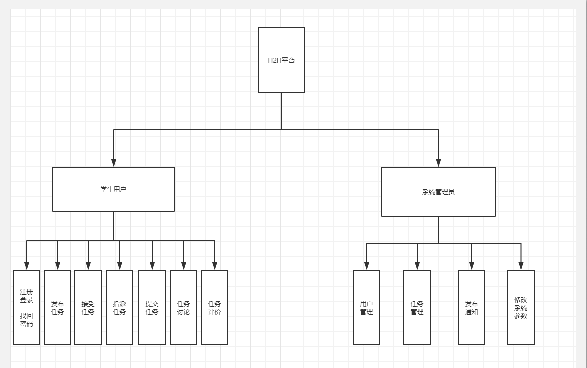

H2H-Doc-SRS-v2.0.0

软件需求规格说明书
==================

**Version： 2.0.0**

>   编写： *陆韬韬，宋昌，李宁生*

>   校对： *李宁生*

>   审核： *宋昌*

>   批准： *卢延悦*

**西北工业大学H2H小组**

>   **2019年7月**

**修订记录**

| **版本号** | **修订时间** | **修订内容**                                           | **提出人**             | **审核人** | **是否通过** |
|------------|--------------|--------------------------------------------------------|------------------------|------------|--------------|
| **V1.0.1** | **7月3日**   | **增加需求**                                           | **宋昌 熊明光 陆韬韬** | **李宁生** | **是**       |
| **V2.0.0** | **7月6日**   | **添加了任务功能流程，添加了消息流程，添加了相应功能** | **李宁生**             | **卢延悦** | **是**       |
|            |              |                                                        |                        |            |              |
|            |              |                                                        |                        |            |              |
|            |              |                                                        |                        |            |              |
|            |              |                                                        |                        |            |              |

1.  **任务增加新属性 热度**

2.  **个人信息页面增添头像**

**需求变更**

1.  **使用jfinal框架，不再部署tomcat服务器，改用jetty-server下部署。同时本次使用了Maven对jar包进行了管理。**

2.  **数据库连接的插件修改为DruidPlugin。**

**审核记录**

| **审核版本号** | **审核时间** | **审核内容**                          | **审核问题**                                                           | **审核人** | **是否通过** |
|----------------|--------------|---------------------------------------|------------------------------------------------------------------------|------------|--------------|
| **v1.0.0**     | **7.2**      | **SRS是否完善**                       | **功能需求不完善**                                                     | **李宁生** | **是**       |
| **V1.0.1**     | **7.3**      | **7.3日增加的需求内容和需求变更内容** | **增加需求的第2项，该需求计划在v2.0版本之后实现。 其余部分进行修改。** | **李宁生** | **是**       |
| **V1.0.1**     | **7.4**      | **7.4日部分用户逻辑功能进行修改**     | **需要进行将部分逻辑功能进行修改**                                     | **李宁生** | **是**       |
| **V1.0.1**     | **7.6**      | **查看是否符合最新需求规格说明**      | **系统结构图需要更新，需求规格说明部分需要更新**                       | **李宁生** | **否**       |
|                |              |                                       |                                                                        |            |              |
|                |              |                                       |                                                                        |            |              |

目录

[一、 范围 3](#_Toc12234_WPSOffice_Level1)

>   [1. 标识 3](#_Toc4495_WPSOffice_Level2)

>   [2. 系统概述 4](#_Toc18190_WPSOffice_Level2)

>   [3. 文档概述 6](#_Toc602_WPSOffice_Level2)

>   [4. 基线 7](#_Toc14478_WPSOffice_Level2)

[二、 引用文件 7](#_Toc11099_WPSOffice_Level1)

[三、 需求 7](#_Toc27048_WPSOffice_Level1)

>   [1. 所需的状态和方式 7](#_Toc9681_WPSOffice_Level2)

>   [2. 需求概述 8](#_Toc6805_WPSOffice_Level2)

>   [3. 需求规格 12](#_Toc21825_WPSOffice_Level2)

>   [4. CSCI能力需求 15](#_Toc23622_WPSOffice_Level2)

>   [5. 保密性和隐私性需求 55](#_Toc23627_WPSOffice_Level2)

>   [6. CSCI环境需求 55](#_Toc11884_WPSOffice_Level2)

>   [7. 性能需求 55](#_Toc19754_WPSOffice_Level2)

>   [8. 计算机资源需求 56](#_Toc20089_WPSOffice_Level2)

>   [9. 软件质量因素 59](#_Toc6946_WPSOffice_Level2)

>   [10. 设计和实现的约束 59](#_Toc18388_WPSOffice_Level2)

>   [11. 数据 59](#_Toc15464_WPSOffice_Level2)

>   [12. 操作 60](#_Toc5793_WPSOffice_Level2)

>   [13. 故障处理 60](#_Toc10315_WPSOffice_Level2)

>   [14. 算法说明 61](#_Toc31171_WPSOffice_Level2)

>   [15. 有关人员需求 61](#_Toc31653_WPSOffice_Level2)

>   [16. 有关后勤需求 62](#_Toc13836_WPSOffice_Level2)

>   [17. 需求的优先次序和关键程度 62](#_Toc7650_WPSOffice_Level2)

[四、 合格性规定 63](#_Toc23468_WPSOffice_Level1)

[五、 需求可追踪性 65](#_Toc21273_WPSOffice_Level1)

[六、 尚未解决的问题 65](#_Toc26722_WPSOffice_Level1)

[七、 注解 65](#_Toc19465_WPSOffice_Level1)

[附录A：词汇表 65](#_Toc13312_WPSOffice_Level1)

1.  **范围**

2.  **标识**

**1.1适用范围**

为了应对高校大学生日常生活遇到生活方面难题，我们小组开发了一个互助平台，用于提供西安高校同学在生活中互相帮助，以提高生活质量，促进学生之间的同窗之情，同时有能切实地解决同辈中遇到类似的生活困扰。具体项目及要求如下：

项目名称： H2H（Help to Help）

软件大体功能：为西安地区高校学生提供互帮平台

软件要求：

1.  硬件要求： 内存：2GM; CPU：Inter Core2 1.80GHz

2.  系统要求： Eclipse5.5以上版本 集成开发工具，MySQL5.0.22数据库和相关windows
    word文档工具。

3.  人员要求：9名在校软件工程大三年级学生，有过软件开发经验和工作经历，熟悉敏捷开发和团队协作。

**1.2术语和缩略语**

| 术语，缩略语 | 解释                 |
|--------------|----------------------|
| H2H          | Helper to Helper平台 |
|              |                      |

1.  **系统概述**

**2.1产品描述**

大学生群体是现今社会上一个非常独特的群体，他们有着多种多样的个性化需求，敢于创新并愿意尝试创新。但是现实发展却束缚了大学生的施展空间，课程紧凑，社团生活密集等现实状况导致大学生时间较少，大学生时间不由自己分配，有事时又要被取快递，排校车琐事烦恼。为了改善这种情况，我们拟搭建一个平台，用于大学生劳动交换，如：在空闲时候帮别人取快递，换取烦忙时别人帮自己取快递的机会……这种利用劳动换取劳动的方式也恰巧迎合了大学生群体无收入来源，不愿付出金钱换取劳动力的心理状态，能够让大学生付出最少的成本，互帮互助的完成更多事情，节约时间和效率，新颖的方式也能更好的吸引大学生的目光，充分实践其乐于助人的一面。

为了迎合大学生群体的需求，更加适应大学生群体，我们创建的平台不收取或极少量的收取信息中介费用，但是中国大学生数量庞大，7000万大学生的存在也让我们设计的平台有更多的流量收入，从而能够获取更大的盈利空间。

当然，大学校园内的群体也不仅仅包括学生，我们的平台终端发展客户群也会逐步完善，从学生覆盖到老师再到学校内的各个组织机构，用新颖的模式来满足大家的个性化需求，提高大学校园内的总体办事效率。

本系统以西安地区的高校为背景，在认真地调研和分析了潜在用户数量和潜在市场规模后，根据学生日常生活中缺少的互帮互助现状，做出了积极的设计方案，进行了平台基础的搭建。在新的管理资源个管理模式上，力争能是工作质量、工作效率得到提高，推动平台的建立。

**2.2软件产品的作用范围**

H2H平台是为西安地区高校在校大学生开发的，用于实现日常的在线互帮互助交流，包括问题提问，代取快递，学业解惑等，为大学生提供更优化的校园服务。

**2.3一般性描述**

本平台可细化为两类使用者：一般用户和系统管理员

一般用户一般指的就是在在校大学生用户，他们通过注册登录进入H2H平台，可以在我们的平台上面发布和接受指定的任务，这些任务可以被所有的平台用户所见，如果有用户对该任务有兴趣，可以在当前任务下方留言进行讨论，获取进一步的任务细节，当确认接受当前任务后，该任务就不在出现平台的任务发布中，但是发布和接受任务的双方可以追踪被接受的任务；任务完成后，发布者可以对接受者的完成情况进行评价，并且给予相应的奖励。奖励的形式是平台内部的积分，积分的获取方式有数种，最基本的就是注册时每个账号会有一个初始的积分，之后每日定时的登录也会获取一定的积分。同时平台还为用户和用户之间开放了私聊的通道，便于一些私人消息的交流。

系统管理员主要是对平台进行维护和保持平台的和谐。他能够对平台上发布的任务进行管理，例如审核，删除，搜索等操作，同时他也能管理一般用户，对于一些蓄意破坏平台的用户进行警告和封禁处理。当平台出现一些重大通知的时候，他也可以发布相关的通知公告。

**2.4系统结构图**

1.  **文档概述**

本文主要描述了H2H平台实现中需要完成的需求。为了保证开发的质量，需求的完整与可追溯性，在该文档中将H2H中所涉及的需求综合列举，并进行系统的处理个管理，细化需求至基本单元，确保可实施性和操作性。

本次H2H平台开发，过程是完全遵循保密协议的，是半封闭的开发环境，9名开发人员都是协议型研发人员，并遵照全权性交付任务。

所有开发成果保留在github上且不公开。

1.  **基线**

系统设计说明书中依据的基线管理为：

| 基线分类  | 需求说明版本 | 系统设计说明版本 |
|-----------|--------------|------------------|
| Baseline1 | 需求说明V2.0 | 设计说明V1.0     |
| Baseline2 | 需求说明V2.0 | 设计说明V2.0     |
| Baseline3 | 需求说明V2.0 | 设计说明V3.0     |

1.  **引用文件**

| 编号               | 标题                   | 修订版本       | 发行日期 |
|--------------------|------------------------|----------------|----------|
| GB/T 8567-1998     | 计算机软件文档编制规范 | GB/T 8567-2006 | 1998     |
| 资料名称           | 出版单位               | 作者           | 发行日期 |
| 《软件工程》       | 高等教育出版社         | 齐志昌 宁洪    | 1998     |
| 《数据库系统概论》 | 高等教育出版社         | 萨师煊 王珊    | 2004     |
| 《软件需求2》      | 清华大学出版社         | 刘伟琴 刘洪涛  | 2004     |

2.  **需求**

3.  **所需的状态和方式**

（1）就绪：可以通过交互进行对系统的操作；

（2）活动：系统通过交互的操作进行相匹配的反应；

（3）紧急情况: 出现异常抛出时未防止进程中断进行自定义抛出；

| （1）注册登录找回密码                 | 就绪、紧急情况 |
|---------------------------------------|----------------|
| （2）发布、接收、指派、提交、验收任务 | 就绪、紧急情况 |
| （3）任务讨论评论                     | 就绪、紧急情况 |
| （4）任务评价                         | 就绪、紧急情况 |
| （5）积分系统                         | 活动、紧急情况 |
| （6）私聊系统                         | 就绪、紧急情况 |
| （7）任务管理(审核、删除、搜索、筛选) | 就绪、紧急情况 |
| （8）用户管理(删除、封号、搜索、筛选) | 就绪、紧急情况 |
| （9）通知公告                         | 活动、紧急情况 |
| （10）热度排行                        | 活动、紧急情况 |

1.  **需求概述**

    1.  **目标**

H2H以“帮你帮我帮大家”为宗旨，即促进大家互相帮助，加强个体之间的联系，促成双赢甚至多赢的局面。为西安地区的高校大学生们打造一个在线互助平台，使用新颖的模式解决的日常生活中遇到的问题，切实地改善当代大学生的生活质量。本系统主要的面向的目标人群是西安地区的高校大学生。

H2H平台在1.0版本中可以实现用户在在平台上的一系列人任务需求，同时还提供了私人聊天功能，在后台的管理员端，通过管理员的用户和任务管理，可以保证平台的稳定和安全性。

目前仍存在的问题有：后台管理员的非24小时在线，积分商城功能还未上线，任务流程处理产生的歧义。

1.  **运行环境**

（1）Microsoft 2003或者以上

1G HZ 或者更高主频的相容CPU

推荐最小内存为2G

至少有500GB可用磁盘空间的硬盘

主机含有网卡

电源:有内置电源以及外置电源，外置电源能够提供突然断电时的时间来保存数据。

计算机资源需求

分以下各条进行描述。

1） 计算机硬件需求

A.服务器端

| 需求设备       | 要求                                                                                                                                                                                                                                                            | 数量 |
|----------------|-----------------------------------------------------------------------------------------------------------------------------------------------------------------------------------------------------------------------------------------------------------------|------|
| CPU            | 采用双核心，标配处理器数量为1，最大处理器数量为2，并支持多线程（SMT）、对称多处理结构（SMP）的CPU，为高速的运算核心准备更多的待处理数据，减少运算核心的闲置时间。二级缓存为500MB以避开内存直接从缓存中调用，从而加快读取速度；2.8GHz的CPU，拥有800MHz的前端总线 | 1    |
| 内存           | 标准容量2GB最大容量50GB支持DDR2                                                                                                                                                                                                                                 | 1    |
| 硬盘           | 采用SCSI，采用高速、稳定、安全的SCSI接口硬盘，且支持热插拔的硬盘，这样就可以在服务器不停机的情况下，拔出或插入一块硬盘，操作系统自动识别硬盘的改动。这种技术对于数据不断更新的服务器来说，是非常必要的，随机容量不低于80GB                                      | 1    |
| 服务器内置电源 | 采用ATX或是SSI作为电源机箱电源，最好带有冗余电源，以增强硬件的可用性。                                                                                                                                                                                          | 1    |
| 服务器外置电源 | 供电环境要求即为较稳定，所以决定采用后备时间达7分钟，允许130%过载、切换时间小于10ms的后备式不间断电源（UPS），起到临时供电作用，防止突然断电而引起的电脑数据丢失。                                                                                              | 1    |

客户端

| 需求设备 | 要求                        | 数量 |
|----------|-----------------------------|------|
| CPU      | CPU\>=1.5GHz                | 1    |
| 内存     | 2GB以上                     | 1    |
| 硬盘     | 500GB以上                   | 1    |
| 键盘鼠标 | 有                          | 1    |
| 灵活性   | 兼容IE，Firefox等主流浏览器 |      |

2）计算机硬件资源使用需求

本系统最大同时支持3台机型同时登陆操作。

3） 计算机软件需求

A.服务器

Windows xp以上操作系统；

产品基于Java开发，要求：JDK1.5及以上，J2EE 1.4

产品支持提供JDBC2.0及以上版本的关系数据库。如Oracle、MS SQL
Server、等，在本系统中使用的数据库为MySQL 。

产品支持提供JSP1.1及以上版本、Servlet2.3及以上版本的所有J2EE机制的Web服务器，如Tomcat、Resin、BEA
WebLogic等，在本系统中使用的Web服务器为jetty-server内嵌服务器，同时将已将服务器端部署到了腾讯云中。

B.客户端

Windows xp以上操作系统

产品基于Java开发，要求：JDK1.5及以上，J2EE 1.4

4）计算机通信需求

使用10Mb/s速率的以太网，遵从其CSMA/CD协议，网络层使用TCP/IP协议。

主机应该集成网卡，不仅可以连接局域网，又可以连接互联网。如果是面向局域网的，需要设定一个网络，在本地网络中设置IP，使得计算机可以指向同一个段，这种情况下，服务器和客户端仅仅是在一个固定的网段中，客户端要访问系统，只需要设置IP即可；如果是面向互联网，服务器必须绑定一定的网络空间，申请域名，通过网络解析，客户端通过网络通信方提供的互联网上网方式，输入系统的网络域名，才可以访问系统。

1.  **用户的特点**

本系统是面向背景的确高校大学生开发的，大学生用户群体都已经掌握了基本的计算机操作能力，网页使用熟练，且对于该类社交平台有使用经验，因此在平台的使用操作方面可以快速的适应。同时西安高校地区的大学生素质有基本的保障，使用人群的素质较高，同时大学生群体对于帮助别人大多持积极的态度，所以平台拓展和推进方面的前景是积极的。

1.  **关键点**

H2H在线互助平台，是一个提供互助服务的在线平台提供商，我们的需要为用户提供便捷的用户体验，在给用户提供便捷的同时还要保证用户个人信息的隐私，在生活服务类平台中，用户隐私的保密是关键问题之一。关键点问题：

（1）对数据库中数据的储存维护，保证数据不泄露、不丢失；

（2）实现用户私聊系统；

（3）数据流动逻辑清晰实现。

（4）任务发布，接受，评价实时，快速化。

（5）多用户并发操作的承载量，服务器网络负荷能力。

1.  **约束条件**

（1）系统用户必须按照操作规范操作系统，出现了系统故障或瘫痪必须马上处理并恢复原有数据。

（2）用户的数据库如果发生了改动，接口发生了变化，硬件产生更替造成不兼容，需及时通知开发人员。

（3）本系统严格按照用户要求开发，在与用户多次交互后完成，用户拥有本系统使用权。

1.  **需求规格**

**3.1软件系统总体功能/对象结构**

**3.2软件子系统功能/对象结构**

>   对于H2H系统来说我们有着俩类用户，其中之一为Admin，其中对于Admin来说，Admin拥有着六大功能：

>   登录功能：Admin可以进行登录操作。

>   任务管理：可以对用户的人物进行一些增删查改功能。

>   系统管理：拥有着一些系统配置管理的能力，以及修改自身密码的能力。

>   用户管理：可以对用户进行一些修改，并拥有者增删改功能。

>   公告管理：日常发布一些公告，可以对之进行修改。

>   个人信息管理：可以对个人一些基本信息进行修改。

用户系统是与H2H平台上日常用户相匹配的。它包括用户注册，登录等进入平台方面，也包含发布任务，接受任务等业务方面，同时个人信息模块也是其中不可或缺的部分。

用户注册：用户通过一个唯一的用户账号和对应的个人密码，注册个人账号到H2H平台。用户注册的同时需要填写一些基本的个人信息，例如手机号码，电子邮箱等，以防之后账号出现危机时及时找回。

用户登录：用户注册完成后，可以使用个人账号登录进入H2H平台，与平台上庞大用户群体进行交互，实现互帮。

用户找回密码：用户忘记自己的密码，或者账号出现被盗风险时候，可以通过该账号绑定的电子邮箱进行密码的找回，当成功进行了邮箱的确认后，便可以重新设置新的登录密码。

用户积分系统：用户在H2H平台上一个重要的素质认定就是积分的高低。同时发布任务需要消耗一定的积分，而成功的帮助他人也会获取相应的积分奖励，积分活的方式是多样，每日登陆可获得指定数量的积分加成，邀请新的用户、完成相应的平台任务也能获得对应积分。积分商城的功能还在计划之中，预计在之后的版本中，积分商城功能也会开启。

用户任务系统：用户任务系统包括：发布任务、接受任务、指派任务、提交任务、验收任务、任务讨论、任务评价。

发布任务：用户需要帮忙时，在平台上发布需要完成的任务内容，所有的在线用户都可以看到这些求助的任务。

接受任务：当某一个用户发布的任务被他人发现后，当发现可以协助求助人解决相应问题时，就可以选择接受当前发布的任务，接受的同时，发布人也会受到自己的发布任务被接受的消息。

指派任务：用户发布一个任务后，当存在多个用户接受任务的情况时，发布者可以自行选择一个接受者，作为任务指派。

提交任务：当某一个用户完成接受的任务之后，点击提交任务，任务发布人会受到提示，从而可以开始对完成的任务进行验证，若验证通过，则当前任务成功完成，任务接受者获得相应的奖励。

验证任务：任务发布者有验证任务的权利。当接受者的任务完成情况符合预期，并得到发布者认可之后，即任务验证成功，否则验证失败，验证失败接受者无法获得相关的奖励。

任务讨论：当一个用户发布一个任务后，该任务底下设置了讨论区，其他的用户可以进一步询问当前任务的信息，而发布者也可以在讨论区中回答提问者的问题，以促成任务被有能力的人接受。

任务评价：当一次任务发布，被接受，被完成之后，任务的发布者可以对背完成的任务进行评价，评价包括对接受者的描述，此次任务发布的体验等等。

私聊系统：H2H平台提供私聊系统，为了避免一些个人隐私暴露，用户和用户之间可以进行一对一的聊天，双方聊天过程中所有的消息都是进行过网络加密，目前使用的加密方式是DES加密，消息在网络中始终是以密文的形式传输的。并且私聊系统是非及时性的。

任务功能逻辑流程图：

消息系统流程图：

用户类逻辑功能结构图：

**3.3描述约定**

| **词语** | **描述**                         |
|----------|----------------------------------|
| H2H平台  | 代表本次开发的大学生在线互帮平台 |
|          |                                  |

1.  **CSCI能力需求**

**4.1用户类CSCI能力**

4.1.1 登陆界面CSCI功能

>   4.1.1.1 登陆

>   （a）说明

>   目的：完成用户登陆，使得使用者成功登入账号

>   技术：通过对输入的账号信息进行判断检查，系统决定是否允许登入

>   背景：这是通常网页检测账户的通用方式之一

>   （b）输入

| 输入源 | 数量    | 度量单位 | 时间设定 | 有效输入范围 |
|--------|---------|----------|----------|--------------|
| 用户名 | 一次1个 | 字符个数 | 无       | 字母与数字   |
| 密码   | 一次1个 | 字符个数 | 无       | 字母与数字   |
| 验证码 | 一次1个 | 字符个数 | 无       | 字母与数字   |

>   （c）处理

| 操作名称   | 受操作影响参数                   | 输出参数            | 参数有效性检查     | 操作方法                           | 异常情况相应 |
|------------|----------------------------------|---------------------|--------------------|------------------------------------|--------------|
| 检查用户名 | 用户名                           | 用户名正误（0/1）   | 符合有效范围即有效 | 判断用户名组成                     | 参数错误     |
| 检查密码   | 密码                             | 密码正误（0/1）     | 符合有效范围即有效 | 判断用户名组成                     | 参数错误     |
| 检查验证码 | 验证码                           | 验证码正误（0/1）   | 符合有效范围即有效 | 判断验证码组成是否匹配             | 参数错误     |
| 判断登陆   | 用户名正误、密码正误、验证码正误 | 是否允许登入（0/1） | 符合有效范围即有效 | 用户名、密码、验证码是否正确并匹配 | 参数错误     |

>   （d）输出

| 输出名称     | 目的地 | 数量    | 度量单位 | 时间关系 | 有效输出范围 | 非法值的处理 | 出错信息 |
|--------------|--------|---------|----------|----------|--------------|--------------|----------|
| 判断登陆结果 | 系统   | 一次1个 | 0或1     | 无       | 0或1         | 提示错误异常 | 输出错误 |

>   4.1.1.2 注册

>   （a）说明

>   目的：完成用户注册，使得使用者成功注册账号

>   技术：通过对输入的账号信息进行判断检查，系统决定是否允许注册

>   背景：这是通常网页注册账户的通用方式之一

>   （b）输入

| 输入源   | 数量    | 度量单位 | 时间设定 | 有效输入范围     |
|----------|---------|----------|----------|------------------|
| 用户名   | 一次1个 | 字符个数 | 无       | 字母与数字       |
| 密码     | 一次1个 | 字符个数 | 无       | 字母与数字       |
| 个人信息 | 一次1组 | 字符个数 | 无       | 字母与数字与汉字 |
| 验证码   | 一次1个 | 字符个数 | 无       | 字母与数字       |

>   （c）处理

| 操作名称     | 受操作影响参数                                 | 输出参数            | 参数有效性检查     | 操作方法                           | 异常情况相应 |
|--------------|------------------------------------------------|---------------------|--------------------|------------------------------------|--------------|
| 检查用户名   | 用户名                                         | 用户名正误（0/1）   | 符合有效范围即有效 | 判断用户名组成                     | 参数错误     |
| 检查密码     | 密码                                           | 密码正误（0/1）     | 符合有效范围即有效 | 判断用户名组成                     | 参数错误     |
| 检查个人信息 | 个人信息                                       | 个人信息正误（0/1） | 符合有效范围即有效 | 判断个人信息是否合法               | 参数错误     |
| 检查验证码   | 验证码                                         | 验证码正误（0/1）   | 符合有效范围即有效 | 判断验证码是否匹配                 | 参数错误     |
| 判断注册     | 用户名正误、密码正误、个人信息正误、验证码正误 | 是否允许注册（0/1） | 符合有效范围即有效 | 用户名、密码、验证码是否正确并匹配 | 参数错误     |

>   （d）输出

| 输出名称     | 目的地 | 数量    | 度量单位 | 时间关系 | 有效输出范围 | 非法值的处理 | 出错信息 |
|--------------|--------|---------|----------|----------|--------------|--------------|----------|
| 判断注册结果 | 系统   | 一次1个 | 0或1     | 无       | 0或1         | 提示错误异常 | 输出错误 |

>   4.1.1.3 找回密码

>   （a）说明

>   目的：完成用户找回密码功能，使得使用者完成找回密码

>   技术：通过对输入的安全信息进行判断检查，系统决定是否允许找回密码

>   背景：这是通常网页账户找回密码的通用方式之一

>   （b）输入

| 输入源   | 数量    | 度量单位 | 时间设定 | 有效输入范围 |
|----------|---------|----------|----------|--------------|
| 安全信息 | 一次1个 | 字符个数 | 无       | 字母与数字   |
| 验证码   | 一次1个 | 字符个数 | 无       | 字母与数字   |

>   （c）处理

| 操作名称         | 受操作影响参数           | 输出参数            | 参数有效性检查     | 操作方法                       | 异常情况相应 |
|------------------|--------------------------|---------------------|--------------------|--------------------------------|--------------|
| 检查安全信息     | 安全信息                 | 安全信息正误（0/1） | 符合有效范围即有效 | 判断安全信息组成               | 参数错误     |
| 检查验证码       | 验证码                   | 验证码正误（0/1）   | 符合有效范围即有效 | 判断验证码组成是否匹配         | 参数错误     |
| 判断是否允许找回 | 安全信息正误、验证码正误 | 是否允许找回（0/1） | 符合有效范围即有效 | 安全信息、验证码是否正确并匹配 | 参数错误     |

>   （d）输出

| 输出名称     | 目的地 | 数量    | 度量单位 | 时间关系 | 有效输出范围 | 非法值的处理 | 出错信息 |
|--------------|--------|---------|----------|----------|--------------|--------------|----------|
| 判断找回结果 | 系统   | 一次1个 | 0或1     | 无       | 0或1         | 提示错误异常 | 输出错误 |

>   4.1.1.4 每日首次登陆加积分

>   （a）说明

>   目的：通过判断是否成功登入来给予用户积分的增加

>   技术：通过对输入的账号是否登入进行判断检查，成功登入后增加积分

>   背景：通过登陆增加积分，是用户增加积分的最基本方式

>   （b）输入

| 输入源       | 数量    | 度量单位 | 时间设定 | 有效输入范围 |
|--------------|---------|----------|----------|--------------|
| 判断登陆结果 | 一次1个 | 0或1     | 无       | 0或1         |

>   （c）处理

| 操作名称     | 受操作影响参数 | 输出参数 | 参数有效性检查     | 操作方法                                  | 异常情况相应 |
|--------------|----------------|----------|--------------------|-------------------------------------------|--------------|
| 检查登陆结果 | 判断登陆结果   | 用户积分 | 符合有效范围即有效 | 判断登陆结果，如果为1，则增加用户积分10分 | 参数错误     |

>   （d）输出

| 输出名称 | 目的地       | 数量    | 度量单位 | 时间关系 | 有效输出范围 | 非法值的处理 | 出错信息 |
|----------|--------------|---------|----------|----------|--------------|--------------|----------|
| 用户积分 | 用户积分参数 | 一次1个 | 数字     | 无       | 数字         | 提示错误异常 | 输出错误 |

4.1.2 首页CSCI能力

4.1.2.1 任务列表筛选搜索功能

>   （a）说明

>   目的：完成任务列表的筛选搜索功能，使得使用者能够筛选搜索任务

>   技术：通过对列表的任务信息进行操作，实现筛选搜索任务

>   背景：这是通常网页列表中通用的功能之一

>   （b）输入

| 输入源       | 数量    | 度量单位       | 时间设定 | 有效输入范围     |
|--------------|---------|----------------|----------|------------------|
| 任务列表信息 | 一次1组 | 行数、字符个数 | 无       | 字母与数字与汉字 |
| 搜索信息     | 一次1个 | 字符个数       | 无       | 字母与数字与汉字 |

>   （c）处理

| 操作名称     | 受操作影响参数         | 输出参数         | 参数有效性检查     | 操作方法                                 | 异常情况相应 |
|--------------|------------------------|------------------|--------------------|------------------------------------------|--------------|
| 检索任务列表 | 任务列表信息、搜索信息 | 符合要求的任务行 | 符合有效范围即有效 | 检测列表每一行，如果与搜索信息匹配标记行 | 参数错误     |
| 输出标记行   | 符合要求的任务行       | 符合要求的任务行 | 符合有效范围即有效 | 将被标记的任务行输出                     | 参数错误     |

>   （d）输出

| 输出名称         | 目的地   | 数量     | 度量单位       | 时间关系 | 有效输出范围 | 非法值的处理 | 出错信息 |
|------------------|----------|----------|----------------|----------|--------------|--------------|----------|
| 符合要求的任务行 | 任务列表 | 一次多行 | 行数、字符个数 | 无       | 多行的字符   | 提示错误异常 | 输出错误 |

4.1.2.2 发布任务

>   （a）说明

>   目的：通过输入发布任务的信息来在网页上发布新的任务

>   技术：通过对发布任务信息判断，确认后在网页上发布新的任务

>   背景：发布任务是该项目平台基本的功能之一

>   （b）输入

| 输入源   | 数量    | 度量单位     | 时间设定 | 有效输入范围 |
|----------|---------|--------------|----------|--------------|
| 任务信息 | 一次1组 | 信息行与字符 | 无       | 多行字符     |

>   （c）处理

| 操作名称         | 受操作影响参数 | 输出参数     | 参数有效性检查     | 操作方法                 | 异常情况相应 |
|------------------|----------------|--------------|--------------------|--------------------------|--------------|
| 检查任务信息正误 | 任务信息       | 是否同意发布 | 符合有效范围即有效 | 判断任务信息是否符合规范 | 参数错误     |

>   （d）输出

| 输出名称            | 目的地 | 数量    | 度量单位 | 时间关系 | 有效输出范围 | 非法值的处理 | 出错信息 |
|---------------------|--------|---------|----------|----------|--------------|--------------|----------|
| 是否同意发布（0/1） | 系统   | 一次1个 | 数字     | 无       | 数字         | 提示错误异常 | 输出错误 |

4.1.2.3 公告窗口显示公告

>   （a）说明

>   目的：通过获取数据库的公告信息，同时将信息显示到网页公告窗口

>   技术：获取数据库技术、网页显示技术

>   背景：该项目需要一个公告窗口能够供使用者查看公告

>   （b）输入

| 输入源   | 数量     | 度量单位           | 时间设定 | 有效输入范围 |
|----------|----------|--------------------|----------|--------------|
| 公告信息 | 一次多个 | 字符个数或图片个数 | 无       | 字符或图片   |

>   （c）处理

| 操作名称                       | 受操作影响参数 | 输出参数        | 参数有效性检查     | 操作方法                         | 异常情况相应 |
|--------------------------------|----------------|-----------------|--------------------|----------------------------------|--------------|
| 判断获取的公告信息是否符合规范 | 公告信息       | 是否显示（0/1） | 符合有效范围即有效 | 判断公告信心，如果符合则确认显示 | 参数错误     |

>   （d）输出

| 输出名称     | 目的地   | 数量    | 度量单位 | 时间关系 | 有效输出范围 | 非法值的处理 | 出错信息 |
|--------------|----------|---------|----------|----------|--------------|--------------|----------|
| 是否显示公告 | 公告列表 | 一次1个 | 数字     | 无       | 数字         | 提示错误异常 | 输出错误 |

4.1.2.4 显示未读消息数目

>   （a）说明

>   目的：通过检索消息信息来统计用户未读消息数量并显示

>   技术：通过对数据库消息条目进行检索，来找出用户离线时错过的消息数量并显示

>   背景：该技术通过统计计算数据库实现，是普通的页面应有的基础功能之一

>   （b）输入

| 输入源       | 数量    | 度量单位         | 时间设定 | 有效输入范围 |
|--------------|---------|------------------|----------|--------------|
| 消息信息列表 | 一次1组 | 信息行与字符个数 | 无       | 多行字符     |

>   （c）处理

| 操作名称       | 受操作影响参数 | 输出参数           | 参数有效性检查     | 操作方法                                                       | 异常情况相应 |
|----------------|----------------|--------------------|--------------------|----------------------------------------------------------------|--------------|
| 检索任务信息行 | 任务信息列表   | 未读的任务信息行数 | 符合有效范围即有效 | 检索遍历任务信息列表，遇到未查看过的任务信息行进行标记并且统计 | 参数错误     |

>   （d）输出

| 输出名称         | 目的地       | 数量    | 度量单位 | 时间关系 | 有效输出范围 | 非法值的处理 | 出错信息 |
|------------------|--------------|---------|----------|----------|--------------|--------------|----------|
| 未读的任务信息行 | 未读信息变量 | 一次1个 | 数字     | 无       | 数字         | 提示错误异常 | 输出错误 |

4.1.2.5 显示我的信息

>   （a）说明

>   目的：通过数据库获得用户信息并显示

>   技术：通过数据库获得用户信息，显示用户信息

>   背景：显示用户信息是一个网页的基础功能之一

>   （b）输入

| 输入源   | 数量    | 度量单位 | 时间设定 | 有效输入范围       |
|----------|---------|----------|----------|--------------------|
| 用户ID   | 一次1个 | 数字个数 | 无       | 一定长度的数字串   |
| 用户列表 | 一次1组 | 行       | 无       | 多行数据库用户信息 |

>   （c）处理

| 操作名称                       | 受操作影响参数   | 输出参数         | 参数有效性检查     | 操作方法                                             | 异常情况相应 |
|--------------------------------|------------------|------------------|--------------------|------------------------------------------------------|--------------|
| 检索数据库找出相应ID的用户信息 | 用户列表、用户ID | 相应用户数据信息 | 符合有效范围即有效 | 检索用户列表找出对应ID的用户数据行，将该行显示于网页 | 参数错误     |

>   （d）输出

| 输出名称         | 目的地       | 数量    | 度量单位 | 时间关系 | 有效输出范围       | 非法值的处理 | 出错信息 |
|------------------|--------------|---------|----------|----------|--------------------|--------------|----------|
| 相应用户数据信息 | 用户信息页面 | 一次1组 | 字符个数 | 无       | 一组多个字符串数据 | 提示错误异常 | 输出错误 |

4.1.3 私信页面显示列表消息

>   （a）说明

>   目的：通过检索消息信息来显示所有消息

>   技术：通过对数据库消息条目进行检索并检查有效性，将其显示

>   背景：该技术通过数据库检索实现，是网页基本功能之一

>   （b）输入

| 输入源       | 数量    | 度量单位         | 时间设定 | 有效输入范围 |
|--------------|---------|------------------|----------|--------------|
| 消息信息列表 | 一次1组 | 信息行与字符个数 | 无       | 多行字符     |

>   （c）处理

| 操作名称       | 受操作影响参数 | 输出参数           | 参数有效性检查     | 操作方法                                         | 异常情况相应 |
|----------------|----------------|--------------------|--------------------|--------------------------------------------------|--------------|
| 检索消息信息行 | 消息信息列表   | 有效的消息信息列表 | 符合有效范围即有效 | 检索遍历消息信息列表，如果符合有效性，则将其显示 | 参数错误     |

>   （d）输出

| 输出名称           | 目的地           | 数量    | 度量单位 | 时间关系 | 有效输出范围 | 非法值的处理 | 出错信息 |
|--------------------|------------------|---------|----------|----------|--------------|--------------|----------|
| 有效的消息信息列表 | 消息信息列表页面 | 一次1组 | 字符个数 | 无       | 多行字符串   | 提示错误异常 | 输出错误 |

4.1.4 个人信息界面CSCI功能

4.1.4.1 显示信息

（a）说明

>   目的：显示当前登录用户的个人信息

>   技术：根据登录账户在数据库中搜索对应的个人信息，并显示在界面上

>   背景：这是用户了解当前账户信息的最常用的方式

（b）输入

| 输入源       | 数量    | 度量单位 | 时间设定 | 有效输入范围   |
|--------------|---------|----------|----------|----------------|
| 当前用户账户 | 一次1个 | 字符个数 | 无       | 字母数字与汉字 |

>   （c）处理

| 操作名称     | 受操作影响参数                                                               | 输出参数                                                                     | 参数有效性检查             | 操作方法                           | 异常情况相应               |
|--------------|------------------------------------------------------------------------------|------------------------------------------------------------------------------|----------------------------|------------------------------------|----------------------------|
| 搜索个人信息 | 信誉度、积分、头像、联系方式、学号、姓名、发布任务数、完成任务数、放弃任务数 | 信誉度、积分、头像、联系方式、学号、姓名、发布任务数、完成任务数、放弃任务数 | 不为空且符合有效范围即有效 | 在数据库中根据当前账户搜索个人信息 | 输出参数错误、当前账户为空 |

>   （d）输出

| 输出名称 | 目的地       | 数量        | 度量单位 | 时间关系 | 有效输出范围 | 非法值的处理 | 出错信息 |
|----------|--------------|-------------|----------|----------|--------------|--------------|----------|
| 个人信息 | 个人信息界面 | 一次1组数据 | 字符个数 | 无       | 多行字符     | 提示错误异常 | 输出错误 |

4.1.4.2 修改密码

>   （a）说明

>   目的：修改当前用户的登录密码，使用户的账户安全性提高

>   技术：对输入的安全信息进行检查，如果成功将数据库当前账户中存储的密码信息替换为用户输入的新密码

>   背景：这是用户保护自己账户的一种方式

（b）输入

| 输入源   | 数量    | 度量单位 | 时间设定 | 有效输入范围 |
|----------|---------|----------|----------|--------------|
| 安全信息 | 一次1个 | 字符个数 | 无       | 字母与数字   |
| 新密码   | 一次1个 | 字符个数 | 无       | 字母和数字   |

>   （c）处理

| 操作名称             | 受操作影响参数 | 输出参数                | 参数有效性检查     | 操作方法                         | 异常情况相应 |
|----------------------|----------------|-------------------------|--------------------|----------------------------------|--------------|
| 检查安全信息         | 安全信息       | 安全信息正误（0/1）     | 符合有效范围即有效 | 判断安全信息组成                 | 参数错误     |
| 判断是否允许修改密码 | 安全信息正误   | 是否允许修改密码（0/1） | 符合有效范围即有效 | 安全信息是否正确并匹配           | 参数错误     |
| 修改密码             | 密码           | 修改是否成功（0/1）     | 符合有效范围即有效 | 判断新密码的有效性并替换入数据库 | 参数错误     |

>   （d）输出

| 输出名称 | 目的地             | 数量    | 度量单位 | 时间关系 | 有效输出范围 | 非法值的处理 | 出错信息 |
|----------|--------------------|---------|----------|----------|--------------|--------------|----------|
| 登录密码 | 数据库登录密码啊项 | 一次1个 | 字符个数 | 无       | 数字和字母   | 提示错误异常 | 输出错误 |

**4.2 管理员类CSCI能力**

>   Admin：

>   4.2.1 登录功能CSCI

>   4.2.2.1 管理员登录

1.  说明

>   目的：用户可以通过指定页面进行登录操作

>   技术：将用户输入的表单数据与数据库中数据进行比对

>   背景：是用户进行登录的最初页面

>   （b）输入

| 输入源 | 数量    | 度量单位 | 时间设定 | 有效输入范围           |
|--------|---------|----------|----------|------------------------|
| 账号   | 一次1个 | 字符个数 | 无       | 字母数字与汉字         |
| 密码   | 一次1个 | 字符个数 | 无       | 字母、数字、汉字和符号 |

>   （c）处理

| 操作名称   | 受操作影响参数 | 输出参数                                         | 参数有效性检查   | 操作方法                                           | 异常情况相应                 |
|------------|----------------|--------------------------------------------------|------------------|----------------------------------------------------|------------------------------|
| 比对数据库 | 是否弹窗       | 不存在用户，弹出用户不存在，密码错误弹出密码错误 | 检查账号以及密码 | 根据任务编号查询任务数据库，将账号以及存储到对应项 | 输出参数错误、搜索数据库错误 |

>   （d）输出

| 输出名称 | 目的地 | 数量    | 度量单位 | 时间关系 | 有效输出范围 | 非法值的处理 | 出错信息 |
|----------|--------|---------|----------|----------|--------------|--------------|----------|
| 登录结果 | 主页面 | 一次1个 | 0或1     | 无       | 0或1         | 提示错误异常 | 输出错误 |

>   4.2.2 管理员找回密码

>   （a）说明

>   目的：管理员登录是忘记密码可以找回密码

>   技术：先进行发送邮箱验证，验证成功之后进行修改密码操作

>   背景：是用户忘记自己密码之后进行的操作

>   （b）输入

| 输入源 | 数量    | 度量单位 | 时间设定 | 有效输入范围           |
|--------|---------|----------|----------|------------------------|
| 邮箱   | 一次1个 | 字符个数 | 无       | 字母数字与汉字         |
| 密码   | 一次2个 | 字符个数 | 无       | 字母、数字、汉字和符号 |

>   （c）处理

| 操作名称   | 受操作影响参数 | 输出参数                                         | 参数有效性检查   | 操作方法                                           | 异常情况相应                 |
|------------|----------------|--------------------------------------------------|------------------|----------------------------------------------------|------------------------------|
| 比对数据库 | 是否弹窗       | 不存在用户，弹出用户不存在，密码错误弹出密码错误 | 检查账号以及密码 | 根据任务编号查询任务数据库，将账号以及存储到对应项 | 输出参数错误、搜索数据库错误 |

>   （d）输出

| 输出名称 | 目的地   | 数量    | 度量单位 | 时间关系 | 有效输出范围 | 非法值的处理 | 出错信息 |
|----------|----------|---------|----------|----------|--------------|--------------|----------|
| 修改成功 | 登录页面 | 一次1个 | 0或1     | 无       | 0或1         | 提示错误异常 | 输出错误 |

>   4.2.3 管理员重置密码

>   （a）说明

>   目的：用户可以进行重置自己的密码

>   技术：将用户输入的密码存入数据库中

>   背景：是用户进行登录的最初页面

>   （b）输入

| 输入源 | 数量    | 度量单位 | 时间设定 | 有效输入范围           |
|--------|---------|----------|----------|------------------------|
| 密码   | 一次2个 | 字符个数 | 无       | 字母、数字、汉字和符号 |

>   （c）处理

| 操作名称   | 受操作影响参数 | 输出参数                                         | 参数有效性检查   | 操作方法                                           | 异常情况相应                 |
|------------|----------------|--------------------------------------------------|------------------|----------------------------------------------------|------------------------------|
| 比对数据库 | 是否弹窗       | 不存在用户，弹出用户不存在，密码错误弹出密码错误 | 检查账号以及密码 | 根据任务编号查询任务数据库，将账号以及存储到对应项 | 输出参数错误、搜索数据库错误 |

>   （d）输出

| 输出名称 | 目的地   | 数量    | 度量单位 | 时间关系 | 有效输出范围 | 非法值的处理 | 出错信息 |
|----------|----------|---------|----------|----------|--------------|--------------|----------|
| 修改成功 | 登录页面 | 一次1个 | 0或1     | 无       | 0或1         | 提示错误异常 | 输出错误 |

>   4.2.4 系统管理

>   4.2.4.1 管理员修改每日登录奖励

>   （a）说明

>   目的：修改用户每日登录奖励积分数值

>   技术：是将系统配置数据库中的数值进行修改

>   背景：是改变，衡量积分价值的改变途径

>   （b）输入

| 输入源   | 数量    | 度量单位 | 时间设定 | 有效输入范围 |
|----------|---------|----------|----------|--------------|
| 修改数值 | 一次1个 | 字符个数 | 无       | 数字         |

>   （c）处理

| 操作名称           | 受操作影响参数               | 输出参数     | 参数有效性检查 | 操作方法                                           | 异常情况相应   |
|--------------------|------------------------------|--------------|----------------|----------------------------------------------------|----------------|
| 进行数据库更新操作 | 用户每日登录奖励数值进行变化 | 是否修改成功 | 无             | 将分值数值利用数据库更新函数，将数值更新在数据库中 | 数据库搜索异常 |

>   （d）输出

| 输出名称 | 目的地         | 数量    | 度量单位 | 时间关系 | 有效输出范围 | 非法值的处理 | 出错信息 |
|----------|----------------|---------|----------|----------|--------------|--------------|----------|
| 修改成功 | 数据库更新成功 | 一次1个 | 0或1     | 无       | 0或1         | 提示错误异常 | 输出错误 |

>   4.2.5 用户管理

>   4.2.5.1 用户删除

1.  说明

>   目的：对用户进行删除操作

>   技术：对用户的状态进行修改，进行删除操作

>   背景：是对用户进行的一种操作，防止一些用户进行恶意操作

>   （b）输入

| 输入源 | 数量    | 度量单位 | 时间设定 | 有效输入范围     |
|--------|---------|----------|----------|------------------|
| 用户ID | 一次1个 | 字符个数 | 无       | 字母、数字、符号 |

>   （c）处理

| 操作名称                           | 受操作影响参数             | 输出参数                         | 参数有效性检查            | 操作方法                                              | 异常情况相应                 |
|------------------------------------|----------------------------|----------------------------------|---------------------------|-------------------------------------------------------|------------------------------|
| 比对用户ID，对用户进行状态进行改变 | 删除的用户无法进行登录操作 | 用户无法进行登录等正常用户的操作 | 检查用户是否能够 进行登录 | 进入相应 的数据库，查找相应的用户对用户的状态进行修改 | 输出参数错误、搜索数据库错误 |

>   （d）输出

| 输出名称 | 目的地       | 数量    | 度量单位 | 时间关系 | 有效输出范围 | 非法值的处理 | 出错信息 |
|----------|--------------|---------|----------|----------|--------------|--------------|----------|
| 删除成功 | 删除成功页面 | 一次1个 | 0或1     | 无       | 0或1         | 提示错误异常 | 输出错误 |

>   4.2.5.2 用户封号

>   （a）说明

>   目的：对用户进行封号7天操作

>   技术：对用户的状态进行修改，进行封号操作

>   背景：是对用户进行的一种操作，防止一些用户进行恶意操作

>   （b）输入

| 输入源 | 数量    | 度量单位 | 时间设定 | 有效输入范围     |
|--------|---------|----------|----------|------------------|
| 用户ID | 一次1个 | 字符个数 | 无       | 字母、数字、符号 |

>   （c）处理

| 操作名称                           | 受操作影响参数             | 输出参数                         | 参数有效性检查            | 操作方法                                              | 异常情况相应                 |
|------------------------------------|----------------------------|----------------------------------|---------------------------|-------------------------------------------------------|------------------------------|
| 比对用户ID，对用户进行状态进行改变 | 封号的用户无法进行登录操作 | 用户无法进行登录等正常用户的操作 | 检查用户是否能够 进行登录 | 进入相应 的数据库，查找相应的用户对用户的状态进行修改 | 输出参数错误、搜索数据库错误 |

>   （d）输出

| 输出名称 | 目的地       | 数量    | 度量单位 | 时间关系 | 有效输出范围 | 非法值的处理 | 出错信息 |
|----------|--------------|---------|----------|----------|--------------|--------------|----------|
| 修改成功 | 封号成功页面 | 一次1个 | 0或1     | 无       | 0或1         | 提示错误异常 | 输出错误 |

>   4.2.5.3 用户筛选

>   （a）说明

>   目的：对用户进行筛选查看功能

>   技术：对用户的属性项目进行排序查看

>   背景：是方便管理员进行查看用户的一种操作

>   （b）输入

| 输入源   | 数量    | 度量单位 | 时间设定 | 有效输入范围     |
|----------|---------|----------|----------|------------------|
| 用户属性 | 一次1个 | 字符个数 | 无       | 字母、数字、符号 |

>   （c）处理

| 操作名称                                         | 受操作影响参数                 | 输出参数                 | 参数有效性检查             | 操作方法                                          | 异常情况相应                 |
|--------------------------------------------------|--------------------------------|--------------------------|----------------------------|---------------------------------------------------|------------------------------|
| 检查要检索的用户属性，进行查找相应的属性进行展示 | 用户显示数量，显示次序发生改变 | 根据检索内容进行显示用户 | 是否显示出正确的用户属性值 | 查找相对应的用户属性 ，将相对应的用户属性进行展示 | 输出参数错误、搜索数据库错误 |

>   （d）输出

| 输出名称 | 目的地   | 数量    | 度量单位 | 时间关系 | 有效输出范围 | 非法值的处理 | 出错信息 |
|----------|----------|---------|----------|----------|--------------|--------------|----------|
| 筛选成功 | 显示筛选 | 一次1个 | 0或1     | 无       | 0或1         | 提示错误异常 | 输出错误 |

>   4.2.6 用户积分修改

>   （a）说明

>   目的：对用户的积分进行修改操作

>   技术：是对用户的积分进行修改，从而修改数据库数据项

>   背景：是方便管理员可以进行收钱操作

>   （b）输入

| 输入源   | 数量    | 度量单位 | 时间设定 | 有效输入范围 |
|----------|---------|----------|----------|--------------|
| 积分数值 | 一次1个 | 字符个数 | 无       | 数字         |

>   （c）处理

| 操作名称                               | 受操作影响参数     | 输出参数                 | 参数有效性检查             | 操作方法                                          | 异常情况相应                 |
|----------------------------------------|--------------------|--------------------------|----------------------------|---------------------------------------------------|------------------------------|
| 将修改的数值进行提交就可以修改永辉积分 | 用户的积分受到改变 | 显示的用户积分发生了改变 | 是否显示出正确的用户属性值 | 查找相对应的用户属性 ，将相对应的用户属性进行展示 | 输出参数错误、搜索数据库错误 |

>   （d）输出

| 输出名称 | 目的地       | 数量    | 度量单位 | 时间关系 | 有效输出范围 | 非法值的处理 | 出错信息 |
|----------|--------------|---------|----------|----------|--------------|--------------|----------|
| 修改成功 | 修改成功页面 | 一次1个 | 0或1     | 无       | 0或1         | 提示错误异常 | 输出错误 |

>   4.2.7 任务管理

>   4.2.7.1 审核任务

>   （a）说明

>   目的：是对用户发送过来的申请的任务进行审核操作

>   技术：是对用户带审核的任务进行状态修改

>   背景：是保证用户发送过来的任务都是较为合理的

>   （b）输入

| 输入源   | 数量    | 度量单位 | 时间设定 | 有效输入范围 |
|----------|---------|----------|----------|--------------|
| 审核状态 | 一次1个 | 字符个数 | 无       | 按钮         |

>   （c）处理

| 操作名称                                          | 受操作影响参数                                                                       | 输出参数 | 参数有效性检查                                   | 操作方法                                         | 异常情况相应                 |
|---------------------------------------------------|--------------------------------------------------------------------------------------|----------|--------------------------------------------------|--------------------------------------------------|------------------------------|
| 将用户的任务的进行审核，审核通过，以及审核 不通过 | 审核通过，所有用户都可以进行接收这个任务，审核未通过，所有的用户都是不氪金这个任务的 | 审核状态 | 在任务列表中可以进行查看用户的状态是否进行了修改 | 对用户的审核状态进行修改，间接修改数据库中的内容 | 输出参数错误、搜索数据库错误 |

>   （d）输出

| 输出名称 | 目的地   | 数量    | 度量单位 | 时间关系 | 有效输出范围 | 非法值的处理 | 出错信息 |
|----------|----------|---------|----------|----------|--------------|--------------|----------|
| 修改成功 | 审核通过 | 一次1个 | 0或1     | 无       | 0或1         | 提示错误异常 | 输出错误 |

>   4.2.7.2 删除任务

>   （a）说明

>   目的：对用户的任务进行删除

>   技术：是对用户任务的状态进行修改

>   背景：是方便管理员发现某些任务意外过审进行的操作

>   （b）输入

| 输入源   | 数量    | 度量单位 | 时间设定 | 有效输入范围 |
|----------|---------|----------|----------|--------------|
| 任务的ID | 一次1个 | 字符个数 | 无       | 数字         |

>   （c）处理

| 操作名称           | 受操作影响参数                                   | 输出参数           | 参数有效性检查       | 操作方法                             | 异常情况相应                 |
|--------------------|--------------------------------------------------|--------------------|----------------------|--------------------------------------|------------------------------|
| 将任务进行删除操作 | 收到删除的任务，用户是不可见，以及无法进行接收的 | 用户无法查看该任务 | 检查状态是否修改成功 | 查找相应的任务，对任务的状态进行修改 | 输出参数错误、搜索数据库错误 |

>   （d）输出

| 输出名称 | 目的地   | 数量    | 度量单位 | 时间关系 | 有效输出范围 | 非法值的处理 | 出错信息 |
|----------|----------|---------|----------|----------|--------------|--------------|----------|
| 修改成功 | 删除成功 | 一次1个 | 0或1     | 无       | 0或1         | 提示错误异常 | 输出错误 |

>   4.2.7.3 搜索任务

>   （a）说明

>   目的：对任务进行搜索操作

>   技术：采用模糊查找的方式对用户进行查找操作

>   背景：是方便管理员检索某一用户的操作

>   （b）输入

| 输入源   | 数量    | 度量单位 | 时间设定 | 有效输入范围     |
|----------|---------|----------|----------|------------------|
| 查找内容 | 一次1个 | 字符个数 | 无       | 数字，字符，字母 |

>   （c）处理

| 操作名称 | 受操作影响参数 | 输出参数       | 参数有效性检查       | 操作方法               | 异常情况相应                 |
|----------|----------------|----------------|----------------------|------------------------|------------------------------|
| 模糊查找 | 用户的属性     | 显示查找的内容 | 是否显示出正确的用户 | 进行数据库模糊查找操作 | 输出参数错误、搜索数据库错误 |

>   （d）输出

| 输出名称 | 目的地       | 数量    | 度量单位 | 时间关系 | 有效输出范围 | 非法值的处理 | 出错信息 |
|----------|--------------|---------|----------|----------|--------------|--------------|----------|
| 修改成功 | 搜索成功页面 | 一次1个 | 0或1     | 无       | 0或1         | 提示错误异常 | 输出错误 |

>   4.2.7.4 筛选任务

>   （a）说明

>   目的：对任务进行筛选操作

>   技术：采用模糊查找的方式对任务进行查找操作

>   背景：是方便管理员筛选出任务的操作

>   （b）输入

| 输入源       | 数量    | 度量单位 | 时间设定 | 有效输入范围     |
|--------------|---------|----------|----------|------------------|
| 满足的属性项 | 一次1个 | 字符个数 | 无       | 数字，字符，字母 |

>   （c）处理

| 操作名称 | 受操作影响参数 | 输出参数               | 参数有效性检查           | 操作方法                           | 异常情况相应                 |
|----------|----------------|------------------------|--------------------------|------------------------------------|------------------------------|
| 模糊查找 | 显示的任务列表 | 显示出正确要筛选的内容 | 是否显示出正确的筛选内容 | 对数据库进行关键词匹配操作进行修改 | 输出参数错误、搜索数据库错误 |

>   （d）输出

| 输出名称 | 目的地       | 数量    | 度量单位 | 时间关系 | 有效输出范围 | 非法值的处理 | 出错信息 |
|----------|--------------|---------|----------|----------|--------------|--------------|----------|
| 修改成功 | 筛选成功页面 | 一次1个 | 0或1     | 无       | 0或1         | 提示错误异常 | 输出错误 |

>   （d）输出

| 输出名称 | 目的地       | 数量    | 度量单位 | 时间关系 | 有效输出范围 | 非法值的处理 | 出错信息 |
|----------|--------------|---------|----------|----------|--------------|--------------|----------|
| 修改成功 | 筛选成功页面 | 一次1个 | 0或1     | 无       | 0或1         | 提示错误异常 | 输出错误 |

>   4.2.8 公告管理

>   4.2.8.1 发布公告

>   （a）说明

>   目的：对公告进行发布操作

>   技术：对数据库进行插入操作对公告进行插入

>   背景：是方便管理员发布一些通知

>   （b）输入

| 输入源   | 数量    | 度量单位 | 时间设定 | 有效输入范围     |
|----------|---------|----------|----------|------------------|
| 公告标题 | 一次1个 | 字符个数 | 无       | 数字，字符，字母 |
| 公告内容 | 一次1个 | 字符个数 | 无       | 数字，字符，字母 |
| 公告时间 | 一次1个 | 字符个数 | 无       | 日期             |

>   （c）处理

| 操作名称 | 受操作影响参数     | 输出参数                       | 参数有效性检查       | 操作方法                 | 异常情况相应                 |
|----------|--------------------|--------------------------------|----------------------|--------------------------|------------------------------|
| 添加公告 | 用户主页显示出公告 | 用户主页显示现在正在进行的公告 | 是否显示出发布的公告 | 对公告数据库进行插入操作 | 输出参数错误、搜索数据库错误 |

>   （d）输出

| 输出名称 | 目的地   | 数量    | 度量单位 | 时间关系 | 有效输出范围 | 非法值的处理 | 出错信息 |
|----------|----------|---------|----------|----------|--------------|--------------|----------|
| 修改成功 | 发布成功 | 一次1个 | 0或1     | 无       | 0或1         | 提示错误异常 | 输出错误 |

>   4.2.8.2 删除公告

>   （a）说明

>   目的：对公告进行删除操作

>   技术：对数据库进行删除操作对公告进行删除

>   背景：是方便管理员发布一些通知

>   （b）输入

| 输入源 | 数量    | 度量单位 | 时间设定 | 有效输入范围     |
|--------|---------|----------|----------|------------------|
| 公告Id | 一次1个 | 字符个数 | 无       | 数字，字符，字母 |

>   （c）处理

| 操作名称 | 受操作影响参数     | 输出参数                       | 参数有效性检查       | 操作方法                 | 异常情况相应                 |
|----------|--------------------|--------------------------------|----------------------|--------------------------|------------------------------|
| 删除公告 | 用户主页显示出公告 | 用户主页显示现在正在进行的公告 | 是否显示出发布的公告 | 对公告数据库进行删除操作 | 输出参数错误、搜索数据库错误 |

>   （d）输出

| 输出名称 | 目的地   | 数量    | 度量单位 | 时间关系 | 有效输出范围 | 非法值的处理 | 出错信息 |
|----------|----------|---------|----------|----------|--------------|--------------|----------|
| 修改成功 | 删除成功 | 一次1个 | 0或1     | 无       | 0或1         | 提示错误异常 | 输出错误 |

>   4.2.8.3 修改公告

>   （a）说明

>   目的：对公告进行修改操作

>   技术：对数据库进行修改操作对公告进行修改

>   背景：是方便管理员发布一些通知

>   （b）输入

| 输入源   | 数量    | 度量单位 | 时间设定 | 有效输入范围     |
|----------|---------|----------|----------|------------------|
| 公告标题 | 一次1个 | 字符个数 | 无       | 数字，字符，字母 |
| 公告内容 | 一次1个 | 字符个数 | 无       | 数字，字符，字母 |
| 公告时间 | 一次1个 | 字符个数 | 无       | 日期             |

>   （c）处理

| 操作名称 | 受操作影响参数     | 输出参数                       | 参数有效性检查       | 操作方法                 | 异常情况相应                 |
|----------|--------------------|--------------------------------|----------------------|--------------------------|------------------------------|
| 修改公告 | 用户主页显示出公告 | 用户主页显示现在正在进行的公告 | 是否显示出发布的公告 | 对公告数据库进行修改操作 | 输出参数错误、搜索数据库错误 |

>   （d）输出

| 输出名称 | 目的地   | 数量    | 度量单位 | 时间关系 | 有效输出范围 | 非法值的处理 | 出错信息 |
|----------|----------|---------|----------|----------|--------------|--------------|----------|
| 修改成功 | 修改成功 | 一次1个 | 0或1     | 无       | 0或1         | 提示错误异常 | 输出错误 |

>   4.2.8.4 查看公告

>   （a）说明

>   目的：对公告进行查看操作

>   技术：便利数据库中的公告内容

>   背景：是方便管理员查看一些公告内容

>   （b）输入

| 输入源   | 数量    | 度量单位 | 时间设定 | 有效输入范围     |
|----------|---------|----------|----------|------------------|
| 查看属性 | 一次1个 | 字符个数 | 无       | 数字，字符，字母 |

>   （c）处理

| 操作名称 | 受操作影响参数     | 输出参数                   | 参数有效性检查       | 操作方法             | 异常情况相应                 |
|----------|--------------------|----------------------------|----------------------|----------------------|------------------------------|
| 查看公告 | 管理员公告显示列表 | 管理员显示现在的所有的公告 | 是否显示出发布的公告 | 对数据库进行便利操作 | 输出参数错误、搜索数据库错误 |

>   （d）输出

| 输出名称 | 目的地   | 数量    | 度量单位 | 时间关系 | 有效输出范围 | 非法值的处理 | 出错信息 |
|----------|----------|---------|----------|----------|--------------|--------------|----------|
| 修改成功 | 查看成功 | 一次1个 | 0或1     | 无       | 0或1         | 提示错误异常 | 输出错误 |

>   4.2.9 个人信息管理

>   4.2.9.1 修改个人密码

>   （a）说明

>   目的：对个人密码进行修改

>   技术：更新数据库中的个人密码

>   背景：是方便用户进行修改自己的密码

>   （b）输入

| 输入源 | 数量    | 度量单位 | 时间设定 | 有效输入范围     |
|--------|---------|----------|----------|------------------|
| 密码   | 一次2个 | 字符个数 | 无       | 数字，字符，字母 |

>   （c）处理

| 操作名称 | 受操作影响参数 | 输出参数               | 参数有效性检查                     | 操作方法             | 异常情况相应                 |
|----------|----------------|------------------------|------------------------------------|----------------------|------------------------------|
| 修改密码 | 用户的密码     | 管理员的密码进行了修改 | 登录使用最新的密码是否能够成功登录 | 对数据库进行更新操作 | 输出参数错误、搜索数据库错误 |

>   （d）输出

| 输出名称 | 目的地   | 数量    | 度量单位 | 时间关系 | 有效输出范围 | 非法值的处理 | 出错信息 |
|----------|----------|---------|----------|----------|--------------|--------------|----------|
| 修改成功 | 修改成功 | 一次1个 | 0或1     | 无       | 0或1         | 提示错误异常 | 输出错误 |

>   4.2.9.2 修改邮箱

>   （a）说明

>   目的：对个人邮箱进行修改操作

>   技术：对数据库中的邮箱进行新修改操作

>   背景：是方便管理员修改个人邮箱

>   （b）输入

| 输入源     | 数量    | 度量单位 | 时间设定 | 有效输入范围     |
|------------|---------|----------|----------|------------------|
| 邮箱       | 一次1个 | 字符个数 | 无       | 数字，字符，字母 |
| 邮箱验证码 | 一次1个 | 字符个数 | 无       | 数字，字符，字母 |

>   （c）处理

| 操作名称 | 受操作影响参数                           | 输出参数               | 参数有效性检查                           | 操作方法                                                                   | 异常情况相应                 |
|----------|------------------------------------------|------------------------|------------------------------------------|----------------------------------------------------------------------------|------------------------------|
| 修改邮箱 | 管理员显示邮箱，找回密码等邮箱发生了改变 | 管理员的邮箱发生了改变 | 找回密码，用户的的个人显示页面发生了改变 | 先进行验证用户的邮箱，在获得到用户的邮箱之后，可以对用户的邮箱进行修改操作 | 输出参数错误、搜索数据库错误 |

>   （d）输出

| 输出名称 | 目的地       | 数量    | 度量单位 | 时间关系 | 有效输出范围 | 非法值的处理 | 出错信息 |
|----------|--------------|---------|----------|----------|--------------|--------------|----------|
| 修改成功 | 修改邮箱成功 | 一次1个 | 0或1     | 无       | 0或1         | 提示错误异常 | 输出错误 |

>   4.2.9.3 修改姓名

>   （a）说明

>   目的：对个人的姓名进行修改

>   技术：更新数据库中的个人姓名

>   背景：是方便用户进行修改自己的姓名

>   （b）输入

| 输入源 | 数量    | 度量单位 | 时间设定 | 有效输入范围     |
|--------|---------|----------|----------|------------------|
| 姓名   | 一次1个 | 字符个数 | 无       | 数字，字符，字母 |

>   （c）处理

| 操作名称 | 受操作影响参数 | 输出参数               | 参数有效性检查                     | 操作方法             | 异常情况相应                 |
|----------|----------------|------------------------|------------------------------------|----------------------|------------------------------|
| 修改姓名 | 用户的姓名     | 管理员的姓名进行了修改 | 登录使用最新的姓名是否能够成功登录 | 对数据库进行更新操作 | 输出参数错误、搜索数据库错误 |

>   （d）输出

| 输出名称 | 目的地       | 数量    | 度量单位 | 时间关系 | 有效输出范围 | 非法值的处理 | 出错信息 |
|----------|--------------|---------|----------|----------|--------------|--------------|----------|
| 修改成功 | 修改姓名成功 | 一次1个 | 0或1     | 无       | 0或1         | 提示错误异常 | 输出错误 |

**4.3 任务类CSCI能力**

>   4.3.1 任务详情界面CSCI功能

>   4.3.1.1 任务评论

>   （a）说明

>   目的：通过在任务详情界面下评论获取更多任务有关信息

>   技术：将评论信息存储到任务数据库中并在详情界面显示出来

>   背景：这是用户与任务发布者沟通方便任务完成的方式

（b）输入

| 输入源     | 数量    | 度量单位 | 时间设定 | 有效输入范围           |
|------------|---------|----------|----------|------------------------|
| 任务编号   | 一次1个 | 字符个数 | 无       | 字母数字与汉字         |
| 评论内容   | 一次1个 | 字符个数 | 无       | 字母、数字、符号、汉字 |
| 评论者账户 | 一次1个 | 字符个数 | 无       | 字母数字               |

>   （c）处理

| 操作名称     | 受操作影响参数 | 输出参数     | 参数有效性检查     | 操作方法                                                   | 异常情况相应 |
|--------------|----------------|--------------|--------------------|------------------------------------------------------------|--------------|
| 存储评论内容 | 任务评论列表   | 任务评论列表 | 符合有效范围即有效 | 根据任务编号将评论内容和评论人账户存储到对应的任务数据库中 | 输出参数错误 |

>   （d）输出

| 输出名称 | 目的地       | 数量     | 度量单位 | 时间关系 | 有效输出范围 | 非法值的处理 | 出错信息 |
|----------|--------------|----------|----------|----------|--------------|--------------|----------|
| 评论内容 | 任务详情界面 | 一次多行 | 字符个数 | 无       | 多行字符     | 提示错误异常 | 输出错误 |

>   4.3.1.2 任务申请

>   （a）说明

>   目的：用户申请任务并完成获取积分

>   技术：将申请人账户与任务编号在数据库中关联起来

>   背景：这是申请人帮助任务发布者在软件系统上的具体操作

（b）输入

| 输入源     | 数量    | 度量单位 | 时间设定 | 有效输入范围   |
|------------|---------|----------|----------|----------------|
| 任务编号   | 一次1个 | 字符个数 | 无       | 字母数字与汉字 |
| 申请人账户 | 一次1个 | 字符个数 | 无       | 字母和数字     |

>   （c）处理

| 操作名称         | 受操作影响参数 | 输出参数                | 参数有效性检查     | 操作方法                         | 异常情况相应 |
|------------------|----------------|-------------------------|--------------------|----------------------------------|--------------|
| 关联任务和申请人 | 无             | 是否关联成功（0/1）     | 符合有效范围即有效 | 将任务编号和申请人账户关联在一起 | 输出参数错误 |
| 修改任务申请状态 | 任务申请状态   | 任务申请是否成功（0/1） | 0/1                | 修改数据库中的任务申请状态       | 输出参数错误 |

>   （d）输出

| 输出名称 | 目的地       | 数量    | 度量单位 | 时间关系 | 有效输出范围 | 非法值的处理 | 出错信息 |
|----------|--------------|---------|----------|----------|--------------|--------------|----------|
| 申请结果 | 任务详情界面 | 一次1个 | 一个字符 | 无       | 0/1          | 提示错误异常 | 输出错误 |

>   4.3.1.3 任务提交

>   （a）说明

>   目的：任务申请人完成任务后将任务提交，把已完成的情况告知发布者

>   技术：修改任务提交的状态

>   背景：这是申请人将完成状况告知发布者的方式之一

（b）输入

| 输入源     | 数量    | 度量单位 | 时间设定 | 有效输入范围   |
|------------|---------|----------|----------|----------------|
| 任务编号   | 一次1个 | 字符个数 | 无       | 字母数字与汉字 |
| 申请人账户 | 一次1个 | 字符个数 | 无       | 字母和数字     |

>   （c）处理

| 操作名称     | 受操作影响参数 | 输出参数            | 参数有效性检查     | 操作方法                                               | 异常情况相应 |
|--------------|----------------|---------------------|--------------------|--------------------------------------------------------|--------------|
| 检查任务状态 | 任务提交状态   | 是否提交成功（0/1） | 符合有效范围即有效 | 根据任务编号和申请人账户找到对应任务，修改任务提交状态 | 输出参数错误 |

>   （d）输出

| 输出名称 | 目的地       | 数量    | 度量单位 | 时间关系 | 有效输出范围 | 非法值的处理 | 出错信息 |
|----------|--------------|---------|----------|----------|--------------|--------------|----------|
| 提交结果 | 任务详情界面 | 一次1个 | 一个字符 | 无       | 0/1          | 提示错误异常 | 输出错误 |

>   4.3.1.4 任务验收

>   （a）说明

>   目的：任务发布者获得任务被完成的通知后进入具体的验收界面进行评价

>   技术：修改任务提交的状态

>   背景：这是任务验收并对完成情况进行评价的必须操作

>   （b）输入

| 输入源     | 数量    | 度量单位 | 时间设定 | 有效输入范围   |
|------------|---------|----------|----------|----------------|
| 任务编号   | 一次1个 | 字符个数 | 无       | 字母数字与汉字 |
| 发布人账户 | 一次1个 | 字符个数 | 无       | 字母和数字     |

>   （c）处理

| 操作名称     | 受操作影响参数 | 输出参数            | 参数有效性检查     | 操作方法                                               | 异常情况相应               |
|--------------|----------------|---------------------|--------------------|--------------------------------------------------------|----------------------------|
| 检查任务状态 | 任务验收状态   | 是否验收成功（0/1） | 符合有效范围即有效 | 根据任务编号和申请人账户找到对应任务，修改任务验收状态 | 输出参数错误               |
| 进入验收界面 | 当前url        | url                 | 符合有效范围即有效 | 将下一个跳转的url修改为当前任务的验收界面              | 输出参数错误、资源不存在等 |

>   （d）输出

| 输出名称 | 目的地   | 数量    | 度量单位 | 时间关系 | 有效输出范围 | 非法值的处理 | 出错信息 |
|----------|----------|---------|----------|----------|--------------|--------------|----------|
| 验收界面 | 验收界面 | 一次1个 | 一个地址 | 无       | 有效的地址   | 提示错误异常 | 输出错误 |

>   4.3.1.5放弃任务

>   （a）说明

>   目的：任务申请人在完成不了任务时需要放弃任务让其它人完成

>   技术：修改任务申请的状态

>   背景：为突发状况导致无法完成任务作出的预备方式

（b）输入

| 输入源     | 数量    | 度量单位 | 时间设定 | 有效输入范围   |
|------------|---------|----------|----------|----------------|
| 任务编号   | 一次1个 | 字符个数 | 无       | 字母数字与汉字 |
| 放弃者账户 | 一次1个 | 字符个数 | 无       | 字母和数字     |

>   （c）处理

| 操作名称     | 受操作影响参数 | 输出参数            | 参数有效性检查     | 操作方法                                               | 异常情况相应 |
|--------------|----------------|---------------------|--------------------|--------------------------------------------------------|--------------|
| 检查任务状态 | 任务申请状态   | 是否放弃成功（0/1） | 符合有效范围即有效 | 根据任务编号和放弃人账户找到对应任务，修改任务申请状态 | 输出参数错误 |

>   （d）输出

| 输出名称 | 目的地       | 数量    | 度量单位 | 时间关系 | 有效输出范围 | 非法值的处理 | 出错信息 |
|----------|--------------|---------|----------|----------|--------------|--------------|----------|
| 放弃结果 | 任务详情界面 | 一次1个 | 一个字符 | 无       | 0/1          | 提示错误异常 | 输出错误 |

>   4.3.1.6 任务详情

>   （a）说明

>   目的：使用户能够查看任务详情信息，包括评论、是否可申请状态等

>   技术：根据任务编号在数据库中搜索得到对应任务信息并显示出来

>   背景：是用户获取详细人物信息的方式之一

（b）输入

| 输入源   | 数量    | 度量单位 | 时间设定 | 有效输入范围   |
|----------|---------|----------|----------|----------------|
| 任务编号 | 一次1个 | 字符个数 | 无       | 字母数字与汉字 |

>   （c）处理

| 操作名称     | 受操作影响参数 | 输出参数             | 参数有效性检查     | 操作方法                     | 异常情况相应 |
|--------------|----------------|----------------------|--------------------|------------------------------|--------------|
| 搜索任务详情 | 输出列表       | 任务详情输出信息列表 | 符合有效范围即有效 | 根据任务编号找到任务详情信息 | 输出参数错误 |

>   （d）输出

| 输出名称     | 目的地       | 数量     | 度量单位 | 时间关系 | 有效输出范围 | 非法值的处理 | 出错信息 |
|--------------|--------------|----------|----------|----------|--------------|--------------|----------|
| 任务详情信息 | 任务详情界面 | 一次多个 | 一个字符 | 无       | 多行字符     | 提示错误异常 | 输出错误 |

>   4.3.2 任务验收界面CSCI功能

>   4.3.2.1 任务评分

>   （a）说明

>   目的：使任务发布者对此次任务完成情况作出量化评分

>   技术：将评分存储到任务数据库中

>   背景：是发布者对任务完成情况的满意程度的体现

（b）输入

| 输入源   | 数量    | 度量单位 | 时间设定 | 有效输入范围   |
|----------|---------|----------|----------|----------------|
| 任务编号 | 一次1个 | 字符个数 | 无       | 字母数字与汉字 |
| 任务评分 | 一次1个 | 整型数字 | 无       | 1位数字        |

>   （c）处理

| 操作名称     | 受操作影响参数 | 输出参数                | 参数有效性检查     | 操作方法                                           | 异常情况相应                 |
|--------------|----------------|-------------------------|--------------------|----------------------------------------------------|------------------------------|
| 检查评分格式 | 评分           | 是否符合格式要求（0/1） | 符合有效范围即有效 | 根据评分判断是否符合格式                           | 输出参数错误                 |
| 存储任务评分 | 评分           | 是否存储成功（0/1）     | 符合有效范围即有效 | 根据任务编号查询任务数据库，将任务评分存储到对应项 | 输出参数错误、搜索数据库错误 |

>   （d）输出

| 输出名称 | 目的地   | 数量    | 度量单位 | 时间关系 | 有效输出范围 | 非法值的处理 | 出错信息 |
|----------|----------|---------|----------|----------|--------------|--------------|----------|
| 评分结果 | 验收界面 | 一次1个 | 一个字符 | 无       | 0/1          | 提示错误异常 | 输出错误 |

>   4.3.2.2 任务评价

>   （a）说明

>   目的：使任务发布者对此次任务完成情况作出详细文字评价

>   技术：将文字评价存储到任务数据库中

>   背景：是发布者对任务完成情况的满意程度的语言表述

（b）输入

| 输入源   | 数量    | 度量单位 | 时间设定 | 有效输入范围           |
|----------|---------|----------|----------|------------------------|
| 任务编号 | 一次1个 | 字符个数 | 无       | 字母数字与汉字         |
| 任务评价 | 一次1个 | 字符个数 | 无       | 字母、数字、汉字和符号 |

>   （c）处理

| 操作名称     | 受操作影响参数 | 输出参数            | 参数有效性检查     | 操作方法                                           | 异常情况相应                 |
|--------------|----------------|---------------------|--------------------|----------------------------------------------------|------------------------------|
| 存储任务评价 | 评价           | 是否存储成功（0/1） | 符合有效范围即有效 | 根据任务编号查询任务数据库，将任务评价存储到对应项 | 输出参数错误、搜索数据库错误 |

>   （d）输出

| 输出名称 | 目的地   | 数量    | 度量单位 | 时间关系 | 有效输出范围 | 非法值的处理 | 出错信息 |
|----------|----------|---------|----------|----------|--------------|--------------|----------|
| 评价结果 | 验收界面 | 一次1个 | 一个字符 | 无       | 0/1          | 提示错误异常 | 输出错误 |

>   4.3.2.3 积分变更

>   （a）说明

>   目的：使任务发布者将悬赏积分变更到完成人的账户下

>   技术：增加完成人账户下的积分数额，减少发布者账户下的积分数额

>   背景：是维持积分系统，激励人做任务的一种方式

（b）输入

| 输入源   | 数量    | 度量单位 | 时间设定 | 有效输入范围   |
|----------|---------|----------|----------|----------------|
| 任务编号 | 一次1个 | 字符个数 | 无       | 字母数字与汉字 |

>   （c）处理

| 操作名称                       | 受操作影响参数 | 输出参数               | 参数有效性检查     | 操作方法                                           | 异常情况相应                 |
|--------------------------------|----------------|------------------------|--------------------|----------------------------------------------------|------------------------------|
| 搜索任务发布人账户和完成人账户 | 无             | 发布人账户和完成人账户 | 符合范围即有效     | 根据任务编号在数据库中查询对应任务的发布任何完成人 | 输出参数错误                 |
| 查询积分变更数额               | 无             | 积分变更数额           | 符合范围即有效     | 根据任务编号在数据库中查询对应任务的悬赏积分数额   | 输出参数错误                 |
| 减少发布人账户积分             | 发布人积分     | 是否操作成功（0/1）    | 符合有效范围即有效 | 修改发布人账户积分为变更后的数额                   | 输出参数错误                 |
| 增加完成人账户积分             | 完成人积分     | 是否操作成功（0/1）    | 符合有效范围即有效 | 修改完成人账户积分为变更后的数额                   | 输出参数错误、搜索数据库错误 |

>   （d）输出

| 输出名称 | 目的地   | 数量    | 度量单位 | 时间关系 | 有效输出范围 | 非法值的处理 | 出错信息 |
|----------|----------|---------|----------|----------|--------------|--------------|----------|
| 变更     | 验收界面 | 一次1个 | 一个字符 | 无       | 0/1          | 提示错误异常 | 输出错误 |

>   4.3.3 任务指派界面CSCI功能

>   4.3.3.1 指派任务

>   （a）说明

>   目的：使任务发布者找到信誉度较高的人去指派完成任务的人

>   技术：将任务编号与发布者选择的申请人账户关联起来并修改任务申请状态

>   背景：是保证任务发布者能够选择信誉较高的人完成任务的一种方式

（b）输入

| 输入源           | 数量    | 度量单位 | 时间设定 | 有效输入范围   |
|------------------|---------|----------|----------|----------------|
| 任务编号         | 一次1个 | 字符个数 | 无       | 字母数字与汉字 |
| 选择的申请人账户 | 一次1个 | 字符个数 | 无       | 字母数字和汉字 |

>   （c）处理

| 操作名称         | 受操作影响参数 | 输出参数                    | 参数有效性检查     | 操作方法                                       | 异常情况相应 |
|------------------|----------------|-----------------------------|--------------------|------------------------------------------------|--------------|
| 关联任务和申请人 | 无             | 是否关联成功（0/1）         | 符合有效范围即有效 | 将任务编号和申请人账户关联到一起存储到数据库中 | 输出参数错误 |
| 修改任务申请状态 | 任务申请状态   | 任务申请是否修改成功（0/1） | 0/1                | 修改数据库中的任务申请状态                     | 输出参数错误 |

>   （d）输出

| 输出名称 | 目的地   | 数量    | 度量单位 | 时间关系 | 有效输出范围 | 非法值的处理 | 出错信息 |
|----------|----------|---------|----------|----------|--------------|--------------|----------|
| 指派结果 | 指派界面 | 一次1个 | 一个字符 | 无       | 0/1          | 提示错误异常 | 输出错误 |

4.3.4 热度

>   （a）说明

>   目的：任务热度的设置可以把大家关注的任务顶到平台的页面靠前位置。

>   技术：用户可以对任务进行点亮，点亮次数越多，热度越高。

>   背景：这可以让众人关注焦点任务，吸引眼球。

（b）输入

| 输入源       | 数量    | 度量单位 | 时间设定 | 有效输入范围 |
|--------------|---------|----------|----------|--------------|
| 任务点亮按钮 | 一次1个 | 点亮次数 | 无       | 数字         |

>   （c）处理

| 操作名称 | 受操作影响参数   | 输出参数   | 参数有效性检查     | 操作方法         | 异常情况相应 |
|----------|------------------|------------|--------------------|------------------|--------------|
| 点击点亮 | 热度值加一定数量 | 最新热度值 | 符合有效范围即有效 | 判断安全信息组成 | 参数错误     |

>   （d）输出

| 输出名称 | 目的地           | 数量    | 度量单位 | 时间关系 | 有效输出范围 | 非法值的处理 | 出错信息 |
|----------|------------------|---------|----------|----------|--------------|--------------|----------|
| 点亮次数 | 数据库任务热度项 | 一次1个 | 数字     | 无       | 数字         | 提示错误异常 | 输出错误 |

1.  **保密性和隐私性需求**

（1）所有用户的账户和密码都是用MD5，进行哈希处理保存在服务器数据库中，防止服务器被攻击后，用户的私人信息被窃取。

（2）系统的所有后台数据只能被唯一的系统管理员修改，其他用户无法接触到后台数据。

（3）平台上提供的私人会话功能中，交谈的内容都是被加密，交谈的过程使用DES全程加密，使用RSA公钥加密系统进行秘钥的传递。

（4）用户登录的页面，防止简单的SQL注入攻击，后台所有的关键数据传输都是用表单的形式隐藏传递，提高安全性。

（5）系统的服务器需要定期维护和数据备份，可以在数据库异常时及时恢复数据，将损失降到最低。

（6）系统会对运行时所发生的错误做相应记录。

1.  **CSCI环境需求**

Microsoft 2003或者以上

1G HZ 或者更高主频的相容CPU

推荐最小内存为2G

至少有500GB可用磁盘空间的硬盘

主机含有网卡

电源:有内置电源以及外置电源，外置电源能够提供突然断电时的时间来保存数据。

1.  **性能需求**

处理能力：系统处理能力考虑到系统能够承受的最大并发用户，按照实际情况规划，系统至少能承载的最大并发用户数要求达到10000。

响应时间：为了能够快捷地提供查询，追踪等服务，系统应该能快速地响应用户的请求，以下表格是不同情况下系统的相应时间的情况。

| 时间段       | 响应时间 |
|--------------|----------|
| 平时（空闲） | 0.2s     |
| 忙碌高峰     | 1s       |

在线人数：同一时刻可以允许登录系统的用户数量是100000。

资源利用率：在一款搭配了i5-760芯片的PC端上运行该系统时候，CPU使用率达到30%，内存使用率达到35%。系统的空闲率在60%以上。

适应性：在前面的涉及的运行环境中能顺利地工作，同时满足网络业务平台的需求。

数据精确度：查询信息时应保证查全率、查准率，所有包含相应关键字的记录都应被查询到，所有查到的记录都应完全匹配给定的查询条件。

容错能力和抗干扰能力：在非硬件故障或非通讯故障时，系统能够保证正常运行。

系统容量：数据库最大容量100TB，数据库表行数不超过1亿行。

扩展性：具有强扩展性，能够满足将来业务扩展的需要。

稳定性：系统具有稳定性，系统的服务器要求全年持续运行，停运时间一年不超过24小时。

异常处理能力：当系统遭遇异常关闭，在导致异常的原因排除后，能够再次正常运行。

适应性：满足用户的使用需求。

1.  **计算机资源需求**

本条分条对计算机所需要的资源进行说明。

1.  **计算机硬件需求**

A.服务器端

| 需求设备       | 要求                                                                                                                                                                                                                                                            | 数量 |
|----------------|-----------------------------------------------------------------------------------------------------------------------------------------------------------------------------------------------------------------------------------------------------------------|------|
| CPU            | 采用双核心，标配处理器数量为1，最大处理器数量为2，并支持多线程（SMT）、对称多处理结构（SMP）的CPU，为高速的运算核心准备更多的待处理数据，减少运算核心的闲置时间。二级缓存为500MB以避开内存直接从缓存中调用，从而加快读取速度；2.8GHz的CPU，拥有800MHz的前端总线 | 1    |
| 内存           | 标准容量2GB最大容量50GB支持DDR2                                                                                                                                                                                                                                 | 1    |
| 硬盘           | 采用SCSI，采用高速、稳定、安全的SCSI接口硬盘，且支持热插拔的硬盘，这样就可以在服务器不停机的情况下，拔出或插入一块硬盘，操作系统自动识别硬盘的改动。这种技术对于数据不断更新的服务器来说，是非常必要的，随机容量不低于80GB                                      | 1    |
| 服务器内置电源 | 采用ATX或是SSI作为电源机箱电源，最好带有冗余电源，以增强硬件的可用性。                                                                                                                                                                                          | 1    |
| 服务器外置电源 | 供电环境要求即为较稳定，所以决定采用后备时间达7分钟，允许130%过载、切换时间小于10ms的后备式不间断电源（UPS），起到临时供电作用，防止突然断电而引起的电脑数据丢失。                                                                                              | 1    |

客户端

| 需求设备 | 要求                        | 数量 |
|----------|-----------------------------|------|
| CPU      | CPU\>=1.5GHz                | 1    |
| 内存     | 2GB以上                     | 1    |
| 硬盘     | 500GB以上                   | 1    |
| 键盘鼠标 | 有                          | 1    |
| 灵活性   | 兼容IE，Firefox等主流浏览器 |      |

1.  **计算机硬件资源利用需求**

本系统最大同时支持3台机型同时登陆操作

1.  **计算机软件需求**

A.服务器

Windows xp以上操作系统；

产品基于Java开发，要求：JDK1.5及以上，J2EE 1.4

产品支持提供JDBC2.0及以上版本的关系数据库。如Oracle、MS SQL
Server、等，在本系统中使用的数据库为MySQL 。

产品支持提供JSP1.1及以上版本、Servlet2.3及以上版本的所有J2EE机制的Web服务器，如Tomcat、Resin、BEA
WebLogic等，在本系统中使用的Web服务器为jetty-server内嵌服务器，同时将已将服务器端部署到了腾讯云中。

B.客户端

Windows xp以上操作系统

产品基于Java开发，要求：JDK1.5及以上，J2EE 1.4

1.  **计算机通讯需求**

使用10Mb/s速率的以太网，遵从其CSMA/CD协议，网络层使用TCP/IP协议。

主机应该集成网卡，不仅可以连接局域网，又可以连接互联网。如果是面向局域网的，需要设定一个网络，在本地网络中设置IP，使得计算机可以指向同一个段，这种情况下，服务器和客户端仅仅是在一个固定的网段中，客户端要访问系统，只需要设置IP即可；如果是面向互联网，服务器必须绑定一定的网络空间，申请域名，通过网络解析，客户端通过网络通信方提供的互联网上网方式，输入系统的网络域名，才可以访问系统。

1.  **软件质量因素**

对于本系统，在质量方面有如下的定性要求和规定，以满足系统在实际使用中可能的需要，主要包含如下方面:

功能性：系统应处理好用户对象与任务对象之间的关联关系，同时积分系统应很好的与任务以及用户相联系，保证整个系统的功能性。

可靠性：系统能保密使用用户的信息及相关数据，如用户的密码可采用MD5进行编码保存，私聊系统用户之间的通信可以用加密解密算法实现，同时也具备了一套应对意外情况的功能，恢复措施。

可维护性：当系统出现错误的时候，系统管理员和维护员能以最快的速度发现错误并且对其进行维护。

可用性：本系统可用且耐用。

可测试性：系统提供测试的功能，能够通过测试来体现本系统实际运行情况。

1.  **设计和实现的约束**

（1）系统用户必须按照操作规范操作系统，出现了系统故障或瘫痪必须马上处理并恢复原有数据。

（2）用户的数据库如果发生了改动，接口发生了变化，硬件产生更替造成不兼容，需及时通知开发人员。

（3）本系统严格按照用户要求开发，在与用户多次交互后完成，用户拥有本系统使用权。

1.  **数据**

本系统数据管理能力的要求主要在服务器。整个系统的数据输入为用户信息和任务信息，输出数据即为对应的积分增减，用户信誉度的改变。因此数据的要求基本如下:

数据流名：用户信息

说明：用户注册填写的个人信息，用户发布任务、接收任务后的数据流动

数据量：2000次/天 处理量大

峰值：每天上午9：00--每天下午5点

数据流名：任务信息

说明：任务被发布、被接取后的数据流动

数据量：2000次/天 处理量大

存取方式:批处理、更新、顺序检索

1.  **操作**

本条描述本系统在众多操作方面的要求。

1.  常规操作。对Web浏览器有一定的了解，使用过社交平台软件，会用检索。

2.  特殊操作。发布任务或者接收任务，评论或者评价，会人际交往。

3.  初始化操作。各操作页面皆有返回按钮，或者可以刷新重新登陆系统进行初始化。

4.  恢复操作。删除已发布任务，放弃完成任务，懂一点软件的使用。

5.  **故障处理**

本条说明本系统在发生可能的软硬件故障时，对故障处理的要求。

1.  软件移交完毕后无法运行系统，可以查看移交附着的文件，更改相应的jdk、jre版本或者更新Maven库。

2.  软件使用过程中出现了预料之外的bug，可以点击联系客服反映情况，将问题描述清楚进行反馈，工作人员会对bug进行修复。

3.  若使用过程中还出现卡死的情况，首先可以采用刷新或者关闭重开的措施进行解决，要是依然解决不了，仔细核对相应的软硬件情况，确认不是软硬件问题后向客服反馈。

4.  **算法说明**

蒙哥马利算法：计算(mod N)

1.  a \* b % n =（ a % n ) \* ( b % n ) % n

2.  （ a + b ）% n =（a % n + b % n ) % n

将Y不断分解，若Y能整除2，则Y = Y1 \* 2；否则Y = 1 + (Y-1);

利用公式（1）和（2）不断分解这个幂乘。

欧几里得拓展算法：

对于不完全为 0 的非负整数 a，b，gcd（a，b）表示 a，b
的最大公约数，必然存在整数对 x，y ，使得 gcd（a，b）=ax+by。求解
x，y的方法的理解

设 a\>b。

1，显然当 b=0，gcd（a，b）=a。此时 x=1，y=0；

2，a\>b\>0 时

设 ax1+ by1= gcd(a,b);

bx2+ (a mod b)y2= gcd(b,a mod b);

根据朴素的欧几里德原理有 gcd(a,b) = gcd(b,a mod b);

则:ax1+ by1= bx2+ (a mod b)y2;

即:ax1+ by1= bx2+ (a - [a / b] \* b)y2=ay2+ bx2- [a / b] \* by2;

说明： a-[a/b]\*b即为mod运算。[a/b]代表取小于a/b的最大整数。

也就是ax1+ by1 == ay2+ b(x2- [a / b] \*y2);

根据恒等定理得：x1=y2; y1=x2- [a / b] \*y2;

这样我们就得到了求解 x1,y1 的方法：x1，y1 的值基于 x2，y2.

上面的思想是以递归定义的，因为 gcd 不断的递归求解一定会有个时候
b=0，所以递归可以结束。

1.  **有关人员需求**

本次开发团队由9个人组成，9个人都是西北工业大学软件工程专业大三本科学生，有过敏捷开发的经验，熟悉组队协作，组内成员都已经熟练的掌握java，c++语言，也学习过数据库，软件测试，Web开发的基础技术。

小组中负责开发的人员为7人，负责测试的人员为2人。

1.  **有关后勤需求**

本次使用的开发场所是西北工业大学友谊校区毅字楼3楼软件实验室，使用的机器是5台个人计算机，使用的软件是包括：Eclipse，MYSQL数据库，同时还租用了一个腾讯云服务器。

1.  **需求的优先次序和关键程度**

| 需求类型                              | 优先次序 | 关键程度 |
|---------------------------------------|----------|----------|
| （1）注册登录找回密码                 | 1        | 关键     |
| （2）发布、接收、指派、提交、验收任务 | 2        | 重要     |
| （3）任务讨论                         | 3        | 一般     |
| （4）任务评价                         | 3        | 一般     |
| （5）积分系统                         | 4        | 可选     |
| （6）私聊系统                         | 3        | 一般     |
| （7）任务管理(审核、删除、搜索、筛选) | 1        | 关键     |
| （8）用户管理(删除、封号、搜索、筛选) | 1        | 关键     |
| （9）通知公告                         | 2        | 重要     |
| （10）热度排行                        | 2        | 重要     |

2.  **合格性规定**

| 测试用例编号               | 01                   | 测试需求项                               | H2H在线互助系统                                        | 日期 | 2018.12.20 |
|----------------------------|----------------------|------------------------------------------|--------------------------------------------------------|------|------------|
| 测试目标状态和测试数据状态 | 达到预期要求         |                                          |                                                        |      |            |
| 序号（用户类）             | 测试项               | 输入说明（操作）                         | 输出说明（预期结果）                                   |      |            |
| 1                          | 登录                 | 检查用户名、密码、验证码                 | 是否允许登入                                           |      |            |
| 2                          | 注册                 | 检查用户名、密码、个人信息、验证码       | 是否允许注册                                           |      |            |
| 3                          | 找回密码             | 检查安全信息、验证码                     | 是否允许更改密码                                       |      |            |
| 4                          | 登录加积分           | 检查登录状态                             | 是否增加积分                                           |      |            |
| 5                          | 任务列表筛选搜索     | 任务列表信息、搜索信息                   | 匹配的任务列表信息                                     |      |            |
| 6                          | 发布任务             | 检查任务信息是否符合规定                 | 是否发布任务                                           |      |            |
| 7                          | 公告窗口显示公告     | 检查公告信息是否符合                     | 是否显示公告                                           |      |            |
| 8                          | 显示未读消息数目     | 消息信息列表                             | 未读的消息数量                                         |      |            |
| 9                          | 显示我的信息         | 用户ID、检查数据库用户信息是否符合       | 显示用户信息                                           |      |            |
| 10                         | 私信界面显示列表消息 | 消息信息列表                             | 显示消息信息列表                                       |      |            |
| 11                         | 个人信息界面显示信息 | 用户ID、用户信息                         | 显示相应用户的信息                                     |      |            |
| 12                         | 修改密码             | 安全信息、修改的密码                     | 判断是否要修改，是则修改密码                           |      |            |
| 序号（管理员类）           | 测试项               | 输入说明（操作）                         | 输出说明（预期结果）                                   |      |            |
| 1                          | 登录                 | 检查用户名、密码、验证码                 | 是否允许登入                                           |      |            |
| 2                          | 注册                 | 检查用户名、密码、个人信息、验证码       | 是否允许注册                                           |      |            |
| 3                          | 找回密码             | 检查安全信息、验证码                     | 是否允许更改密码                                       |      |            |
| 4                          | 审核任务             | 检查任务是否符合标准                     | 是否允许通过审核                                       |      |            |
| 5                          | 删除任务             | 删除错误的任务                           | 删除错误的任务                                         |      |            |
| 6                          | 修改系统参数         | 修改每日签到积分                         | 修改每日签到积分                                       |      |            |
| 7                          | 查找用户             | 根据模糊查找用户                         | 显示用户列表                                           |      |            |
| 8                          | 密码修改             | 根据二次修改密码                         | 显示修改密码成功                                       |      |            |
| 9                          | 筛选查看任务         | 根据筛选需求对任务进行划分               | 显示已经筛选过的任务                                   |      |            |
| 10                         | 修改公告             | 对已经发布的公告进行修改                 | 显示已经修改过的公告                                   |      |            |
| 序号（任务类）             | 测试项               | 输入说明（操作）                         | 输出说明（预期结果）                                   |      |            |
| 1                          | 任务申请成功         | 点击申请，且该任务未被指派人员           | 弹出申请成功，申请按钮变灰显示“已申请”                 |      |            |
| 2                          | 任务申请失败         | 点击申请，但该任务已被指派人员           | 弹出申请失败，返回主页                                 |      |            |
| 3                          | 任务评论             | 在输入框中输入评论内容，点击发布         | 弹出评论成功，返回当前任务详情页                       |      |            |
| 4                          | 任务指派             | 点击任务指派                             | 进入任务指派界面，可以浏览所有申请人                   |      |            |
| 5                          | 指派完成人           | 在任务指派界面中的某个申请人右侧点击指派 | 弹出指派成功，返回任务详情页                           |      |            |
| 6                          | 任务提交             | 点击任务提交                             | 弹出提交成功，返回任务详情页，提交按钮变灰显示“已提交” |      |            |
| 7                          | 任务验收             | 点击任务验收                             | 弹出验收成功，跳转到评分界面                           |      |            |
| 8                          | 任务评分             | 点击评价分数，点击提交                   | 弹出提交成功，返回任务详情页，验收按钮变灰显示“已验收” |      |            |
| 9                          | 放弃任务             | 点击放弃按钮                             | 弹出放弃成功，返回任务详情页，按钮变灰显示“已放弃”     |      |            |
| 10                         | 任务详情             | 点击任务名                               | 进入任务详情页，显示各项详细信息                       |      |            |

3.  **需求可追踪性**

本H2H在线互助系统分为了用户端与管理员端，要保持很好的可追踪性的话，关键在于用户所“发布任务”的可追踪，所以数据库的设计方面关系到问卷的可追踪。在这种情况下，需要直接将任务信息明确的联系到一起。

除了任务信息的明确可追踪性之外，我们必须明确地维护需要、特性和用例模型之间的可追踪性。

1.  **尚未解决的问题**

（1）H2H系统中积分系统设计的逻辑存在问题，积分的总量控制问题以及积分消耗问题。

（2）任务指派的实现逻辑有时候会产生紊乱。

（3）任务评价是否需要被审核以及可信度的问题。

1.  **注解**

**附录A：词汇表**

一般用户 = 任务发布用户

\+ 任务接受用户

任务单 = 任务单号

\+ 任务发布人 ID

>   \+ 任务内容

>   \+ 任务分类

>   \+ 任务发布开始时间

>   \+ 任务发布结束时间

>   \+ 任务接受人员清单

>   \+ 任务状态
