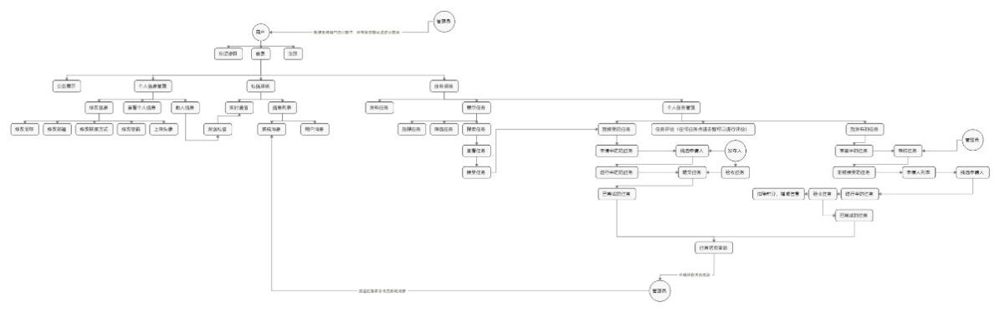
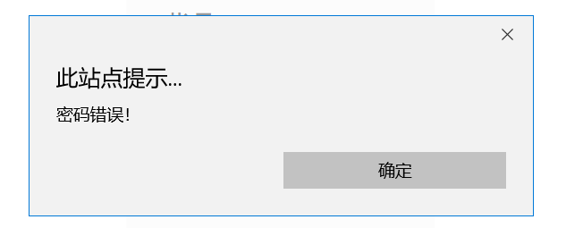
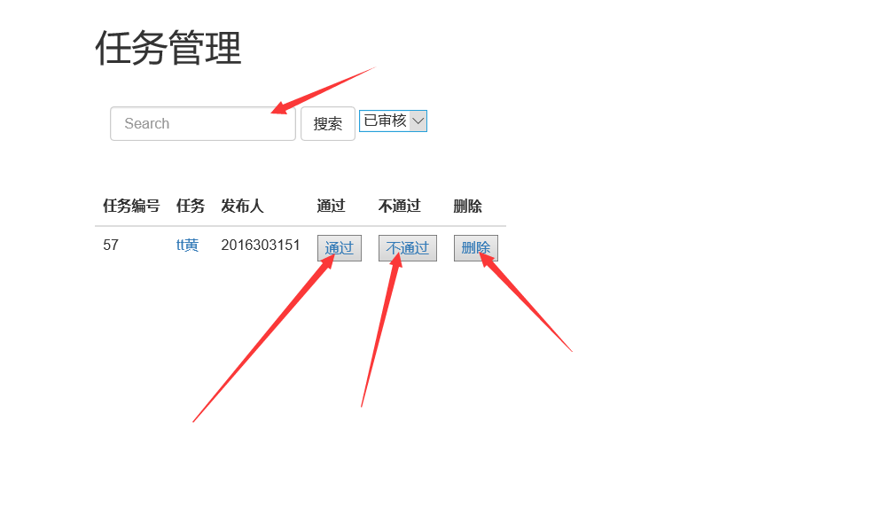
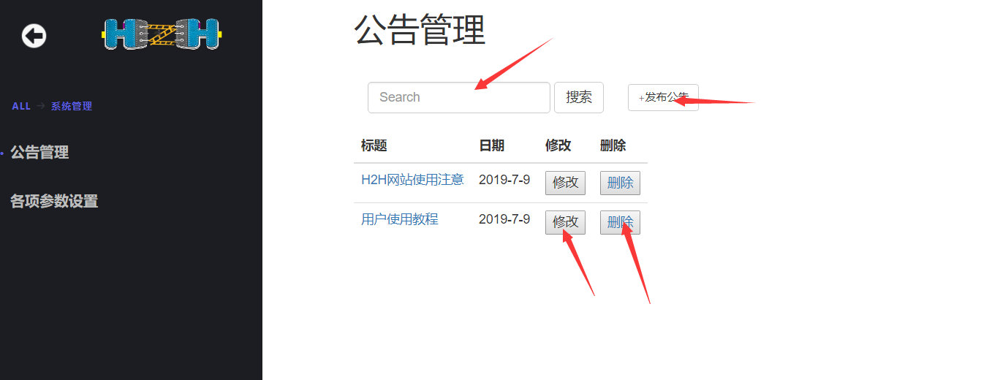
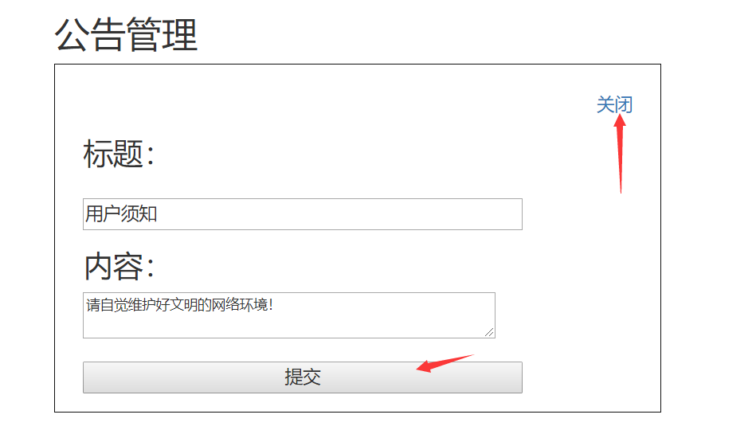
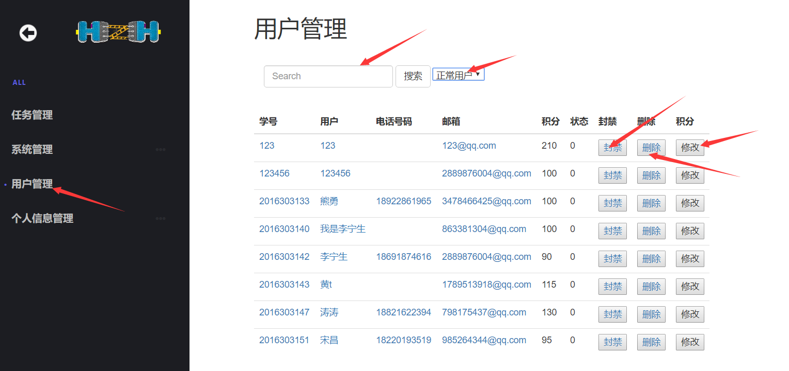
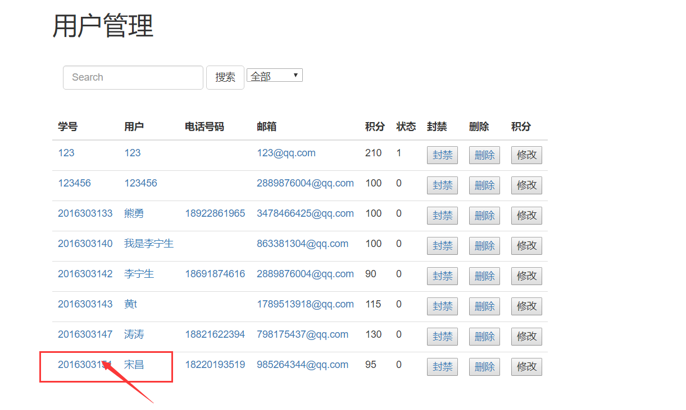
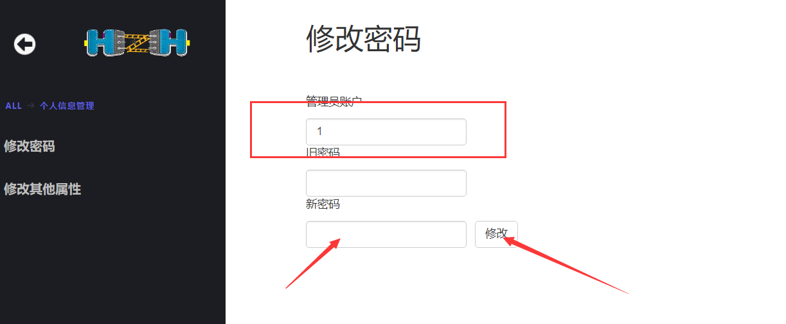
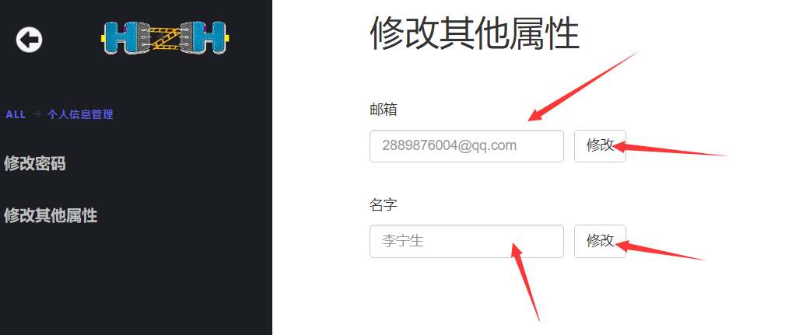

H2H-Doc-SUM For Admin-v1.0

**软件用户手册**

**版本： 1.0**

>   编写： *李新博 黄韬*

>   校对：

>   审核：

>   批准： *卢延悦*

**2019年7月**

**修订记录**

| **版本号** | **修订时间** | **修订内容** | **提出人** | **审核人** | **是否通过** |
|------------|--------------|--------------|------------|------------|--------------|
|            |              |              |            |            |              |
|            |              |              |            |            |              |
|            |              |              |            |            |              |
|            |              |              |            |            |              |
|            |              |              |            |            |              |
|            |              |              |            |            |              |

**审核记录**

| **审核版本号** | **审核时间** | **审核内容** | **审核问题** | **审核人** | **是否通过** |
|----------------|--------------|--------------|--------------|------------|--------------|
|                |              |              |              |            |              |
|                |              |              |              |            |              |
|                |              |              |              |            |              |
|                |              |              |              |            |              |
|                |              |              |              |            |              |

**1引言**

本章应分为以下几条。

**1.1标识**

标识号：H2H012019001DP01

标题：HELP TO HELP

缩略词语：H2H

版本号：1.1.1.190701_alpha

发行号：略

**1.2系统概述**

系统正在执行开发、无运行和维护的历史；

投资方：无

需方：开拓校园业务的公司或学校组织机构

用户：因课业、竞赛、社团等活动而无法及时做一些事情的学生

开发方和支持机构；HTH项目小组

标识前和计划的运行现场；小组进行了关于项目的初步讨论，正在编写软件开发计划书。

其他文档：无

**1.3文档概述**

《用户手册》由H2H小组成员编写，描写用户使用软件时应当注意的事项以及产品的正确使用方法，此文档是供管理员使用的用户手册。

**2引用文件**

《计算机软件文档编制规范 GB/T 8567-2006》

《H2H-Doc-SDP-v2.0》

《H2H-Doc-SRS-v2.0》

《H2H-Doc-SDD-v2.0》

《H2H-Doc-SCMP-v2.0》

**3软件综述**

本章应分为以下几条。

**3.1软件应用**

本产品预期开发用于校园生活中，在校学生遇到麻烦或者想咨询某件事情，便可以通过改软件互帮互助，营造良好的校园氛围。

**3.2软件清单**

用户使用需要安装的软件：

1.  H2H.exe；

2.  MySql-5.6.4、h2h.sql；

3.  apache-maven-3.6.1-bin；

4.  Tomcat 8.0；

5.  Eclipse/Idea

>   **3.3软件环境**

本条应标识用户安装并运行该软件所需的硬件、软件、手工操作和其他的资源。(若适用)包括以下标识：

a.计算机设备；

| CPU      | CPU\>=1.5GHz                |
|----------|-----------------------------|
| 内存     | 2GB以上                     |
| 硬盘     | 500GB以上                   |
| 键盘鼠标 | 有                          |
| 灵活性   | 兼容IE，Firefox等主流浏览器 |

b.通信设备；

使用10Mb/s速率的以太网，遵从其CSMA/CD协议，网络层使用TCP/IP协议。主机应该集成网卡，不仅可以连接局域网，又可以连接互联网。如果是面向局域网的，需要设定一个网络，在本地网络中设置IP，使得计算机可以指向同一个段，这种情况下，服务器和客户端仅仅是在一个固定的网段中，客户端要访问系统，只需要设置IP即可；如果是面向互联网，服务器必须绑定一定的网络空间，申请域名，通过网络解析，客户端通过网络通信方提供的互联网上网方式，输入系统的网络域名，才可以访问系统。

c.其他软件；

操作系统：Windows 10；

数据库：MySql-5.6.14；

数据文件：h2h.sql；

实用程序：Eclipse/Idea；

d.提供的格式、过程或其他的手工操作；

无；

e.其他设施、设备或资源；

（1）服务器

Windows xp以上操作系统；

产品基于Java开发，要求：JDK1.5及以上，J2EE 1.4

产品支持提供JDBC2.0及以上版本的关系数据库。如Oracle、MS SQL
Server、等，在本系统中使用的数据库为MySQL 。

产品支持提供JSP1.1及以上版本、Servlet2.3及以上版本的所有J2EE机制的Web服务器，如Tomcat、Resin、BEA
WebLogic等，在本系统中使用的Web服务器为jetty-server内嵌服务器，同时将已将服务器端部署到了腾讯云中。

（2）客户端

Windows xp以上操作系统

产品基于Java开发，要求：JDK1.5及以上，J2EE 1.4

**3.4软件组织和操作概述**

本条应从用户的角度出发，简要描述软件的组织与操作。(若适用)描述应包括：

a.从用户的角度来看的软件逻辑部件和每个部件的用途/操作的概述；

b.用户期望的性能特性

（1）
处理能力：系统处理能力考虑到系统能够承受的最大并发用户，按照实际情况规划，系统至少能承载的最大并发用户数要求达到10000。

（2）响应时间：为了能够快捷地提供查询，追踪等服务，系统应该能快速地响应用户的请求，以下表格是不同情况下系统的相应时间的情况。

时间段 响应时间

平时（空闲）0.2s

忙碌高峰 1s

（3）资源利用率：在一款搭配了i5-760芯片的PC端上运行该系统时候，CPU使用率达到30%，内存使用率达到35%。系统的空闲率在60%以上。

（4）适应性：在前面的涉及的运行环境中能顺利地工作，同时满足网络业务平台的需求。

（5）数据精确度：查询信息时应保证查全率、查准率，所有包含相应关键字的记录都应被查询到，所有查到的记录都应完全匹配给定的查询条件。

（6）容错能力和抗干扰能力：在非硬件故障或非通讯故障时，系统能够保证正常运行。

（7）稳定性：系统具有稳定性，系统的服务器要求全年持续运行，停运时间一年不超过24小时。

（8）异常处理能力：当系统遭遇异常关闭，在导致异常的原因排除后，能够再次正常运行。

c.该软件执行的功能与所接口的系统、组织或岗位之间的关系；

d.为管理软件而采取的监督措施(例如口令)

无

**3.5意外事故以及运行的备用状态和方式**

>   （1）软件移交完毕后无法运行系统，可以查看移交附着的文件，更改相应的jdk、jre版本或者更新Maven库。

（2）软件使用过程中出现了预料之外的bug，可以点击联系客服反映情况，
将问题描述清楚进行反馈，工作人员会对bug进行修复。

**3.6保密性和私密性**

保密性：软件仅限于用户使用，其他未授权机构不得盗取。

私密性：用户使用数据严格保密。

**3.7帮助和问题报告**

>   若使用过程中还出现卡死的情况，首先可以采用刷新或者关闭重开的措施进行解决，要是依然解决不了，仔细核对相应的软硬件情况，确认不是软硬件问题后向客服反馈。

>   遇到问题是系统生成问题工作日志。

**4访问软件**

本章应包含面向首次/临时的用户的逐步过程。应向用户提供足够的细节，以使用户在学习软件的功能细节前能可靠地访问软件。在合适的地方应包含用“警告”或“注意”标记的安全提示。

**4.1软件的首次用户**

本条应分为以下几条。

**4.1.1熟悉设备**

设备包括以下几条:

a.运行服务器时保证供电环境较稳定，采用后备时间达7分钟，允许130%过载、切换时间小于10ms的后备式不间断电源（UPS），起到临时供电作用，防止突然断电而引起的电脑数据丢失；

b.屏幕分辨率要求较小，基本适用大部分分辨率；

c.产品初始光标即为普通鼠标箭头，当有可点击交互的区域，光标会变为点击的point，同时可以选取文字；

e.要停止使用的话会检测是否有管理员或其他用户正在使用，确保无人连接时断开电源。

**4.1.2访问控制**

本条提供用户可见的软件访问与保密性特点的概述：

a.要访问数据库文件请与管理员联系获得口令；

b.可与开发人员协商进行口令的编辑（删除或修改）；

c.用户信息将会保存在服务器数据库，且妥善保存起来，严格服从保密性需求，不仅于此，用户账户密码采用MD5加密储存，具有较高的保密性与私密性保证。

**4.1.3安装和设置**

本产品不需要安装，当服务器运行时，用户便可以通过浏览器访问本产品，关于产品的配置等操作都可以登陆成功后进行编辑。若想更改某些重大设置，比如后台程序配置，请联系管理员或开发人员。

**4.2启动过程**

本产品目前使用局域网连接，因此开始启动过程为：

（1）局域网部署服务器，开启局域网，等待管理员或者其他用户连接；  
（2）打开任意浏览器，输入“局域网地址：8888/admin”进入管理员登陆界面；

特殊状况：若输入网址后，页面显示404、500或其他无法正常显示的状况，请按以下进行采用应急措施：

（1）404：请确认网址输入是否正确。

（2）500：若网址输入正确，应该是服务器局域网出错；

（3）其他：重复刷行界面，实在无法使用，请联系开发人员。

**4.3停止和挂起工作**

本产品由于是Web产品，停止挂起操作都可以直接实现，若想保证账户安全，可以选择登出，其余时间可以直接停止工作。

**5使用软件指南**

本章应向用户提供使用软件的过程。

**5.1管理员登陆功能（管理员账户为指定账户，不需要注册）；**

1.  首先打开任意一个浏览器，输入局域网ip与端口号组成的地址：

1.  登陆页面进行操作

1.  账号密码正确，成功进入管理员主页；

1.  当账号或者密码错误时，会显示相关提示；

5.2 管理员忘记密码功能；

1）点击找回密码，输入要找回密码的账号以及要使用的邮箱，点击发送邮件；

1.  输入邮箱中获得的验证码，然后点击下一步；

3）然后进行重设密码操作,两次密码相同后，点击完成;

>   4）接下来就可以用新设的密码进行登陆了;

**5.3 任务管理功能**

1）点击任务管理，进入任务管理界面：

>   2）在任务管理界面可以进行任务的搜索，筛选，审核，任务的删除；

>   当任务数目较多时，在搜索框可以根据任务的编号或任务标题进行搜索筛选，同时搜索栏旁边的下拉框可以筛选已审核和未审核的任务；在下面的任务列表中，点击通过让用户发布的任务审核通过，点击不通过让用户发布的任务审核不通过，点击删除将用户发布的任务从数据库中移除；

1.  点击任务列表中任务，可以查看任务详情页；

>   然后可以在任务详情页对任务进行管理；

>   **5.4 管理员系统管理**

>   1）点击系统管理按钮，进入管理员系统管理界面；

1.  管理店系统管理包括公告管理和各项参数管理，点击公告管理；

1.  在公告管理界面点击搜索可以对公告进行搜索筛选，同时对列表中存在的公告，点击修改进行内容修改，点击删除可以删除公告；

1.  点击公告管理界面的各项参数设置，对每日用户登录签到积分做修改；

1.  点击ALL返回管理员主页面；

>   **5.5 管理员用户管理**

>   1）点击管理员界面的用户管理，进入用户管理界面；在搜索栏输入学号、用户名、电话号码、邮箱可以对用户列表进行筛选搜索；点击封禁对用户进封号处理，点击删除进行删除用户操作，点击修改对用户积分进行修改；

>   修改用户积分：

>   用户封号：

1.  点击用户列表中的用户，进行浏览用户操作：

>   浏览用户个人信息,然后点击浏览完毕可以返回管理员主页面:

>   **5.6 管理员个人信息管理**

1.  管理员可以点击主页上的个人信息管理，进入个人信息管理界面；

>   （2）选择修改密码还是修改其他属性，这里先展示点击修改密码；

>   进入管理员修改密码界面：

>   根据管理员账户的账号，输入旧密码，然后再输入新密码，点击修改进行密码修改；

>   （3）在主页点击修改其他属性按钮;

>   进入管理员修改其他属性界面，管理员可以对自己的邮箱和名字进行修改：

>   **5.7 管理员登出操作**

>   （1）当管理员在进行某一界面的操作时，因为其他状况需要临时登出，这时候只需要点击界面左上角的按钮：

1.  登出后返回登录主页面：

>   **管理员用户操作基本为以上所陈述的，若在使用过程总遇到了不可预知的情况，请联系其他管理员或开发人员。**
