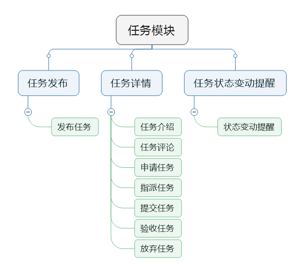

H2H-Doc-SDD-v1.1.0

软件设计说明
============

**Version： 1.1.0**

>   编写： *卢延悦，熊敏光*

>   校对： *卢延悦*

>   审核： *宋昌*

>   批准： *宋昌*

**西北工业大学H2H小组**

>   **2019年7月**

**修订记录**

| **版本号** | **修订时间** | **修订内容**                   | **提出人** | **审核人** | **是否通过** |
|------------|--------------|--------------------------------|------------|------------|--------------|
| **1.0.0**  | **7.4**      | **SDD是否完善,功能更是否全面** | **李宁生** | **李宁生** | **是**       |
| **1.1.0**  | **7.5**      | **SDD是否完善**                | **熊敏光** | **李宁生** | **是**       |
|            |              |                                |            |            |              |
|            |              |                                |            |            |              |
|            |              |                                |            |            |              |
|            |              |                                |            |            |              |

**审核记录**

| **审核版本号** | **审核时间** | **审核内容**                   | **审核问题**                               | **审核人** | **是否通过** |
|----------------|--------------|--------------------------------|--------------------------------------------|------------|--------------|
| **1.0.0**      | **7.2**      | **SDD是否完善,功能更是否全面** | **现阶段可以将体系结构，CSCI详细设计完善** | **李宁生** | **是**       |
| **1.1.0**      | **7.5**      | **SDD是否完善**                | **数据库，内部接口有无加入。**             | **李宁生** | **是**       |
|                |              |                                |                                            |            |              |
|                |              |                                |                                            |            |              |
|                |              |                                |                                            |            |              |
|                |              |                                |                                            |            |              |

**目录**

[H2H 1](#_Toc12946531)

[1.引言 3](#_Toc12946532)

>   [1.1.标识 3](#_Toc12946533)

>   [1.2.系统概述 3](#_Toc12946534)

>   [1.3文档概述 3](#_Toc12946535)

>   [1.4基线 3](#_Toc12946536)

[2.引用文件 4](#_Toc12946537)

[3.设计决策 4](#_Toc12946538)

[4.体系结构设计 6](#_Toc12946539)

>   [4.1.体系结构 6](#_Toc12946540)

>   [4.1.1程序(模块)划分 6](#_Toc12946541)

>   [4.2.全局数据结构说明 9](#_Toc12946542)

>   [4.2.1.常量 9](#_Toc12946543)

>   [4.2.2.变量 9](#_Toc12946544)

>   [4.2.3.数据结构 9](#_Toc12946545)

>   [4.3.数据库设计 12](#_Toc12946546)

>   [4.4.CSCI部件 12](#_Toc12946547)

>   [4.5.接口设计 13](#_Toc12946548)

>   [4.5.1.外部接口 13](#_Toc12946549)

>   [4.5.2.内部接口 14](#_Toc12946550)

[5.CSCI详细设计 20](#_Toc12946551)

>   [5.1.功能 20](#_Toc12946552)

>   [第一部分：系统管理员 20](#_Toc12946553)

>   [第二部分：用户 26](#_Toc12946554)

>   [第三部分：读者 35](#_Toc12946555)

>   [5.2.性能 43](#_Toc12946556)

>   [5.3.输入项目 44](#_Toc12946557)

>   [5.4.输出项目 44](#_Toc12946558)

[6.需求可追踪性 44](#_Toc12946559)

[7.注解 44](#_Toc12946560)

**1.引言**

**1.1.标识**

H2H V1.0。

**1.2.系统概述**

我们的项目“H2H”是一个面向校内大学生的校内互助平台。旨在为大学生处理一些在时间、空间上冲突的活动。用户可以在该平台上发布自己急需完成但却因种种原因没空脱身、或者因为客观因素无法完成的事情作为任务。这时，有时间、精力或者同样也要做类似事情的用户可以在平台上进行“接受任务”操作，替该同学完成任务，并且进行相应对接。

为了鼓励用户积极参与到互助活动中，我们设计了积分奖励系统。任务发布者可以通过支付一定的积分进行“悬赏”，使自己的任务吸引到更多人的注意，得到更好、更快地解决。而完成对应任务的用户将获得相应的悬赏积分。此外，用户还可以通过每日签到获取少量积分。

为了提高任务完成质量，真正实现平台互帮互助的宗旨，系统还集成了评价系统。任务完成后，发布者和执行者都可以就这次任务的体验对任务进行评分和评价。任务记录以及对应的评价会展示在用户的个人信息页面中，评分将通过一定算法转化为用户的信用评分，展示在个人信息页面中。在任务领取与指派的过程中，用户可以根据这些信息判断对方的可信程度。

**1.3文档概述**

本文档描述了H2H系统计算机软件配置项的设计。它描述了CSCI级设计决策、CSCI体系结构设计(概要设计)和实现该软件所需的详细设计。

**1.4基线**

-   《H2H软件开发计划》

**2.引用文件**

-   《H2H软件需求说明书》

-   《H2H软件开发计划》

**3.设计决策**

H2H系统面向系统中的信息交互主体，被划分为三个模块：“系统管理员模块”、“用户模块”和“任务模块”。

1.  系统管理员模块

>   系统管理员模块仅向本系统的管理者开放，拥有系统的最高权限，通过特殊的链接入口进入。该模块包含三个小模块：“用户管理模块”、“任务管理模块”和“系统管理模块”。

-   用户管理模块实现了对用户的统一管理。主要功能包括：

    -   删除无效用户。无效用户主要指已毕业的学生或在发布、执行任务中多次出现恶意破坏行为的用户。

    -   封锁用户账号。当用户出现轻微违规行为，管理员可以通过在一段时间内限制其使用作为惩罚措施。

    -   搜索用户。系统管理员可以通过用户的账户、姓名来搜索需要管理的用户。

    -   筛选用户。管理员可以通过用户管理列表提供的筛选筛选被封号中的用户账户。

    -   积分更改。管理员可以更改用户的积分值。主要用于用户违规行为的惩罚措施以及当系统出现问题时的修复措施。

-   任务管理模块实现了管理员对任务的审核以及其他管理功能，主要包括：

    -   审核用户提交的任务。

    -   删除审核通过后违规的任务。

    -   通过关键词、用户账户搜索需要管理的任务。

    -   筛选任务。管理员可以通过任务状态、任务发布日期筛选任务列表，进而方便其管理。

-   系统管理模块负责管理管理所有可供修改的系统参数，包括：管理员账户密码、每日签到能获得的积分数目、放弃任务扣除的积分数目等。

1.  用户模块

>   用户模块主要面向系统用户，为用户行为提供接口

-   任务管理模块实现了馆藏任务的统一管理功能。利用该模块，用户可以方便地进行任务入库、任务信息编辑、任务归类、任务检索、任务删除操作。其中，任务信息的录入有扫描书籍ISBN码以及手动输入两种方式。任务录入后，系统自动为其生成barcode
    并提供打印功能。该模块还提供了书籍的借阅历史，以备用户查询。

-   任务管理模块实现了任务账户的统一管理功能。利用该模块，用户可以查看任务列表，查看任务的个人信息、借阅记录、缴费欠费记录，也可以增加、检索、删除任务账户，也可以更改用户的个人信息。

-   借还书模块帮助用户进行借还书登记。扫描任务barcode获取任务信息，刷借书卡获取任务信息。

-   用户可以通过公告模块发布公告并推送给任务。

-   财务模块实现了任务馆营收的统一管理。包括押金收入记录、借书费的收缴和记录、损坏或遗失任务罚款的收缴和记录。

-   用户的账户管理主要包括更改本账户的密码。

1.  任务模块

-   任务模块面向本系统的任务用户。该模块封装了任务馆提供的服务，为任务提供了一个方便快捷的信息化接口。该模块主要包括检索模块、预约模块、借阅记录模块、任务个人信息管理模块。

-   检索模块是一个综合的任务检索工具。包括目录检索和关键词检索两种方式。其中关键词检索支持作者、出版社、题名、分类的模糊匹配。

-   预约模块帮助用户更好地利用馆藏资源。用户可以通过该模块预约自己想要借阅的任务，系统将在一段时间内为其保留该书借阅权利。

-   借助借阅记录模块，任务可以查阅自己的借阅及预约记录。该模块还展示借阅费用和罚款。同时该模块还提供借阅超期提醒功能。

-   个人信息管理主要包括用户姓名、联系方式等基本信息的查看和修改操作，以及账户密码的修改操作。

**4.体系结构设计**

**4.1.体系结构**

**4.1.1程序(模块)划分**

H2H系统被划分为三个面向用户的模块：“系统管理员模块”、“用户模块”和“任务模块”。

-   系统管理员模块HIPO图

-   用户模块HIPO图

-   任务模块HIPO图

**4.2.全局数据结构说明**

**4.2.1.常量**

1.  用户：用户编号，学号，密码，联系方式，用户邮箱，姓名；

2.  管理员：密码；

3.  系统参数：每日签到积分值；

4.  任务：任务编号，标题，描述，类型，悬赏，发布时间，截止时间，发布人，领取人；

5.  公告：公告编号，标题，内容，时间；

6.  消息：消息编号，发送人，接收人，内容，时间；

7.  评论：评论编号，发布人，内容，关联的任务，时间；

    **4.2.2.变量**

8.  系统管理员、用户登录所需的密码；

9.  用户的个人信誉（评分），密码，任务列表，积分，消息列表，发布任务数、完成任务数、放弃任务数；

10. 消息状态（未读，已阅）；

11. 任务状态（未审核，已发布，执行中，已提交，已验收，已失效），任务申请人列表；

12. 用户和管理员的各种输入；

13. 数据库各类信息和状态；

    **4.2.3.数据结构**

**系统管理员 =密码**

**用户 =学号**

>   **+密码**

>   **+联系方式**

>   **+用户邮箱**

>   **+个人信誉（评分）**

>   **+姓名**

>   **+任务列表**

>   **+积分**

>   **+消息列表**

>   **+发布任务数、完成任务数、放弃任务数**

个人信誉=\*根据过去任务完成评价产生的信誉评分\*

任务列表=\*用户自己维护的跟自身有关的任务列表\*

积分=\*用户通过接收完成任务获得的分数，可以用来委托他人完成任务\*

消息列表=\*用户收到的消息的表格\*

发布任务数、完成任务数、放弃任务数=\*用户发布，完成，放弃的任务数量\*

**任务 =任务编号**

>   **+标题**

>   **+描述**

>   **+类型**

>   **+悬赏**

>   **+发布时间**

>   **+截止时间**

>   **+发布人**

>   **+申请人列表**

>   **+领取人**

>   **+状态**

描述=\*任务描述\*

类型=\*任务所属类型\*

悬赏=\*完成该任务能得到的积分\*

申请人列表=\*申请人形成的列表\*

状态=\*任务目前状态，总共有未审核，已发布，执行中，已提交，已验收，已失效六种\*

时间格式：“YYYY-MM-DD hh-mm-ss”

**评论 =任务编号**

>   **+内容**

**+关联的任务**

**+时间**

**+发布人**

关联的任务=\*在该任务下被评论\*

时间格式：“YYYY-MM-DD hh-mm-ss”

**公告 =公告编号**

>   **+标题**

**+内容**

**+时间**

时间格式：“YYYY-MM-DD hh-mm-ss”

**消息 =消息编号**

>   **+发送人**

**+接收人**

**+内容**

**+时间**

**+状态**

状态=\*消息目前状态，总共有未读，已阅两种\*

时间格式：“YYYY-MM-DD hh-mm-ss”

**4.3.数据库设计**

见《数据库设计说明(DBDD)》。

**4.4.CSCI部件**

-   系统管理员模块调用：

1.  用户管理模块

2.  系统参数管理模块

3.  任务管理模块

-   用户模块调用：

1.  系统模块

2.  首页模块

3.  私信模块

4.  个人信息模块

-   任务模块调用：

1.  任务发布模块

2.  任务详情模块

3.  任务状态变动提醒模块

    **4.5.接口设计**

    **4.5.1.外部接口**

-   用户界面布局：

**一、系统管理员页面**

1.  系统管理员页面应使用列表展示用户信息。列表应附有筛选和搜索功能。同时列表支持对部分表项数据中进行修改，比如是否封号。

2.  系统管理员页面应使用列表展示任务信息。列表应附有筛选和搜索功能。同时列表支持对部分表项数据进行修改，比如是否删除。

3.  系统管理员页面应展示系统运行状况，包括数据库状态、各终端设备状态以及网络链接状态等。

4.  系统管理员页面应提供修改各类系统参数的选项卡。

**二、用户页面**

1.  用户页面应用两个列表分别展示当前已经完成任务信息以及等待完成任务信息。列表应附有筛选和搜索功能。

2.  用户页面展示用户的账号，现有积分基本信息。

3.  用户页面提供去往任务界面通道。

4.  用户页面支持对个人基本信息进行修改。

5.  用户页面设有窗口供用户发送评价和消息。

**三、任务界面**

>   1. 任务页面展示任务的状态、发布人、描述等基本信息。

>   2. 任务页面提供任务分类浏览、筛选以及搜索功能。

>   3. 任务页面提供任务领取按钮。

4. 任务页面提供任务验收按钮。

5. 任务页面提供任务评价按钮。

6. 任务页面提供任务指派按钮。

7. 任务页面提供任务放弃按钮。

>   3. 任务页面提供任务发布按钮。

>   8. 任务页面支持任务状态变更提醒。

-   软件接口：

1.  系统数据库：用于系统参数、用户和任务的信息以及入库任务资料。

2.  操作系统：Windows10。

-   通信接口：

1.  网络通信标准或协议：客户端和服务器端的通信遵循TCP/IP协议。

2.  通信安全或加密问题：采用中等级别的加密算法保证用户的通信安全。

    **4.5.2.内部接口**

本节列举了服务器提供给Web界面的所有API以及它们的输入输出数据格式、使用方式。

1.  **获取用户信息**

>   接口地址：http://www.H2H.com/UserInfo

>   请求方法：GET

>   URL参数：

| 参数名 | 类型   | 必填 | 描述                                        | 默认值 |
|--------|--------|------|---------------------------------------------|--------|
| key    | String | 否   | 获取完整列表：NULL 搜索某些账户：搜索关键词 | NULL   |

>   请求体描述：返回用户结构体列表。其中每个用户结构参数如下：

| 参数名          | 类型   | 必填 | 描述           | 默认值 |
|-----------------|--------|------|----------------|--------|
| account         | String | 是   | 用户登录账户名 | 无     |
| email           | String | 是   | 邮箱           | 无     |
| phone           | String | 是   | 联系电话       | 无     |
| creditScore     | int    | 是   | 信誉值         | 0      |
| points          | int    | 是   | 积分           | 0      |
| name            | String | 否   | 姓名           | NULL   |
| userState       | int    | 是   | 用户状态       | 无     |
| releasedTaskNum | int    | 是   | 发布任务数     | 无     |
| finishedTaskNum | Int    | 是   | 完成任务数     | 0      |
| lastLoginDate   | String | 是   | 最后登录时间   | 无     |

1.  **获取系统参数**

接口地址：[http://www.H2H.com/SysParam](http://www.OReader.com/SysParam)

请求方法：GET

URL参数：无

请求体描述：返回包含所有系统参数的结构体，结构参数如下表所示：

| 参数名 | 类型 | 必填 | 描述             | 默认值 |
|--------|------|------|------------------|--------|
| Point  | Int  | 是   | 每日登陆获取积分 | 无     |

1.  **获取任务数据**

>   接口地址：http://www.H2H.com/TaskInfo

>   请求方法：GET

>   URL参数：

| 参数名 | 类型   | 必填 | 描述                                        | 默认值 |
|--------|--------|------|---------------------------------------------|--------|
| key    | String | 否   | 获取完整列表：NULL 搜索某些任务：搜索关键词 | NULL   |

>   请求体描述：返回任务结构体列表。其中每个任务结构参数如下：

| 参数名       | 类型   | 必填 | 描述       | 默认值 |
|--------------|--------|------|------------|--------|
| taskID       | int    | 是   | 任务ID     | 无     |
| title        | String | 是   | 任务标题   | 无     |
| description  | String | 是   | 任务描述   | 无     |
| type         | String | 是   | 类型       | 无     |
| rewardPoints | int    | 是   | 悬赏分     | 无     |
| startTime    | String | 是   | 开始时间   | NULL   |
| deadLine     | String | 是   | 截止时间   | NULL   |
| publisherNum | long   | 是   | 发布人学号 | 无     |
| receiverNum  | long   | 否   | 领取人学号 | 无     |
| taskState    | int    | 否   | 状态       | 0      |
| heatValue    | Int    | 否   | 热度       | 0      |

1.  **更改任务信息**

接口地址：http://www.H2H.com/EditTask

请求方法：POST

URL参数：任务结构体，结构体参数如下：

| 参数名       | 类型   | 必填 | 描述     | 默认值 |
|--------------|--------|------|----------|--------|
| title        | String | 是   | 任务标题 | 无     |
| description  | String | 是   | 任务描述 | 无     |
| type         | String | 是   | 类型     | 无     |
| rewardPoints | int    | 是   | 悬赏分   | 无     |
| deadLine     | String | 是   | 截止时间 | NULL   |

1.  **更改用户个人信息**

接口地址：http://www.H2H.com/EditUserInf

请求方法：POST

URL参数：任务结构体，结构体参数如下：

| 参数名          | 类型   | 必填 | 描述           | 默认值 |
|-----------------|--------|------|----------------|--------|
| account         | String | 是   | 用户登录账户名 | 无     |
| email           | String | 是   | 邮箱           | 无     |
| phone           | String | 是   | 联系电话       | 无     |
| creditScore     | int    | 是   | 信誉值         | 0      |
| points          | int    | 是   | 积分           | 0      |
| name            | String | 否   | 姓名           | NULL   |
| userState       | int    | 是   | 用户状态       | 无     |
| releasedTaskNum | int    | 是   | 发布任务数     | 无     |
| finishedTaskNum | Int    | 是   | 完成任务数     | 0      |
| lastLoginDate   | String | 是   | 最后登录时间   | 无     |

1.  **获取评论信息**

接口地址：http://www.H2H.com/CommentsInfo

>   请求方法：GET

>   URL参数：

>   请求体描述：返回读者结构体列表。其中每个评论结构参数如下：

| 参数名         | 类型   | 必填 | 描述           | 默认值 |
|----------------|--------|------|----------------|--------|
| commentID      | int    | 是   | 评论ID         | 无     |
| commentatorNum | long   | 是   | 评论人         | 无     |
| content        | String | 是   | 内容           | 无     |
| taskID         | Int    | 是   | 任务ID         | 无     |
| time           | String | 是   | 发表时间       | 0      |
| borrowedNum    | Int    | 是   | 当前借书数目   | 0      |
| borrowedList   | List   | 否   | 借书列表       | NULL   |
| cash           | Double | 是   | 已缴纳押金数额 | 0      |

1.  **删除任务**

>   接口地址：http://www.H2H.com/TaskDel

>   请求方法：POST

>   URL参数：待删除的任务 id

1.  **添加任务**

>   接口地址：[http://www.H2H.com/TaskAdd](http://www.OReader.com/BookAdd)

>   请求方法：POST

URL参数：任务结构体，结构体参数如下：

| 参数名       | 类型   | 必填 | 描述       | 默认值 |
|--------------|--------|------|------------|--------|
| taskID       | int    | 是   | 任务ID     | 无     |
| title        | String | 是   | 任务标题   | 无     |
| description  | String | 是   | 任务描述   | 无     |
| type         | String | 是   | 类型       | 无     |
| rewardPoints | int    | 是   | 悬赏分     | 无     |
| startTime    | String | 是   | 开始时间   | NULL   |
| deadLine     | String | 是   | 截止时间   | NULL   |
| publisherNum | long   | 是   | 发布人学号 | 无     |
| receiverNum  | long   | 否   | 领取人学号 | 无     |
| taskState    | int    | 否   | 状态       | 0      |
| heatValue    | Int    | 否   | 热度       | 0      |

1.  **用户注册**

>   接口地址：[http://www.H2H.com/Reg](http://www.OReader.com/ReaderAdd)*ister*

>   请求方法：POST

>   URL参数：读者结构体，结构体参数如下：

| 参数名          | 类型   | 必填 | 描述           | 默认值 |
|-----------------|--------|------|----------------|--------|
| account         | String | 是   | 用户登录账户名 | 无     |
| email           | String | 是   | 邮箱           | 无     |
| phone           | String | 是   | 联系电话       | 无     |
| creditScore     | int    | 是   | 信誉值         | 0      |
| points          | int    | 是   | 积分           | 0      |
| name            | String | 否   | 姓名           | NULL   |
| userState       | int    | 是   | 用户状态       | 无     |
| releasedTaskNum | int    | 是   | 发布任务数     | 无     |
| finishedTaskNum | Int    | 是   | 完成任务数     | 0      |
| lastLoginDate   | String | 是   | 最后登录时间   | 无     |

1.  **删除用户账户**

>   接口地址：[http://www.H2H.com/UserDel](http://www.OReader.com/ReaderDel)

>   接口方法：POST

>   URL参数：用户account

1.  **用户账户封号**

>   接口地址：[http://www.H2H.com/UserFr](http://www.OReader.com/LibAdd)*ozen*

>   请求方法：POST

>   URL参数：用户结构体，参数如下表所示：

| 参数名          | 类型   | 必填 | 描述           | 默认值 |
|-----------------|--------|------|----------------|--------|
| account         | String | 是   | 用户登录账户名 | 无     |
| email           | String | 是   | 邮箱           | 无     |
| phone           | String | 是   | 联系电话       | 无     |
| creditScore     | int    | 是   | 信誉值         | 0      |
| points          | int    | 是   | 积分           | 0      |
| name            | String | 否   | 姓名           | NULL   |
| userState       | int    | 是   | 用户状态       | 无     |
| releasedTaskNum | int    | 是   | 发布任务数     | 无     |
| finishedTaskNum | Int    | 是   | 完成任务数     | 0      |
| lastLoginDate   | String | 是   | 最后登录时间   | 无     |

1.  **删除用户账户**

>   接口地址：[http://www.H2H.com/LibDel](http://www.OReader.com/LibDel)

>   请求方法：POST

>   URL参数：用户账户account

1.  **发布公告**

>   接口地址：[http://www.H2H.com//AddPost](http://www.OReader.com//Post)

>   请求方法：POST

>   URL参数：公告结构体，结构体参数如下：

| 参数名   | 类型   | 必填 | 描述     | 默认值 |
|----------|--------|------|----------|--------|
| noticeID | Int    | 是   | 公告ID   | 无     |
| title    | String | 是   | 标题     | 无     |
| content  | String | 是   | 内容     | 无     |
| time     | String | 是   | 发布时间 | NULL   |

1.  **编辑公告**

>   接口地址：[http://www.H2H.com//EditPost](http://www.OReader.com//Post)

>   请求方法：POST

>   URL参数：公告结构体，结构体参数如下：

| 参数名   | 类型   | 必填 | 描述     | 默认值 |
|----------|--------|------|----------|--------|
| noticeID | Int    | 是   | 公告ID   | 无     |
| title    | String | 是   | 标题     | 无     |
| content  | String | 是   | 内容     | 无     |
| time     | String | 是   | 发布时间 | NULL   |

1.  **删除公告**

>   接口地址：[http://www.H2H.com/PostDel](http://www.OReader.com/LibDel)

>   请求方法：POST

>   URL参数：公告编号 noticeID

1.  **更改密码**

>   接口地址：[http://www.H2H.com/PasswordUpdate](http://www.OReader.com/PasswordUpdate)

>   请求方法：POST

>   URL参数：新密码

**5.CSCI详细设计**

**5.1.功能**

**管理员：**

-   登陆

用户输入正确的系统管理员的账号和密码进行登陆。用户若输入了错误的密码，会有密码错误提示。

-   首页

首页提供搜索，对用户的浏览和删除等操作。管理员可以通过左侧的导航栏通向其他可用的功能。在导航栏右上角有登出按钮供管理员登出系统。

-   任务管理

    -   审核（通过、不通过）

    -   删除

    -   搜索（通过关键词、用户搜索）

    -   筛选（分类筛选：未审核、审核通过、审核拒绝、已完成；日期筛选）

-   用户管理

    -   删除

    -   封号

    -   搜索（关键词）

    -   筛选（封号中）

    -   积分更改

-   系统管理

    -   修改系统参数（设置每次登陆给多少分）

-   公告管理

    -   删除公告

    -   发布公告

    -   搜索公告（关键词）

    -   编辑公告

        **用户：**

-   登陆

用户输入正确的账号和密码进行登陆。用户若输入了错误的密码，会有密码错误提示。

-   找回密码

用户可以通过电子邮箱验证找回密码。

-   注册

用户可以注册新账号加入系统。

-   首页

首页提供搜索，对任务的浏览等操作。用户可以通过上侧的导航栏通向其他可用的功能。在导航栏右上角有登出按钮供用户登出系统。

-   任务列表（显示未指派的任务）

    -   筛选（类型、发布时间、悬赏范围、热度）

    -   搜索（关键词）

    -   公告窗口

    -   未读消息数目

    -   我的留言箱按钮

-   私信界面

私信界面提供查看已有的消息，已经给其他用户发私信等功能。

-   消息列表（回复）

    -   筛选（时间）

    -   搜索（关键词）

    -   未读消息数目

    -   发送私信

-   个人界面

个人页面提供个人信息的浏览，更改等操作。

-   个人信息

    -   浏览个人信息

    -   更改个人信息

    -   修改密码

-   与我有关的任务（在任务系统中详细说明）

    **任务系统：**

-   任务发布页（标题、描述、类型、悬赏、有效截止时间）

    -   发布任务

        -   发布任务

-   任务详情页（标题、描述、类型、悬赏、有效截止时间）

    -   任务介绍

        -   任务介绍

    -   任务评论（类似于追问）

        -   评论

    -   申请任务

        -   申请任务

    -   提交任务

        -   提交任务

    -   验收任务

        -   任务验收（评分、评价；提交后不可修改；积分变动）

    -   放弃任务

        -   任务放弃

    -   任务申请人

        -   浏览申请人列表

        -   查看申请人详细信息

        -   指派任务

-   任务状态变动提醒

    **5.2.性能**

1.  空间占用：

Web程序安装前安装包大小不大于200M，解压安装后对于Windows系统的磁盘空间占用量不超过500M。数据库空间占用量根据任务馆用户数量而定，在一个表数据长度达到18000时占用内存为2M，达到33139时占用内存为4M，达到44000时占用内存为8M，达到87809时占用内存为16M。

1.  资源占用：

在80%的用户使用时间内，对于ARM处理器的率不超过30%，对于RAM的占用量不超过10M。

1.  功耗：

后台运行状态下，本程序对于Windows系统的耗电量平均每天不超过10%。

1.  安全性能：

2.  用户在注册时，必须设置他的电子邮箱，作为找回密码等敏感操作的验证工具。

3.  用户在修改密码、修改找回密码问题与回答时，系统应向用户电子邮件验证码，来确保操作的安全性。

4.  服务器保存所有用户操作记录，以供用户可以查询自己和他人先前历史操作。

5.  灵活性：页面响应绝大部分的操作。

6.  时间特性：响应点击按钮，页面间跳转的时长在0.5\~1秒之间。

    **5.3.输入项目**

输入的数据是户执行的各种操作，包括点击按钮，键盘输入等操作。

**5.4.输出项目**

输出是从数据库中读取的数据，或错误警告信息。

**6.需求可追踪性**

**7.注解**

-   CSCI：计算机软件配置项

相关技术介绍：

-   基于Web的程序

>   应用程序有两种模式C/S、B/S。C/S是客户端/服务器端程序，也就是说这类程序一般独立运行。而B/S就是浏览器端/服务器端应用程序，这类应用程序一般借助IE等浏览器来运行。WEB应用程序一般是B/S模式。Web应用程序首先是“应用程序”，和用标准的程序语言，如C、C++等编写出来的程序没有什么本质上的不同。然而Web应用程序又有自己独特的地方，就是它是基于Web的，而不是采用传统方法运行的。换句话说，它是典型的浏览器/服务器架构的产物。

>   一个Web应用程序是由完成特定任务的各种Web组件（web
>   components)构成的并通过Web将服务展示给外界。在实际应用中，Web应用程序是由多个Servlet、JSP页面、HTML文件以及图像文件等组成。所有这些组件相互协调为用户提供一组完整的服务
