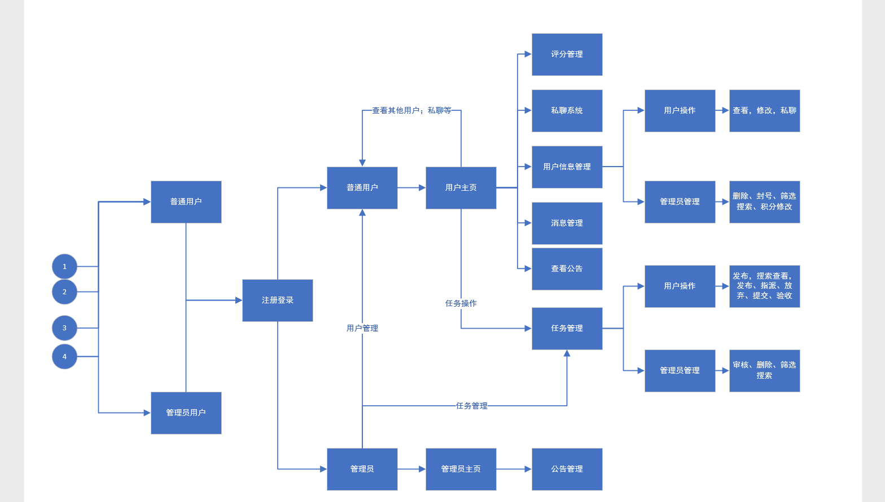

H2H-Doc-PDSR-v1.0.0

**项目开发总结报告**

**版本： 1.0.0**

>   编写： *黄韬*

>   校对： *李宁生*

>   审核： *李宁生*

>   批准： *李宁生*

**西北工业大学H2H小组**

>   **2019年7月**

**修订记录**

| **版本号** | **修订时间** | **修订内容** | **提出人** | **审核人** | **是否通过** |
|------------|--------------|--------------|------------|------------|--------------|
|            |              |              |            |            |              |
|            |              |              |            |            |              |
|            |              |              |            |            |              |
|            |              |              |            |            |              |
|            |              |              |            |            |              |
|            |              |              |            |            |              |

**审核记录**

| **审核版本号** | **审核时间** | **审核内容**                   | **审核问题** | **审核人** | **是否通过** |
|----------------|--------------|--------------------------------|--------------|------------|--------------|
| **1.0**        | **1.11**     | **报告内容与项目过程是否吻合** | **无**       | **卢延悦** | **是**       |
|                |              |                                |              |            |              |
|                |              |                                |              |            |              |
|                |              |                                |              |            |              |
|                |              |                                |              |            |              |

**1 引言**

本章分为以下几条。

1.  **标识**

标识号：H2HV01201907PDSR01

标题：HELP TO HELP

缩略词语：H2H

版本号：1.0.0

发行号：略

1.  **系统概述**

系统正在执行开发、无运行和维护的历史；

投资方：无

需方：开拓校园业务的公司或学校组织机构

用户：因课业、竞赛、社团等活动而无法及时做一些事情的学生

开发方和支持机构；H2H项目小组

标识前和计划的运行现场；小组进行了关于项目的初步讨论，正在编写软件开发计划书。

其他文档：《校园互助平台计划书》

1.  **文档概述**

《软件开发计划》由HTH小组成员编写，描写开发者实施软件开发工作的计划，是编写《需求规格说明书》、《概要设计说明书》、《详细设计说明文档》、《软件交付说明书》等文档的依据。

保密性：本文档仅限于项目参与者使用

**2 引用文件**

《计算机软件文档编制规范 GB/T 8567-2006》

**3 实际开发结果**

**3.1 产品**

最终制成的产品，包括：

1.  产品主要类及功能:

DemoConfig.java 项目启动文件，启动类

SendEmail.java 实现发送邮件功能类

AdminController.java 管理员相关功能类

EditController.java 实现编辑功能类

HomePageController.java 主页相关功能类

LoginController.java 登陆相关功能类

MessageController.java 消息相关功能类

Admin.java,Apply.java,Comment.java,Message.java,Notice.java,Param.java,Task.java,TaskType.java,User.java
数据库各对象类

MessageService.java 消息数据库连接类

TaskService.java 任务数据库连接类

UserService.java 用户数据库连接类

1.  各类之间的协调关系

运行DemoConfig.java类，启动软件，在浏览器输入http：//localhost：8888进入用户主页，接着可以根据LoginController.java和SendEmail.java实现登陆功能或者注册发送邮件验证码功能，然后由于用户主页HomePageController.java的功能，用户可以在主页进行相关操作，比如通过UserService.java的作用浏览自己个人信息或者其他用户信息、通过TaskSercice.java的作用浏览任务列表的详情、通过MessageService.java的作用浏览自己的消息然后根据MessageController.java进行消息操作。管理员通过自己的登陆界面进入管理员主页，然后通过AdminController.java的作用进行管理员相关功能的实现，用户和管理员都可以通过EditController.java的作用对自己的信息进行修改编辑。

1.  产品版本

H2H_V1.0、H2H_V2.0、beta（外部测试版）、Alpha（内部测试版）

**3.2 主要功能和性能**

主要功能：（1）登陆注册找回密码，每日首次登陆加积分、管理员修改每日登陆
积分数值；

1.  筛选搜索任务、发布任务；

2.  公告窗口显示公告；

3.  显示未读消息数目；

4.  显示、修改个人信息；

5.  私信页面显示列表消息；

6.  管理员对用户进行管理（删除、封号、筛选、积分修改）；

7.  管理员对任务进行管理（审核、删除、筛选搜索）；

8.  管理员对公告进行管理（发布、删除、修改、查看）；

9.  任务页面相关功能（查看、评论、申请、提交、验收、放弃）；

10. 任务的相关操作（评分、积分变更、指派、热度排行）。

功能基本都成功实现，未完全实现功能为用户安全与隐私功能，以及相关功能实现程度为基本要求；本项目的要求就是一个校园内使用的互帮互助平台，就此看来开发的目标已经基本达到了。

性能：本产品可以实现流畅的操作，用户之间可以私聊通信，任务评论处进行互动，并且实现了用户密码加密储存的隐私设置，界面友好，用户体验很好。

**3.3 基本流程**

**3.4 进度**

|               | 计划进度                                                   | 实际进度                                         |
|---------------|------------------------------------------------------------|--------------------------------------------------|
| Day 1         | 确定团队开发题目                                           | 确定团队开发题目                                 |
| Day 2         | 进行具体的模块分析和设计，完成数据库设计，小组进行任务分配 | 模块的设计基本完成，数据库设计完成，任务分配完毕 |
| Day 3         | 补全SRS，前端进行界面设计，后端学习JFinal新框架            | SRS补全完毕，前端与后端的进度都完成了绝大部分    |
| Day 4 - Day 7 | 前端编写界面，后端实现各模块功能，第一次迭代               | 前端界面基本完成，后端功能实现大半               |
| Day 8         | 各个模块进行合并，组合成完整程序                           | 程序合并成功但有些部分仍有bug，计划进行修改      |
| Day 9         | 修改bug，进行第二次迭代，提交beta版本                      | 对程序进行了局部改进                             |
| Day 10        | 完成整个项目的文档和设计部分，程序定型，提交Alpha版本      | 挤时间完成任务                                   |
| Day 11        | 搭建云服务器，提交正式发布版                               | 按时提交正式发布版                               |

项目的实际进度整体看来略低于计划的进度，原因在于，我们的时间安排紧张，小组成员之间的配合需要一定时间才有默契，另外对于项目的开发，第一阶段的设计还不够完善，每次迭代都花费了很多的时间，另外对项目的开发目标认识不够清楚，使得程序功能经常变化。

**3.5 费用**

原定计划费用与实际支出费用的对比，包括:

|                  | 计划费用 | 实际支出费用 |
|------------------|----------|--------------|
| 工时             | 56h      | 75h          |
| 计算机的使用时间 | 56h      | 100h         |
| 物资消耗         | 0        | 0            |

原定计划为每天工作8个小时，小组集体开发，但在实际开发中往往不能做到集体编程大家都要各自编写，遇到问题也没办法及时解决，浪费了大量时间，程序的调试，组合，测试，修复漏洞也浪费了很多时间。

**4 开发工作评价**

**4.1 对生产效率的评价**

生产效率：

|                                         | 实际生产效率 | 计划生产效率 |
|-----------------------------------------|--------------|--------------|
| 程序的平均生产效率（行/每人天生产行数） | 500          | 800          |
| 文件的平均生产效率（字/每人天生产字数） | 2000         | 8000         |

程序的编写比较分散，在整个项目期间，编程的量并不很大，实际的效率要比计划的低，文件的撰写在项目开发的早期与后期都有涉及，前期效率低，后期效率高。

**4.2 对产品质量的评价**

（1）可用性：产品操作简单且用途很贴近生活，任何在校园或者社区内需要帮助的人，都可以通过这个产品在网上发布一则任务，然后便可以借助他人的力量解决这个问题。同时，通过这种方式，也可以融洽人际关系，构建良好的氛围。

（2）可维护性：JFinal开发框架实用而简单，且运行在JAVA机中，减少了代码的维护性，基本保证了代码的零维护。

（3）可移植性：只要构建好了JFinal的开发环境，然后导入工程便可以完美移植，项目中还包括一份数据库的sql文件，便于移植后数据库的完美构建。

**4.3 对技术方法的评价**

（1）开发本系统主要的开发工具为：Mysql，eclipse或者IDEA，JFinal框架，涉及到的技术基本上难点在于JFinal框架的使用，至于数据库和开发工具软件的使用，难度不大。

（2）使用数据库工具Navicat。Navicat工具用来建立与本地Mysql的连接，以方便程序员很好的进行数据编辑和连接，更好的实现客户的功能。在今后的开发中，我们要更好的完成系统的前期数据库的建立，最大的来优化系统功能。

（3）系统开发框架：此系统的框架使用的是JFinal，此框架在开发一些中小软件是比较实用的，尤其是在Web开发这一方面。我们要学会熟练地使用这一框架，这样以来，在以后的系统开发中，针对系统中一些通用的功能就不需要再开发，从而也可以很好的提高我们的开发效率；减少很多维护费用，使我们的技术不断的更加成熟。

（4）系统安全加密：此系统中针对可能存在的安全问题，我们采用了MD5加密方法对用户的密码进行加密保存。这样一来，用户的密码不易被窃取（不法人员无法登陆到我们系统来），这样就最大的提高了我们系统的安全性，安全这一方面在以后的开发过程中要经常考虑到。

**4.4 出错原因的分析**

（1）由于大部分人员是第一次使用JFinal的框架，所以对许多开发过程经验不足，这就导致了许多无用功的产生，或者造成一些中间过程的bug。

（2）前端设计人员与后端开发人员没有很好的进行交流，往往导致了后端人眼对于前端设计的界面不能得心应手地传值跳转，继而造成了不必要的麻烦。

（3）项目开发过程的前期设计阶段没有很好地明确功能和设计一个完善的数据库，这就导致了迭代次数过多，开发过程走远路等现象。

**4.5 风险管理**

**5 缺陷与处理**

缺陷与处理主要包括以下几个方面：

1.  需求评审阶段：缺陷主要为对需求的评审不够明确，导致功能不明确，逻辑存在疑惑；后面迭代过程中不断对需求功能进行完善，整个需求已经描述地十分详细；

2.  设计评审阶段：缺陷主要为数据库设计，缺少必要的数据库属性和接口；后面迭代对数据库进行了补充与完善；

3.  代码测试阶段：缺陷主要为一开始的测试用例不具有代表性，得到的测试结果不能给项目的进一步完善做借鉴；

4.  系统测试阶段：缺陷主要为整个系统的优化性还有待提高，项目工程过大，这就导致了运行的缓慢，这一方面由于能力有限，在后续的开发过程中只能尽量做到初步的优化，缓慢运行现象仍存在；

5.  验收测试阶段：缺陷主要为项目的各模块没有很好地做到独立化，每个模块应该有它自己的说明文档。

**6 经验与教训**

1.  在项目确定后，要尽快的建立起项目开发团队。项目团队成员的团结合作、相互沟通是非常重要的，团队成员之间要相互学习彼此的优点和技术，使团队的能力不断的提高。这样，在项目的开发过程中，团队才不会被难题困住不动，另外，团队中要有一个项目负责人，这个人无论是在与客户沟通上，还是在技术上都要是很出众的人，此项目负责人要能很好的沟通客户与开发人员之间，以此来更好的理解客户的功能需求。人的记忆力总是有限的，所以就要求开发团队成员要尽量的书写一些开发文档，这些文档往往是我们在项目开发后期要用到的可寻资料。项目团队士气是项目成功的一个因素，我们需要不断的培养我们的团队气势，使我们的团队不断的壮大。

2.  做好开发计划。在项目确立后，我们就需要做好项目开发计划，需求总结时，开发用时，测试用时，实施用时，维护用时。在我们做好了计划后，我们要随时的跟踪计划任务的完成进度，从而使我们的项目进度掌控在我们的开发周期范围之内，今日计划、行动，明日成功。

3.  在项目进行的过程中，我们要不断去整理自己的工作情况和做好总结，这样以来，无论是在自己的技术还是在其他方面，都会对我们有很大的提高，在长期的积累后，无论是我们个人能力，还是我们的团队能力都会有很大的提高。

**附录**

**项目总结报告**

| **项目**                                                                                                                                                                                                                                                                                                                                                                                                                                                                                                                                                                                                 | H2H校园帮帮                                                                                                                                                                                                                                                                                                                | **编写**           | 黄韬             | **审批**           |       |
|----------------------------------------------------------------------------------------------------------------------------------------------------------------------------------------------------------------------------------------------------------------------------------------------------------------------------------------------------------------------------------------------------------------------------------------------------------------------------------------------------------------------------------------------------------------------------------------------------------|----------------------------------------------------------------------------------------------------------------------------------------------------------------------------------------------------------------------------------------------------------------------------------------------------------------------------|--------------------|------------------|--------------------|-------|
| **一般性信息**                                                                                                                                                                                                                                                                                                                                                                                                                                                                                                                                                                                           |                                                                                                                                                                                                                                                                                                                            |                    |                  |                    |       |
| **1.生产效率** 大约代码量500行/人天 文档量2000字/人天                                                                                                                                                                                                                                                                                                                                                                                                                                                                                                                                                    |                                                                                                                                                                                                                                                                                                                            |                    |                  |                    |       |
| **2.质量** 中等                                                                                                                                                                                                                                                                                                                                                                                                                                                                                                                                                                                          |                                                                                                                                                                                                                                                                                                                            |                    |                  |                    |       |
| **3.项目工期**                                                                                                                                                                                                                                                                                                                                                                                                                                                                                                                                                                                           |                                                                                                                                                                                                                                                                                                                            |                    |                  |                    |       |
|                                                                                                                                                                                                                                                                                                                                                                                                                                                                                                                                                                                                          | **初始估算**                                                                                                                                                                                                                                                                                                               | **实际**           | **延误**         |                    |       |
| **起始日期**                                                                                                                                                                                                                                                                                                                                                                                                                                                                                                                                                                                             | 2019/7/1                                                                                                                                                                                                                                                                                                                   | 2019/7/2           | 1条天            |                    |       |
| **4.过程裁剪情况** 无                                                                                                                                                                                                                                                                                                                                                                                                                                                                                                                                                                                    |                                                                                                                                                                                                                                                                                                                            |                    |                  |                    |       |
| **5.使用的工具** Mysql，eclipse，IDEA，Navicat，github，DW等                                                                                                                                                                                                                                                                                                                                                                                                                                                                                                                                             |                                                                                                                                                                                                                                                                                                                            |                    |                  |                    |       |
| **风险管理**                                                                                                                                                                                                                                                                                                                                                                                                                                                                                                                                                                                             |                                                                                                                                                                                                                                                                                                                            |                    |                  |                    |       |
| **1.初期预估的风险**                                                                                                                                                                                                                                                                                                                                                                                                                                                                                                                                                                                     |                                                                                                                                                                                                                                                                                                                            |                    |                  |                    |       |
| **规模**                                                                                                                                                                                                                                                                                                                                                                                                                                                                                                                                                                                                 |                                                                                                                                                                                                                                                                                                                            |                    |                  |                    |       |
| **估算项**                                                                                                                                                                                                                                                                                                                                                                                                                                                                                                                                                                                               | **估算规模**                                                                                                                                                                                                                                                                                                               | **实际规模**       |                  |                    |       |
| 整体开发规模                                                                                                                                                                                                                                                                                                                                                                                                                                                                                                                                                                                             | 中等规模                                                                                                                                                                                                                                                                                                                   | 较小               |                  |                    |       |
| **工作量**                                                                                                                                                                                                                                                                                                                                                                                                                                                                                                                                                                                               |                                                                                                                                                                                                                                                                                                                            |                    |                  |                    |       |
| **1.团队最大规模** 开发小组9人，后端开发3人，前端开发4人，测试人员2人                                                                                                                                                                                                                                                                                                                                                                                                                                                                                                                                    |                                                                                                                                                                                                                                                                                                                            |                    |                  |                    |       |
| **2.估算工作量** 需求分析计划（1天），概要设计与详细设计（2天），编码计划（4天），测试（5天）                                                                                                                                                                                                                                                                                                                                                                                                                                                                                                            |                                                                                                                                                                                                                                                                                                                            |                    |                  |                    |       |
| **3.实际工作量** 需求分析计划（1天），概要设计与详细设计（1天），编码计划（6天），测试（4天）                                                                                                                                                                                                                                                                                                                                                                                                                                                                                                            |                                                                                                                                                                                                                                                                                                                            |                    |                  |                    |       |
| **4.工作量在各阶段的分布**                                                                                                                                                                                                                                                                                                                                                                                                                                                                                                                                                                               |                                                                                                                                                                                                                                                                                                                            |                    |                  |                    |       |
| **阶段**                                                                                                                                                                                                                                                                                                                                                                                                                                                                                                                                                                                                 | **任务(人时)**                                                                                                                                                                                                                                                                                                             | **审查(人时)**     | **返工(人时)**   | **总计(人时)**     |       |
| 需求分析                                                                                                                                                                                                                                                                                                                                                                                                                                                                                                                                                                                                 | 2                                                                                                                                                                                                                                                                                                                          | 1                  | 1                | 4                  |       |
| 概要设计与详细设计                                                                                                                                                                                                                                                                                                                                                                                                                                                                                                                                                                                       | 3                                                                                                                                                                                                                                                                                                                          | 2                  | 2                | 7                  |       |
| 编码计划                                                                                                                                                                                                                                                                                                                                                                                                                                                                                                                                                                                                 | 10                                                                                                                                                                                                                                                                                                                         | 5                  | 5                | 20                 |       |
| 测试计划                                                                                                                                                                                                                                                                                                                                                                                                                                                                                                                                                                                                 | 6                                                                                                                                                                                                                                                                                                                          | 3                  | 3                | 12                 |       |
| 整合阶段                                                                                                                                                                                                                                                                                                                                                                                                                                                                                                                                                                                                 | 5                                                                                                                                                                                                                                                                                                                          | 6                  | 4                | 15                 |       |
| **总计(人时)**                                                                                                                                                                                                                                                                                                                                                                                                                                                                                                                                                                                           | 26                                                                                                                                                                                                                                                                                                                         | 17                 | 15               | 58                 |       |
| **质量成本(COQ)**                                                                                                                                                                                                                                                                                                                                                                                                                                                                                                                                                                                        | **COQ=(审查工作量＋返工工作量＋测试工作量＋培训工作量)/总工作量×100%**                                                                                                                                                                                                                                                     |                    |                  |                    |       |
| **质量成本(COQ)值**                                                                                                                                                                                                                                                                                                                                                                                                                                                                                                                                                                                      | **COQ=** 75.86%                                                                                                                                                                                                                                                                                                            |                    |                  |                    |       |
| **5.工作量在各阶段的分布比例和偏差**                                                                                                                                                                                                                                                                                                                                                                                                                                                                                                                                                                     |                                                                                                                                                                                                                                                                                                                            |                    |                  |                    |       |
| **阶段**                                                                                                                                                                                                                                                                                                                                                                                                                                                                                                                                                                                                 | **估算值**                                                                                                                                                                                                                                                                                                                 | **实际值**         | **偏差(％)**     |                    |       |
|                                                                                                                                                                                                                                                                                                                                                                                                                                                                                                                                                                                                          | **工作量(人日)**                                                                                                                                                                                                                                                                                                           | **工作量(％)**     | **工作量(人日)** | **工作量(％)**     |       |
| 需求分析                                                                                                                                                                                                                                                                                                                                                                                                                                                                                                                                                                                                 | 0.5                                                                                                                                                                                                                                                                                                                        | 3.8                | 0.8              | 6.1                | 60.0  |
| 概要设计与详细设计                                                                                                                                                                                                                                                                                                                                                                                                                                                                                                                                                                                       | 2.5                                                                                                                                                                                                                                                                                                                        | 19.2               | 2.2              | 16.9               | 13.6  |
| 编码计划                                                                                                                                                                                                                                                                                                                                                                                                                                                                                                                                                                                                 | 5                                                                                                                                                                                                                                                                                                                          | 38.5               | 6                | 46.2               | 20.0  |
| 测试计划                                                                                                                                                                                                                                                                                                                                                                                                                                                                                                                                                                                                 | 3                                                                                                                                                                                                                                                                                                                          | 23.1               | 2                | 15.4               | 50.0  |
| 整合阶段                                                                                                                                                                                                                                                                                                                                                                                                                                                                                                                                                                                                 | 2                                                                                                                                                                                                                                                                                                                          | 15.4               | 2                | 15.4               | 0.0   |
| **总计**                                                                                                                                                                                                                                                                                                                                                                                                                                                                                                                                                                                                 | 13                                                                                                                                                                                                                                                                                                                         | **100**            | 13               | **100**            | 28.7  |
| **缺陷**                                                                                                                                                                                                                                                                                                                                                                                                                                                                                                                                                                                                 |                                                                                                                                                                                                                                                                                                                            |                    |                  |                    |       |
| **1.缺陷分布情况**                                                                                                                                                                                                                                                                                                                                                                                                                                                                                                                                                                                       |                                                                                                                                                                                                                                                                                                                            |                    |                  |                    |       |
| **缺陷检测阶段**                                                                                                                                                                                                                                                                                                                                                                                                                                                                                                                                                                                         | **估算值**                                                                                                                                                                                                                                                                                                                 | **实际值**         | **偏差(％)**     |                    |       |
|                                                                                                                                                                                                                                                                                                                                                                                                                                                                                                                                                                                                          | **缺陷数量**                                                                                                                                                                                                                                                                                                               | **占总缺陷数(％)** | **缺陷数量**     | **占总缺陷数(％)** |       |
| **需求评审**                                                                                                                                                                                                                                                                                                                                                                                                                                                                                                                                                                                             | 2                                                                                                                                                                                                                                                                                                                          | 4                  | 3                | 4.3                | 33.3  |
| **设计评审**                                                                                                                                                                                                                                                                                                                                                                                                                                                                                                                                                                                             | 5                                                                                                                                                                                                                                                                                                                          | 10                 | 10               | 14.2               | 20.0  |
| **代码测试**                                                                                                                                                                                                                                                                                                                                                                                                                                                                                                                                                                                             | 20                                                                                                                                                                                                                                                                                                                         | 40                 | 30               | 42.9               | 50.0  |
| **系统测试**                                                                                                                                                                                                                                                                                                                                                                                                                                                                                                                                                                                             | 13                                                                                                                                                                                                                                                                                                                         | 26                 | 7                | 10.0               | 46.2  |
| **验收测试**                                                                                                                                                                                                                                                                                                                                                                                                                                                                                                                                                                                             | 10                                                                                                                                                                                                                                                                                                                         | 20                 | 20               | 28.6               | 100.0 |
| **总计**                                                                                                                                                                                                                                                                                                                                                                                                                                                                                                                                                                                                 | 50                                                                                                                                                                                                                                                                                                                         | **100**            | 70               | **100**            | 49.9  |
| **2.缺陷消除率**                                                                                                                                                                                                                                                                                                                                                                                                                                                                                                                                                                                         |                                                                                                                                                                                                                                                                                                                            |                    |                  |                    |       |
| **缺陷检测阶段**                                                                                                                                                                                                                                                                                                                                                                                                                                                                                                                                                                                         | **缺陷引入阶段**                                                                                                                                                                                                                                                                                                           | **缺陷消除率(％)** |                  |                    |       |
|                                                                                                                                                                                                                                                                                                                                                                                                                                                                                                                                                                                                          | **需求**                                                                                                                                                                                                                                                                                                                   | **设计**           | **实现**         | **其他**           |       |
| **需求评审**                                                                                                                                                                                                                                                                                                                                                                                                                                                                                                                                                                                             | 4                                                                                                                                                                                                                                                                                                                          | 5                  | 3                |                    | 33.3  |
| **设计评审**                                                                                                                                                                                                                                                                                                                                                                                                                                                                                                                                                                                             |                                                                                                                                                                                                                                                                                                                            |                    | 12               | 1                  | 28.7  |
| **代码测试**                                                                                                                                                                                                                                                                                                                                                                                                                                                                                                                                                                                             |                                                                                                                                                                                                                                                                                                                            |                    | 15               | 2                  | 62.5  |
| **系统测试**                                                                                                                                                                                                                                                                                                                                                                                                                                                                                                                                                                                             |                                                                                                                                                                                                                                                                                                                            |                    |                  | 2                  | 100.0 |
| **验收测试**                                                                                                                                                                                                                                                                                                                                                                                                                                                                                                                                                                                             | 2                                                                                                                                                                                                                                                                                                                          | 5                  | 7                | 1                  | 100.0 |
| **因果分析**                                                                                                                                                                                                                                                                                                                                                                                                                                                                                                                                                                                             |                                                                                                                                                                                                                                                                                                                            |                    |                  |                    |       |
| **偏差**                                                                                                                                                                                                                                                                                                                                                                                                                                                                                                                                                                                                 | **偏差原因**                                                                                                                                                                                                                                                                                                               |                    |                  |                    |       |
| 需求、设计与编码、代码评审三个活动的缺陷清除率依次升高                                                                                                                                                                                                                                                                                                                                                                                                                                                                                                                                                   | 需求分析时注入的缺陷，在设计时发现的比较少，说明在这个活动中对需求沟通、讨论的不充分，没有尽早发现需求的问题，这个活动的质量是迫切需要改进的； 设计与编码活动中的缺陷逃逸率也比较高，也需要在该活动中加强对需求的沟通与讨论； 在采取了改进措施后，如果每个活动的缺陷清除率有了显著提升，可以说明改进有效，过程质量提高了。 |                    |                  |                    |       |
| **提交的过程资产**                                                                                                                                                                                                                                                                                                                                                                                                                                                                                                                                                                                       |                                                                                                                                                                                                                                                                                                                            |                    |                  |                    |       |
| 外部文档：README，INSTALL（安装说明），CHANGELOG（更新日志，功能变更点，新增功能点）                                                                                                                                                                                                                                                                                                                                                                                                                                                                                                                     |                                                                                                                                                                                                                                                                                                                            |                    |                  |                    |       |
| **总结论**                                                                                                                                                                                                                                                                                                                                                                                                                                                                                                                                                                                               |                                                                                                                                                                                                                                                                                                                            |                    |                  |                    |       |
| 在项目确定后，要尽快的建立起项目开发团队。项目团队成员的团结合作、相互沟通是非常重要的，团队成员之间要相互学习彼此的优点和技术，使团队的能力不断的提高。这样，在项目的开发过程中，团队才不会被难题困住不动，另外，团队中要有一个项目负责人，这个人无论是在与客户沟通上，还是在技术上都要是很出众的人，此项目负责人要能很好的沟通客户与开发人员之间，以此来更好的理解客户的功能需求。人的记忆力总是有限的，所以就要求开发团队成员要尽量的书写一些开发文档，这些文档往往是我们在项目开发后期要用到的可寻资料。项目团队士气是项目成功的一个因素，我们需要不断的培养我们的团队气势，使我们的团队不断的壮大。 |                                                                                                                                                                                                                                                                                                                            |                    |                  |                    |       |

1.  用户手册：User Guide ,Mannual

2.  软件开发过程中的过程资产：上线前的部署，checkLists,黑白名单控制
